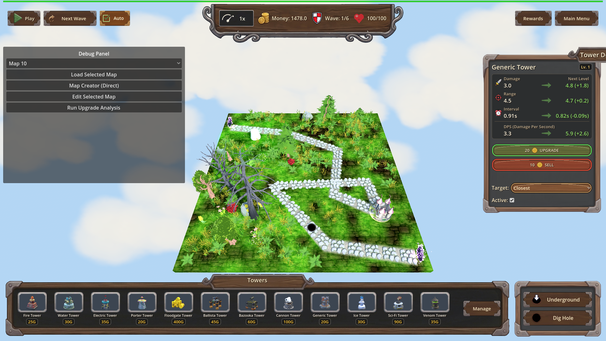
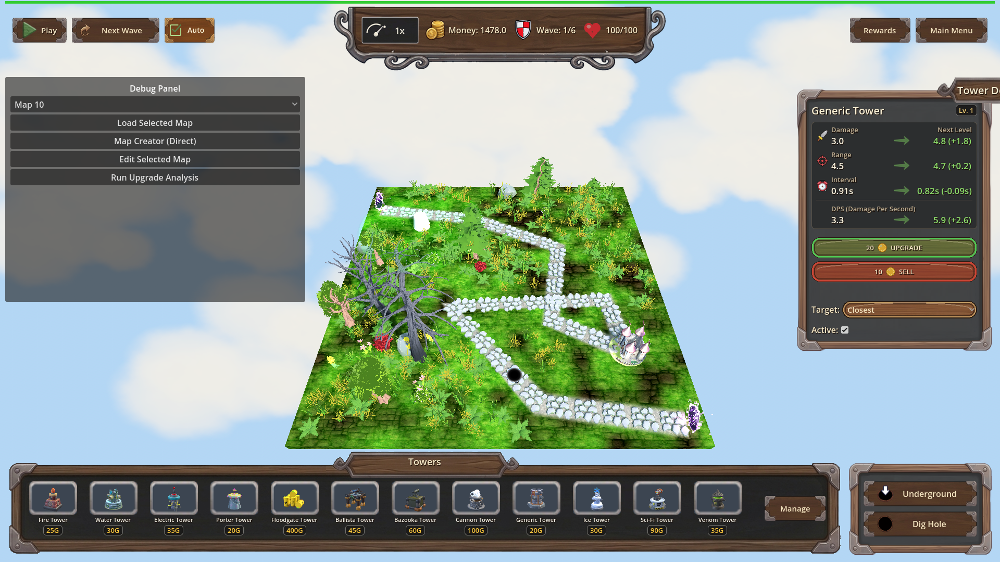
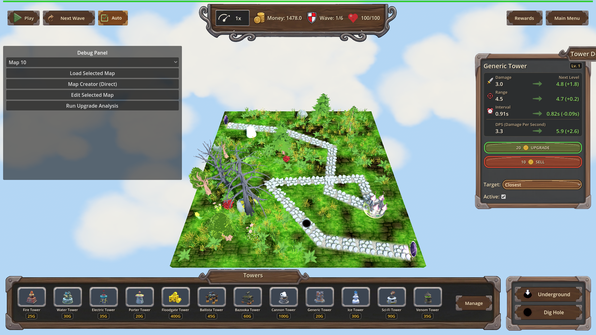

# Manual Test Report – Tower details panel docked right (issue-move-tower-details-panel-right-side)

## Summary

- Result: PASSED
- Tested on: 2026-08-23, windowed Godot 4.4.1 (gl_compatibility, Dummy audio) via run_project_cmd
- Scenario: .gen/ui_scenario.md (created this run; visual variant of tests/scenarios/tower_details_panel_right_side.json)
- Tester: Manual-tester profile

Overall: Walked the tower-selection flow in a real windowed run: placed a hole and a Generic
tower on map_10, selected it, and confirmed the tower details (upgrade) panel now docks on
the RIGHT edge of the screen instead of covering mid-screen gameplay. All 13 harness actions
passed at the default resolution and all 6 geometry conditions passed again at 1280x720.
Final verdict: ui_feels_broken: no.

## Scenario Walkthrough

### Step 1 – Before selection: map without details panel

- Action: Loaded map_10, set money 1500, dug a hole at (0.75, 0, 6.5), placed a Generic
  tower at (-5.684, 0, -5.213). Took screenshot before selecting anything.
- Expected: No details panel covering the map; gameplay UI (top bar, bottom build bar,
  left panel) visible; tower present on the grass.
- Observed: Exactly that — top bar with Money/Wave/Health, bottom Towers build bar,
  debug panel on the left, tower on the map near the path end. No details panel anywhere.
- Status: PASS

### Step 2 – Tower selected: panel docked at the right edge

- Action: `towers.select_at([-5.684, 0, -5.213])` + `ui.on_tower_selected()`, then screenshot.
- Expected: Details panel docked on the right side of the screen, not overlapping gameplay
  UI or the described tower.
- Observed: "Generic Tower Lv.1" panel sits flush against the right screen edge between the
  top bar and bottom build bar. It shows Damage/Range/Interval/DPS upgrade comparisons,
  UPGRADE (20G) and SELL (+10G) buttons, target priority and Active toggle. The selected
  tower is fully visible on the map to the LEFT of the panel; zero overlap with top bar,
  bottom build bar, or left panel. Harness geometry agreed: overlap ratios vs ItemList /
  ButtonsContainer / selected tower all 0.0, right-edge gap ≤ 20px (measured 16px),
  position.x ≥ 960, end.x ≥ 1900, panel visible.
- Status: PASS

### Step 3 – Same layout at 1280x720

- Action: Re-ran the same flow windowed with `--resolution 1280x720`, screenshot + geometry checks.
- Expected: Docking stays correct at another window size.
- Observed: Panel still right-docked, contents intact, no overlaps; all 6 wait_for_condition
  assertions passed (status=pass, exit 0).
- Status: PASS

## Criteria

- Showing a tower's details displays the panel docked on the right side of the screen.
  - 
  - 
- Panel does not overlap gameplay-critical UI or the tower it describes.
  - 
  - 
  (Harness measured overlap ratio == 0.0 against Root/ItemList, Root/ButtonsContainer,
  TopBar and the selected tower's projected mesh AABB.)
- Layout stays correct across window resize / different resolutions.
  - 

All criteria shown by screenshots of the proving state (map with the placed tower AND the
open details panel), not just a modal.

## Issues and Observations

- None affecting the tested behavior. Pre-existing engine exit-time leak warnings
  (GL textures/RIDs) appear after every run and are unrelated to this change.
- Low (cosmetic): many invalid-UID warnings for HudTheme.tres textures at load; harmless.

## Recommendation

Ready. The right-side docking works as described, is clean of overlaps at both resolutions,
and the final shot reads as sane player-facing UI (ui_feels_broken: no).
