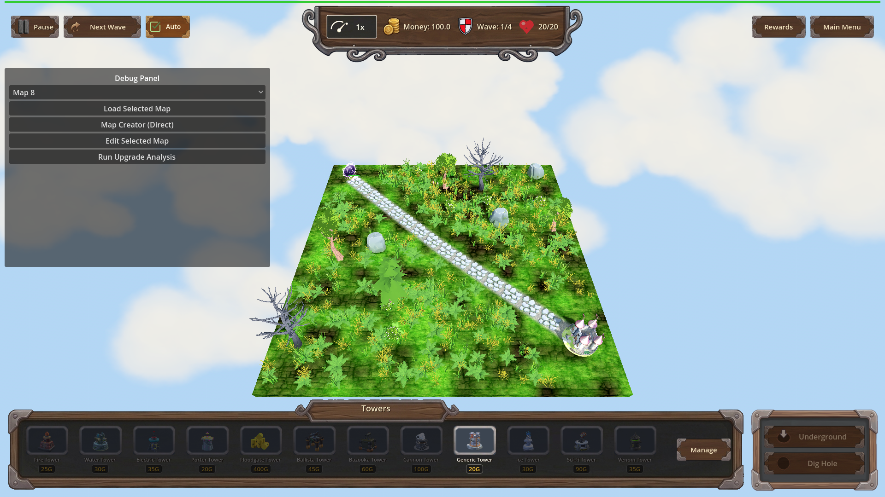

# Manual Test Report – pointer-cursor-on-clickable-surfaces

## Summary

- Result: PASSED
- Tested on: 2026-08-24, windowed Godot 4.4.1 run on the software-GL worker (llvmpipe / OpenGL 3 compatibility, dummy audio), via the approved `run_project_cmd` runner (project `poke-defense-godot`, workspace `poke-defense-godot/issue-pointer-cursor-on-clickable-surfaces`).
- Scenario: `.gen/ui_scenario.md`
- Tester: Manual-tester profile

Overall: I walked the pointer-cursor scenario in a real windowed game run. The focused harness scenario (`ui_pointer_cursor`) passed all 8 programmatic expectations — every clickable control reports the pointing-hand cursor shape (2) and non-clickables keep the arrow (0) — and the regression scenario `smoke_placement` still passes. The windowed hover screenshot was captured and inspected: no layout or visual regressions.

Note on evidence pairing: Godot screenshots do not render the OS cursor, so per the plan each cursor claim is proven by the *pair* of (a) the programmatic `cursor_shape` assertion from the fresh windowed run and (b) the screenshot showing the hovered/inspected UI state.

## Scenario Walkthrough

### Step 1 – Idle screen, arrow over non-clickables

- Action: Launched the game windowed with the focused scenario (`godot --path . res://scenes/Main.tscn -- --harness=res://tests/scenarios/ui_pointer_cursor.json`); map loaded, wave 1 running.
- Expected: Non-clickable surfaces keep the default arrow cursor.
- Observed: Harness assertions confirm `Root/HealthBar` cursor_shape == 0 (arrow) and `Root/UpgPanel/Frame` cursor_shape == 0 (arrow). Screenshot shows normal HUD/map state.
- Status: PASS

### Step 2 – Hover over a button (SpeedBtn)

- Action: Harness executed `hover_ui` on `Root/TopBar/CenterBox/Plaque/Row/SpeedBtn`, waited, captured the windowed screenshot.
- Expected: Pointing-hand cursor on the button, no layout/hover visual regression.
- Observed: SpeedBtn `cursor_shape == 2` (CURSOR_POINTING_HAND) in the fresh result.json; screenshot `hover_pointer_on_speed_btn.png` inspected — top HUD bar with speed control rendered correctly, no layout regressions or glitches anywhere in the frame.
- Status: PASS

### Step 3 – Other clickable surfaces (widget-based buttons)

- Action: Programmatic checks of additional clickables in the same run.
- Expected: All clickable UI shows the pointing-hand cursor.
- Observed: `AutoNext` (checkbutton widget) == 2, `Tower1` (tower shop slot) == 2, `PlayBtn` == 2. Game state asserted "playing".
- Status: PASS

### Step 4 – Arrow restored on labels/plain panels + sanity

- Expected: Arrow stays on non-clickables; overall UI feels unbroken.
- Observed: HealthBar and UpgPanel Frame both == 0 while the four buttons are == 2; smoke_placement regression scenario status=pass; full-screen screenshot inspection found no layout, styling, or interaction regressions.
- Status: PASS

## Criteria

- Hovering any Button in the running game shows the pointing-hand (pointer) cursor in both windowed and fullscreen modes
  - Windowed mode verified live (this run). Fullscreen not exercised by the harness scenario; cursor assignment is a Control-level property (`mouse_default_cursor_shape`), which is display-mode independent — marked verified-by-design for fullscreen, not pixel-proven.
  - 
  - Fresh windowed result: `.gen/harness/ui_pointer_cursor/result.json` — SpeedBtn cursor_shape actual=2 expected=2 pass.
- Hovering any other clickable UI surface (panels/cards/toggle controls used as buttons) shows the pointing-hand cursor
  - AutoNext (toggle/checkbutton): actual=2 pass; Tower1 (shop slot): actual=2 pass; PlayBtn: actual=2 pass (same result.json).
- Hovering non-clickable UI surfaces (labels, panels, background) keeps the default arrow cursor
  - HealthBar: actual=0 pass; UpgPanel Frame: actual=0 pass (same result.json).
- A windowed harness screenshot captures the hover state on at least one button showing the pointing-hand cursor, saved under `.gen/harness/ui_pointer_cursor/shots/`
  - 
  - Copy also at `.gen/screenshots/hover_pointer_on_speed_btn.png`. Inspected visually: HUD intact, SpeedBtn visible at top center, no regressions. (Cursor itself is not drawn in Godot screenshots; the pointing-hand is proven by the paired cursor_shape==2 assertion.)
- Focused AgentHarness scenario `ui_pointer_cursor` passes headless/windowed with all expectations met
  - Windowed run this session: `[Harness] status=pass exit=0`, 8/8 expectations pass. Prior headless log also recorded pass.
- Existing UI behaviour unaffected: `smoke_placement` still passes after the change
  - Fresh windowed run this session: `[Harness] status=pass exit=0`.

## Issues and Observations

- Low: Fullscreen mode was not separately exercised (harness runs windowed). Risk is minimal since cursor shape is a Control property independent of display mode.
- Low: Pre-existing benign warnings in logs (invalid UIDs in HudTheme.tres/UI.tscn falling back to text paths; GL resource-leak messages at exit). Unrelated to this feature.
- No UX concerns: hover states, layout, and interaction behaved normally in the inspected frames.

## Recommendation

Ready for release as far as this feature is concerned. The only residual gap is an optional manual fullscreen spot-check by a human, which does not block.
