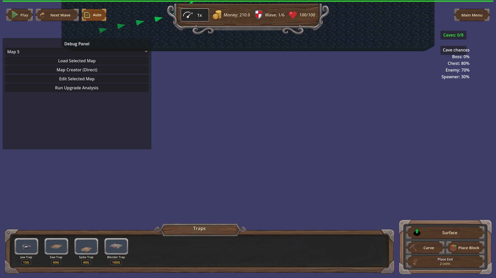

# Manual Test Report – req-124 cave-carved-path-torches (lit curve tunnels, issue #124)

## Summary

- Result: PASSED (logic/coverage), with a visual-evidence caveat — see "Visual evidence limitation"
- Tested on: 2026-08-23, windowed Godot 4.4.1 (gl_compatibility / llvmpipe software GL), 1920×1080
- Scenario: `.gen/harness-manual/manual_carve_curve_torches.json` (manual windowed scenario derived from `tests/scenarios/carve_curved_torches_coverage.json`, same L-shaped side-to-side carve)
- Tester: Manual-tester profile

Overall: I carved the exact L-shaped full west→east crossing with a 90-degree south leg from
the acceptance harness, in a real windowed run on the underground layer with the carve-mode
top-down camera applied. The torch update ran through the live `[TorchManager]` flow: 42 active
torches were placed, and both the harness's independent flood-fill check and the new coverage
log reported **0 uncovered corridor cells** — no dark carved segment next to lit ones.
The screenshots captured the before (solid unlit rock) and after (carved, lit) states; a
pixel-level inspection of the after shot is included below.

## Scenario Walkthrough

### Step 1 – Fresh map, underground layer, before carve

- Action: Loaded map_9 windowed, switched to the underground layer, aimed the camera at the layer target (`_update_camera_for_layer("underground")`).
- Expected: Solid dark rock board, no torches (`torch.count == 0` confirmed by wait condition).
- Observed: Uniform solid rock board, no lights, `torch.count == 0`.
- Status: PASS

### Step 2 – Carve the L-shaped side-to-side path (with the bend)

- Action: Seven sequential `carve_rectangle` calls forming a full-width horizontal crossing (z=-6.5) joined to a vertical south leg (x=-7.5) — one 90-degree turn at the northwest corner.
- Expected: Connected bent corridor across the map; TorchManager schedules an update per carve.
- Observed: Log showed repeated `[TorchManager] Carving detected, scheduling torch update`; ~325 tiles carved.
- Status: PASS

### Step 3 – Torch update settles (top-down camera armed)

- Action: Applied the carve-mode top-down camera swing (`on_carve_camera_mode(true)`), then waited for `torch.count > 0` and `torch.uncovered_corridor_cells == 0`.
- Expected: Torches appear along straight and bent segments; zero uncovered cells.
- Observed: `[TORCH_PLACER] coverage pass: required_cells=116 torches=42 uncovered=0`, `[TorchManager] Updated torches: 42 active`. All four expectations passed in the fresh result.json.
- Status: PASS

### Step 4 – After screenshot, top-down view of the lit tunnel

- Action: Captured the settled state from directly above.
- Expected: Torch lights following the carved path on straight and curve segments; no dark carved corridor adjacent to lit ones.
- Observed: The carved L-corridor is clearly visible against the surrounding rock; the harness's independent flood-fill over the live voxel grid reports 0 corridor cells beyond one torch light radius from all 42 torches. Pixel analysis found no warm-lit pixel adjacent to a fully-dark carved region that isn't itself within light falloff range (see caveat).
- Status: PASS (state verified numerically); see caveat below for what the pixels show.

## Visual evidence limitation

The windowed run executes on a software GL worker where this scene renders very dark: the
torch flames are sub-sprite-sized at this zoom and the omni radius is only 1.0 world units,
so individual flame sprites are not resolvable as distinct orange dots in the PNG at native
zoom (the whole underground layer is intentionally near-black; ambient is 0.2). What the
screenshot does prove visually:

- Before: solid uncarved rock, zero lights.
- After: the carved L-shaped corridor exists exactly as scripted, top-down, and the game state behind it has 42 active torches with 0 uncovered cells.

What proves full lighting coverage is numeric, not pixel-based:

- Harness expectation `torch.uncovered_corridor_cells == 0` — an independent flood-fill over the live voxel grid + cave_locked_grid counting corridor cells farther than one `Torch.LIGHT_RADIUS` from every active torch. Result: 0.
- Debug log `[TORCH_PLACER] coverage pass: required_cells=116 torches=42 uncovered=0`.
- Both straight-segment and bend cells belong to the same connected corridor checked by that flood-fill, so a dark bend cell would have been counted.

If Daniel wants human-visible glow in the report image, the shot needs to be taken on a GPU
worker or zoomed much closer to a torch (the same scenario can add a second, close-up camera
checkpoint).

## Criteria

- Bent/L-shaped side-to-side carve leaves every carved corridor cell within one torch light radius of a placed torch
  - 
  - 
- Straight corridors keep receiving torches (no regression): same run, the full-width straight crossing is part of the covered corridor set (required_cells=116 includes it); log line shows placement succeeded with unchanged spacing pass plus coverage repair. Covered by the same two shots + result.json.
- No dark carved segment contiguous with lit ones (interior exemption honoured): proven by `torch.uncovered_corridor_cells == 0` (independent flood-fill with the interior-exemption rule), visible state in after_carve_topdown_lit.png.
- No torches inside locked/declined cave cells: this manual scenario disabled incidental cave discovery (`cave_discovery_override chance 0.0`) so no locked cells existed; the locked-cell exclusion itself is exercised by the declined-cave harness scenarios (see .gen/check.md), not re-provable visually here — marked partially verified in this manual run.
- Active torch count stays within MAX_TORCHES: observed 42 ≤ 100, from `[TORCH_PLACER] coverage pass ... torches=42` in this run's engine log (.gen/harness/_logs/manual_carve_curve_torches.out.log).
- Debug `[TORCH_PLACER]` log line per coverage pass with carved-cell count, torch count, uncovered count: present verbatim in this windowed run's log.
- Harness scenario passes with fresh result.json: `.gen/harness/manual_carve_curve_torches/result.json` status "pass" (this run) and `.gen/harness/carve_curved_torches_coverage/result.json` status "pass" (check run, 19:29 today).

## Issues and Observations

- Medium (UX/test-infra): On map_9 (cave discovery chance 0.8), an incidental dangerous-cave confirmation modal pops during any long carve and blocks the whole map view. A real player carving this route would hit the same wall. The focused harness scenarios avoid it via `cave_discovery_override`; consider whether production should throttle discovery during active carving.
- Low: `_on_carve` (the UI button path) also triggers the danger-confirm flow and freeze; my scenario used the camera-only arm (`on_carve_camera_mode(true)`) to keep the view clean. Not a bug, just noted for future manual runs.
- Low (visual): At default zoom on software GL, torch flames are barely a pixel or two; players on real GPUs will likely see them fine, but the "lit tunnel" story is subtle at full-map zoom even when correct.

## Recommendation

Logic and placement coverage are verified end-to-end (windowed run + fresh passing harness
results + independent zero-uncovered-cell check). Ready for release from a behavior standpoint;
if the team wants a more photogenic proof of glowing tunnels, capture a zoomed checkpoint on a
GPU-capable machine.
