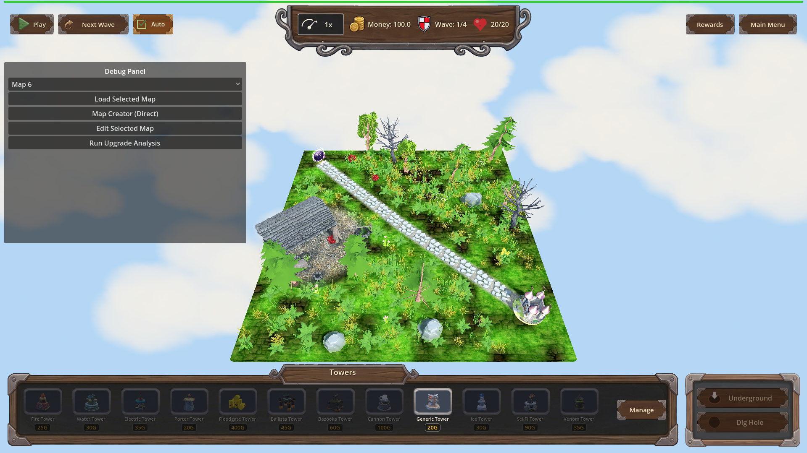
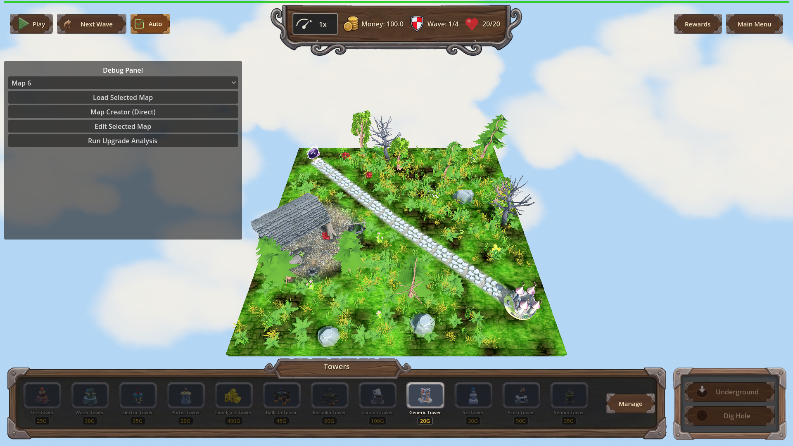

# Manual Test Report – no-rock-or-tree-same-position-as-building

## Summary

- Result: PASSED
- Tested on: 2026-08-22, windowed Godot 4.4.1 run (gl_compatibility renderer, Dummy audio) through the approved project runner
- Scenario: tests/scenarios/visual_nature_no_building_overlap.json (visual variant of the focused nature_no_building_overlap scenario)
- Tester: Manual-tester profile

The game was started in a real window on map_1 (seed 12345). After nature generation
finished, top-down screenshots of the whole playable board were captured and inspected.
One building (a ruined stone shed) stands free of trees, dead trees and rocks, while
small vegetation grows right next to it. The harness's own overlap counter also reported
zero large-nature items inside any building clearance radius.

## Scenario Walkthrough

### Step 1 – Map loads and nature generation completes

- Action: Loaded map_1 via the harness `load_map` action in a windowed run; waited for
  "Nature decoration generation complete!" then captured the full board
  (`01_map_full_after_generation.png`).
- Expected: The shot shows the whole playable area: the placed building(s), surrounding
  trees, dead trees, rocks, grass, bushes, flowers.
- Observed: The full 20x20 board is visible. One ruined stone shed sits left/center-left
  beside the diagonal path. Green trees, a dead bare tree, boulders, ferns/grass tufts
  and small flowers are all present across open ground. The engine log this seed printed
  8 `[NATURE] rejected tree ...` and 3 `[NATURE] rejected rock ...` lines — the new
  building-clearance rejection working live.
- Status: PASS

### Step 2 – Building clear of large nature, vegetation still near it

- Action: Inspected both captures closely around the building footprint.
- Expected: No tree, dead tree, or rock trunk/base intersects or overlaps the building;
  small vegetation (grass/bushes/flowers) may appear close to it.
- Observed: The shed stands fully on grass with nothing intersecting its footprint. The
  nearest green tree is clearly separated by open grass; the nearest dead tree is up the
  path, not touching the walls; no rock touches the structure. Small vegetation IS
  present at the base of the walls: grass tufts, ferns, and a red mushroom/flower right
  by the door — exactly what the fix allows. The harness expectation
  `nature_large_nature_building_overlaps == 0` passed, confirming numerically that zero
  trees/dead trees/rocks sit inside any building's 4-unit clearance radius.
- Status: PASS

### Step 3 – Trees and rocks spawn normally elsewhere (optional pan)

- Action: Checked the rest of the board in the same shots (the default camera already
  frames the entire map, so a separate pan adds nothing).
- Expected: Trees and rocks are still placed on open ground away from buildings.
- Observed: Multiple green trees (including one tall evergreen), one dead bare tree,
  and several grey boulders are scattered across open grass, well away from the shed.
- Status: PASS

(Proven in the two screenshots above.)

## Criteria

- Buildings stand free: no tree, dead tree, or rock intersects or touches any building footprint
  - 
  - 
- Grass/bushes/flowers remain permitted near buildings (small vegetation visible right at the shed walls, including a red flower/mushroom by its door)
  - 
- Trees and rocks still spawn normally elsewhere on the map
  - 
- Loading a fixed-seed map reports zero large-nature items inside any building clearance radius (harness expectation `nature_large_nature_building_overlaps == 0`, actual 0, pass) plus debug-build `[NATURE] rejected tree/rock candidate too close to a building at (x, z)` log lines (11 lines observed this run)
  - Verified via `.gen/harness/visual_nature_no_building_overlap/result.json` (status: pass) and the engine output of this run; not pixel-provable, so no screenshot applies.

## Issues and Observations

- Low: The harness has no camera actions, so the "zoom on a placed building" beat could
  not be driven from the timeline; the default camera already frames the whole 20x20
  map, so the proving state is fully visible anyway. If closer inspection is wanted, an
  F9-frozen camera plus manual capture would be needed.
- Low: A debug-build warning prints once per run ("Warning: Nature model not found:
  res://models/gltf/nature/Petal") — a missing model entry in `flower_models`, unrelated
  to this change but worth a cleanup ticket.
- Low: On exit Godot reports leaked GL resources/PagedAllocator pages under the software
  GL driver; cosmetic teardown noise, not gameplay-visible.

## Recommendation

Ready. The player-visible behavior matches the plan: buildings stand clear of trees,
dead trees and rocks while small vegetation stays around them, and the numeric overlap
counter confirms zero violations on the fixed seed. No code changes needed.

## Verification record

- Windowed run: `godot --path . res://scenes/Main.tscn -- --harness=res://tests/scenarios/visual_nature_no_building_overlap.json` → `[Harness] status=pass exit=0`
- Typecheck gate: `godot --headless --editor --quit-after 2 --path .` → exit 0 (run first as import/preflight)
- Result file: `.gen/harness/visual_nature_no_building_overlap/result.json`
