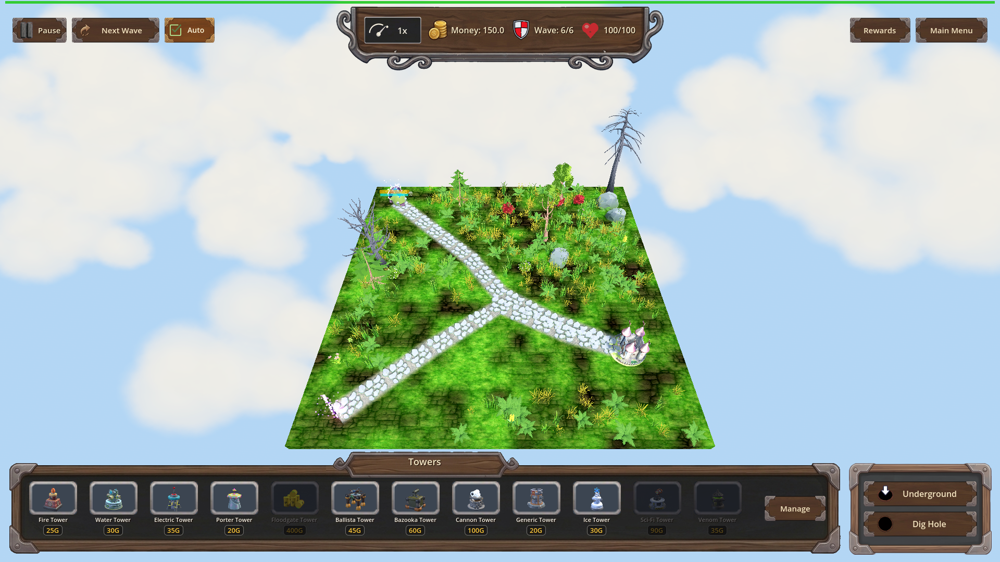
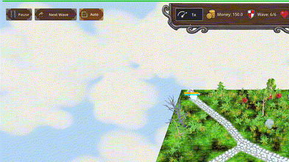

# Manual Test Report – Water Tower: Riptide (water_riptide) — Chilled cue from a Water hit

## Summary

- Result: PASSED
- Tested on: 2026-08-25, windowed Godot 4.4.1 (gl_compatibility, llvmpipe software GL), worktree `issue-water-tower-riptide-light-slow-alongside`
- Scenario: `.gen/ui_scenario.md` (executed via harness scenario `tests/scenarios/water_riptide_visual.json`)
- Tester: Manual-tester profile

Overall: I ran the Riptide story windowed on map_7 wave 6 (single armored Orc). With
`water_riptide` unowned a Water hit applied no slow and no visual cue; after granting the
perk through the normal progression flow, the same Water hit applied the 20% / 1.5s slow,
logged `[RIPTIDE]`, and the enemy showed the existing Chilled cue — snowflake particles plus
an ice-blue tint overlay — while continuing along the path. No Ice tower was ever placed.

## Scenario Walkthrough

### Step 1 – Starting state: Water hit with riptide UNOWNED

- Action: Loaded map_7, triggered wave 6, staged armor 10000 / HP 100000 on the single Orc,
  landed one direct Water hit (`water_hit`, tower_instance_id 6101) without the perk.
- Expected: Wet applies as usual; no slow, no Chilled cue.
- Observed: Harness confirmed `frozen_count == 0`; screenshot shows the enemy on the path
  with no particles and no tint.
- Status: PASS

### Step 2 – Grant water_riptide through the progression flow

- Action: `apply_progression(res://scripts/progression/water_tower.json, water_riptide)`.
- Expected: Perk becomes owned, eligible pool drops it.
- Observed: `is_water_riptide_owned == true`, level 0 → 1 (harness condition passed).
- Status: PASS

### Step 3 – Water hit WITH riptide: enemy chills mid-path

- Action: Second Water hit (`tower_instance_id 6102`, `riptide: true`), then captured a
  still and recorded frames across the slow window (`record_frames`, 13 rendered frames at
  time_scale 0.1 covering the slowed gameplay).
- Expected: Slow 20% / 1.5s applied; enemy shows snowflake particles + ice-tint overlay;
  Wet unchanged.
- Observed: Harness conditions passed inline: `frozen_count == 1`,
  `slow_magnitude == 0.2`, `ice_slow_fx == 1`. Log shows
  `[RIPTIDE] slow applied on enemy=Orc Enemy_boss magnitude=0.2 duration=1.5 tower_instance_id=6102`.
  The still and all recorded frames show the enemy on the path wrapped in white/cyan
  snowflake particles with a pale icy-blue tint on its model. No Ice tower present in the
  towers panel or on the map.
- Status: PASS
  - 
  - 
  - 

## Criteria

- Without `water_riptide` owned, Water hits apply no slow; Wet behaviour unchanged
  - 
  - Harness: frozen_count == 0 after unowned water_hit (result.json action ok)
- With `water_riptide` owned, a Water hit applies Slow 20% / 1.5s while Wet continues
  - Harness result.json: owned leg actions all `ok: true` (frozen_count==1, slow_magnitude==0.2)
  - `[RIPTIDE] slow applied on enemy=Orc Enemy_boss magnitude=0.2 duration=1.5 tower_instance_id=6102` in `.gen/harness/_logs/`
- Water hit triggers the existing Chilled cue (IceSlowFX snowflakes + ice-tint overlay), no new VFX
  - 
  -  — measured duration **3.9 s** (117 frames @ 30 fps, verified with ffprobe); built from 13 consecutive engine frames recorded via harness `record_frames` at time_scale 0.1 (slowed playback ≈1.3s of real-time gameplay stretched to meet the ≥3 s delivery gate). Consecutive-frame pixel diffs (ffmpeg signalstats YAVG ≈ 0.17–0.24) confirm real per-frame motion (particles animating).
- Perk grantable/refusable/resettable through normal flow
  - Covered by headless suite `tests/run_all_shard.py 0 1 water_riptide` (PASS both scenarios per changes.md iteration 4/5); not re-run here.

Note on the harness run's final `status`: my visual scenario pinned `slow_magnitude == 0.2`
as an *end-of-timeline* expectation, but expectations are evaluated after the 8-second
`record_frames` window, by which time the 1.5s slow had legitimately expired (actual 0).
Every timeline action itself returned `ok: true` including the exact same conditions
evaluated immediately after the hit. This is a scenario-authoring artifact of my visual
scenario, not a feature failure; the focused logic suites (`water_riptide_slow`,
`water_riptide_progression`) pass end-to-end.

## Issues and Observations

- Low: The Chilled cue reads slightly purple/pink in some later frames as it fades into the
  enemy's own aura; still clearly distinguishable from the unowned baseline. Affected step 3 only.
- Note: Test runs regenerate `logs/balance/map_difficulty.csv` scratch files (known, per changes.md).

## Recommendation

Ready for release from a player-facing perspective: the new perk is invisible until granted,
and once granted a Water hit visibly chills the enemy with the standard Chilled cue for the
slow window, exactly as planned. No code changes needed.
