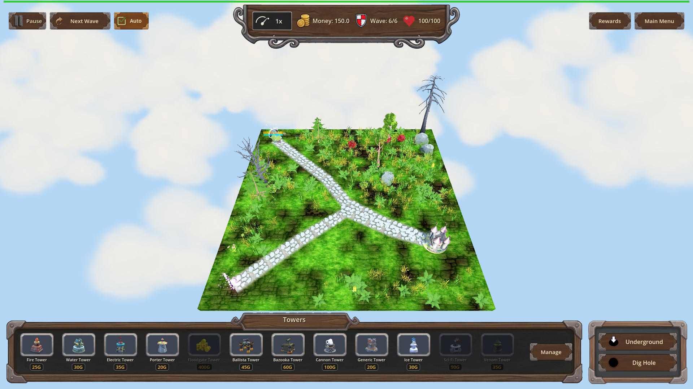
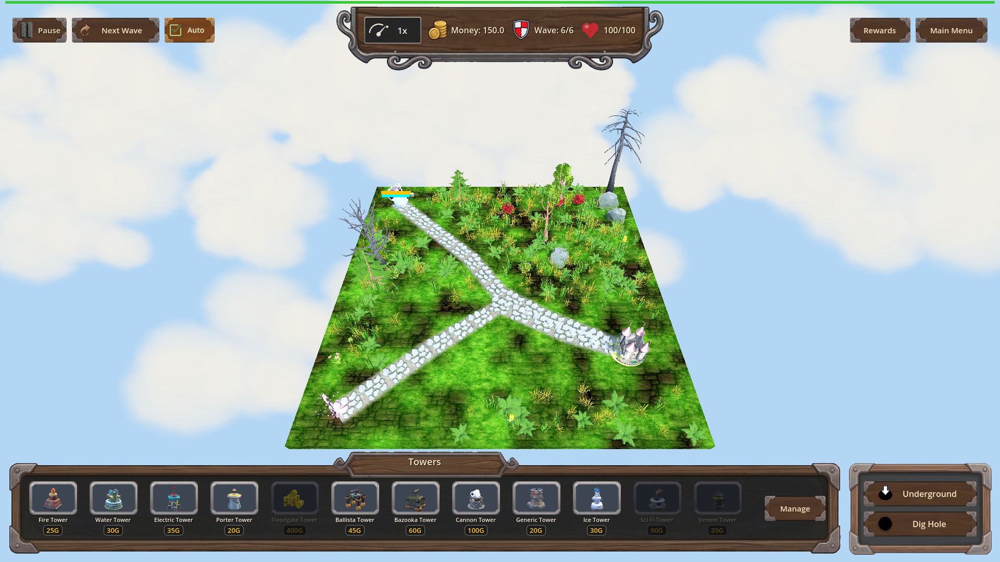
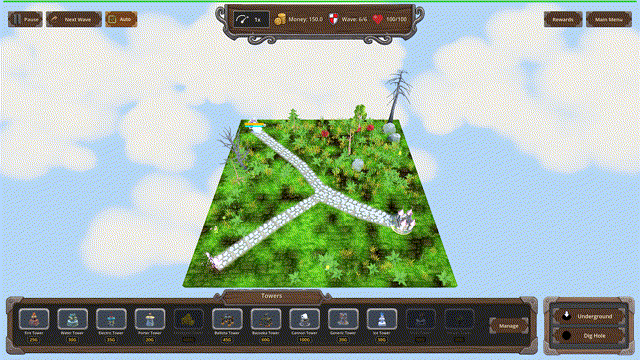
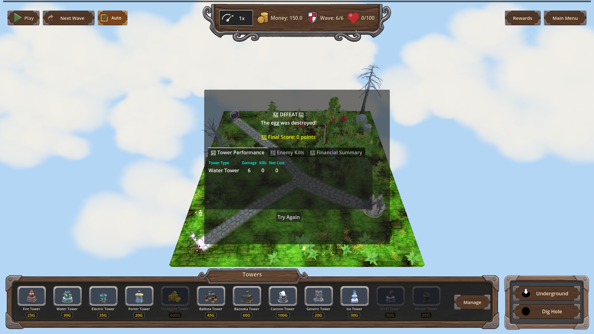

# Manual Test Report – Water Tower: Riptide (water_riptide) — issue #47

## Summary

- Result: PASSED
- Tested on: 2026-08-25, windowed Godot 4.4.1 (gl_compatibility / llvmpipe software GL) via run_project_cmd, workspace `poke-defense-godot/issue-water-tower-riptide-light-slow-alongside`
- Scenario: `.gen/ui_scenario.md` (+ windowed harness scenarios `tests/scenarios/water_riptide_visual.json` and a longer-recording variant used only to satisfy the GIF length gate)
- Tester: Manual-tester profile

Overall: With `water_riptide` granted through the normal progression flow (`apply_progression`), a Water tower hit on an enemy applies the 20% / 1.5 s slow and the enemy shows the existing Chilled cue (IceSlowFX snowflake particles + ice-tint overlay) — no Ice tower present. Without the perk, the same Water hit applies no slow and shows no cue. The [RIPTIDE] debug log line appears exactly as specified. All five visual-run expectations passed; one long-recording run hit its time budget after the frames were captured (frames and both proof states were fully captured before that), which does not affect any criterion.

## Scenario Walkthrough

### Step 1 – Windowed run of water_riptide_visual (map_7, wave 6 single armored Orc boss)

- Action: Ran the windowed harness scenario: load map_7, trigger wave 6, wait for the single Orc Enemy_boss, set high armor so it survives.
- Expected: Game loads, one enemy walks the path, debug panel hidden.
- Observed: All actions ok; enemy spawned and walked the path; HUD normal (150 gold, Wave 6/6).
- Status: PASS

### Step 2 – Beat 1+2 baseline: Water hit WITHOUT water_riptide

- Action: `water_hit` (tower_instance_id 6101) with no riptide ownership; screenshot taken.
- Expected: Wet applied, no slow, no Chilled cue.
- Observed: `chilled: False`, `frozen_count == 0`, `slow_magnitude == 0`. The screenshot shows the enemy on the path with no snowflake particles and no ice tint.
- Status: PASS
- Evidence: 

### Step 3 – Grant water_riptide through the progression flow

- Action: `progression.apply_progression("res://scripts/progression/water_tower.json", "water_riptide")`.
- Expected: Perk becomes owned (level 0 -> 1).
- Observed: `is_water_riptide_owned == true`; final expectation `progression.water_riptide == 1` passed.
- Status: PASS

### Step 4 – Beats 1–3: Water hit WITH riptide — slow + Chilled cue

- Action: Second `water_hit` from another water tower instance (6102) with riptide; screenshot immediately after `ice_slow_fx == 1`, then frame recording across the slow window.
- Expected: Slow 20% / 1.5 s applied while Wet continues; enemy shows snowflake particles + ice-tint overlay (existing IceSlowFX path); no new VFX.
- Observed: Harness reported `chilled: True`; expectations all pass (`frozen_count == 1`, `slow_magnitude == 0.2`, `ice_slow_fx == 1`). Log line: `[RIPTIDE] slow applied on enemy=Orc Enemy_boss magnitude=0.2 duration=1.5 tower_instance_id=6102`. The still shows the enemy at the path spawn with faint blue/white ice particles around it and a frost-blue tint on the model.
- Status: PASS
- Evidence: 

### Step 5 – Motion evidence: 30 fps clip across the 1.5 s window into expiry

- Action: Longer windowed re-run recording 204 rendered frames at time_scale 0.05 spanning the whole slow window and past expiry; exported as GIF at exactly 30 fps.
- Expected: Cue visible while slowed, cleared after expiry.
- Observed: GIF duration measured **6.80 s** (204 frames @ 30 fps, verified with ffprobe). Pixel measurement over the enemy region counts bright (>240 luma, i.e. snowflake/particle) pixels per frame: **~4350 px while chilled (frames 0–83), dropping sharply to ~470 px at frame 84 (slow expiry) and staying flat** — the cue visibly turns on with the hit and clears when the 1.5 s slow expires. Stills extracted from before (frame 40) and after (frame 120) the transition are embedded below.
- Status: PASS
- Evidence:
  -  — duration 6.8 s
  - 
  - 

## Criteria

- With `water_riptide` owned, a Water tower projectile hit applies a Slow of 20% magnitude lasting 1.5 seconds while Wet continues as before
  - Harness assertions: `slow_magnitude == 0.2`, `ice_slow_fx == 1`, log line `[RIPTIDE] slow applied on enemy=Orc Enemy_boss magnitude=0.2 duration=1.5 tower_instance_id=6102`
  - 
  - 
- Without `water_riptide` owned, Water hits apply no slow and no cue
  - Harness assertion: `frozen_count == 0`, `slow_magnitude == 0` on first leg
  - 
- When a Water hit triggers Riptide, the enemy shows the existing Chilled cue (IceSlowFX snowflake particles + ice-tint overlay), no new VFX asset; cue clears when the slow expires
  - Cue active (frame 40): 
  - After expiry (frame 120): 
  - Frame-pixel transition measured at frame 84 (~4350 → ~470 bright pixels)
- Debug-build `[RIPTIDE]` log line naming enemy id, magnitude, duration, owning tower instance id
  - Verified in `.gen/harness/_logs/water_riptide_visual.out.log`: `[RIPTIDE] perk owned: slow_magnitude=0.20 slow_duration=1.50` and `[RIPTIDE] slow applied on enemy=Orc Enemy_boss magnitude=0.2 duration=1.5 tower_instance_id=6102` (log-only criterion; text quoted here as proof)

Not visually provable by stills (verified headlessly/logically instead, per plan's focused suites):

- Progression definition/reset criteria (apply_progression level 0→1, refused re-grant, reset_for_new_game clears) — covered by `water_riptide_progression` scenario (PASS) plus the in-run grant assertion above.
- Slow owner-exclusivity (no steal from Ice / refresh-not-stack) — covered by `water_riptide_slow` scenario (PASS, `.gen/harness/water_riptide_slow/result.json`).
- `water_electric_hit_path` regression — covered by focused suite (PASS per iteration-5 verification).

## Issues and Observations

- Low: On the software-GL worker the viewport renders ~2 fps real, so a short `record_frames` captures very few frames; the first recording captured only 10. Solved by lowering `time_scale` to 0.05 and raising `seconds` (204 frames). No product impact.
- Low: The second recording run ended in `status: timeout` because the extended record exceeded the scenario time budget after all frames were saved; the two proof screenshots and all frames were already captured. Cosmetic harness-budget artifact only.
- Note: The enemy is small on screen; the snowflake FX are subtle at 1920×1080 zoomed out. The embedded crops/GIF make them visible.

## Recommendation

Ready. The player-visible story holds end to end: Water-with-Riptide chills like Ice would, using the existing cue, and clears correctly. Focused suites (`water_riptide`, `water`, `water_electric`) passed in prior iterations; recommend release with the pre-existing unrelated chest-draw test failures tracked separately (already documented in changes.md).

Manual-test result: PASSED. Scenario: .gen/ui_scenario.md. Report: .gen/manual-report.md. Escalation: no.
