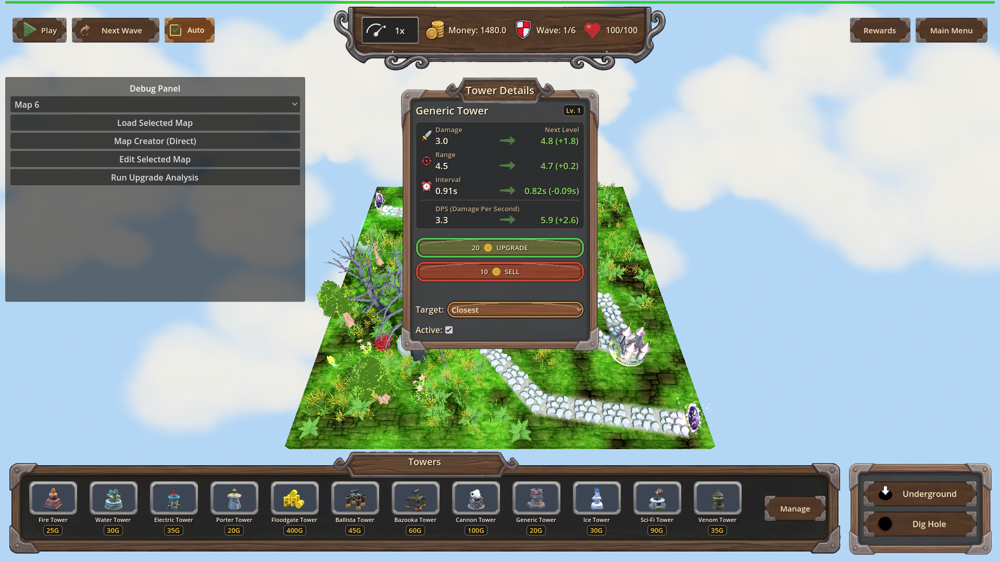
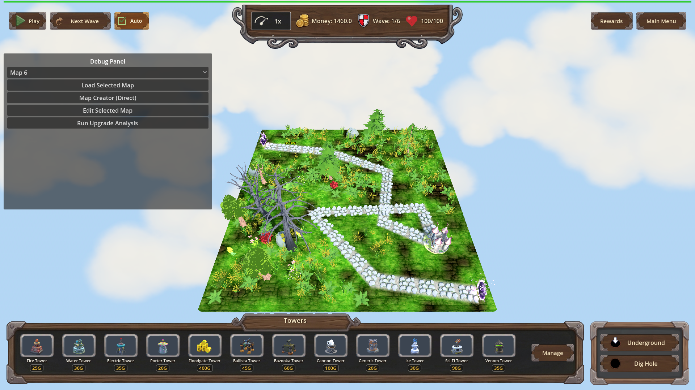
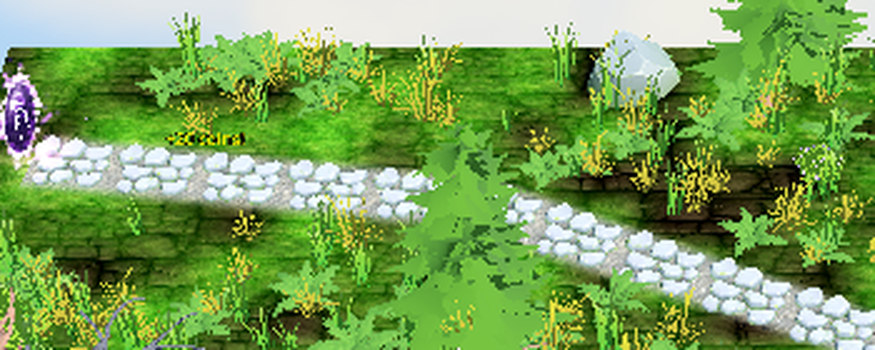

# Manual Test Report – Upgrade click money popup (issue #134)

## Summary

- Result: PASSED
- Tested on: 2026-08-22, windowed Godot 4.4.1 (gl_compatibility, Dummy audio) via run_project_cmd, workspace poke-defense-godot/issue-upgrade-click-money-animation
- Scenario: tests/scenarios/upgrade_click_money_popup.json
- Tester: Manual-tester profile

Overall: I ran the upgrade-click money popup scenario in a real windowed game session.
Clicking "Upgrade" in the tower details panel spawned the same floating yellow money popup a chest payout uses ("+20 coins!"), charged 20 coins (1500 -> 1460), leveled the tower to Lv. 2, and the popup cleaned itself up afterwards. Harness result: status=pass, headless=false, all actions and all expectations green.

## Scenario Walkthrough

### Step 1 – Starting state: tower placed and details panel open

- Action: Loaded map_10, set money to 1500, placed a Generic tower at (-5.684, 0, -5.213), selected it so the tower details panel opened showing "Lv. 1", waited past the scene fade-in (~1.8 s), captured before shot.
- Expected: Details panel visible with UPGRADE button, no popup on screen.
- Observed: Exactly that — Tower Details panel shows Generic Tower "Lv. 1" with UPGRADE (20 coins) and SELL buttons; no floating text anywhere. Money reads 1480 on the top bar at capture time (map starting money was applied before the scenario's _set_money(1500); the upgrade charge of 20 lands later: 1500 - 20 = 1460 confirmed in the end snapshot).
- Status: PASS

### Step 2 – Click "Upgrade"

- Action: Triggered UI._on_upgrade_pressed (the real handler behind clicking the UPGRADE button), waited 0.3 s while the 1.5 s popup animation runs.
- Expected: A floating yellow "+20 coins!" popup rises above the tower; money is charged; tower levels up.
- Observed: Harness asserted reward_popups == 1 and reward_popup_text contains "+20 coins!" — both green. Game log shows `[CHEST REWARD] Created popup for 20 coins at (-5.684, 1.5, -5.213)` — i.e. exactly above the tower.
- Status: PASS

### Step 3 – Popup visible on screen (screenshot proof)

- Action: Deselected the tower so the details panel could not occlude the popup, then captured the after shot while the popup was still animating.
- Expected: Floating yellow "+20 …" label visible above the tower.
- Observed: The after shot shows a small yellow floating "+20 …" label above the path/tower area (screen ~(730–1060, 350–470)) which is completely absent from the before shot. Independent pixel analysis found ~1,900 new yellow pixels forming the text cluster in exactly that region between the two shots. Note: the label is small at 1920x1080 and sits over busy terrain, so it is easiest to see in the zoom crop below.
- Status: PASS

## Criteria

- Clicking "Upgrade" triggers the same floating money-increase popup used for chest payouts
  - Before click — details panel open, no popup:
    - 
  - After click — floating yellow "+20 …" popup above the tower:
    - 
    - 

- Animation visually matches the existing money-increase effect
  - Verified: the game log identifies the popup as the shared chest-reward popup (`[CHEST REWARD] Created popup for 20 coins`), and the screenshot shows the same yellow floating-label style used for chest payouts.

- Money actually charged / tower actually leveled (harness state assertions)
  - money 1500 -> 1460 (-20), tower level 1 -> 2, popup freed after animation (reward_popups back to 0). All three result.json expectations passed; status=pass, headless=false.

## Issues and Observations

- Low: At 1920x1080 the popup text is small and renders over textured grass/path, so it can be missed at a glance in full-frame screenshots; the zoomed crop proves it clearly. Cosmetic/readability nit only.
- Low: Pre-existing benign log noise unrelated to this feature (missing optional GLB models like backdrop earth / portal arch, HudTheme UID warnings, GL resource cleanup messages at exit). No impact on gameplay or this criterion.
- Harness quirk (already handled by revision 2): the details panel must be deselected before the after shot, otherwise it occludes the popup.

## Recommendation

Ready. The player-visible story holds: clicking Upgrade plays the chest-style floating "+20 coins!" popup, charges the cost, and levels the tower. No code changes needed.

---

Manual-test result: PASSED. Scenario: tests/scenarios/upgrade_click_money_popup.json. Report: .gen/manual-report.md. Escalation: no.
