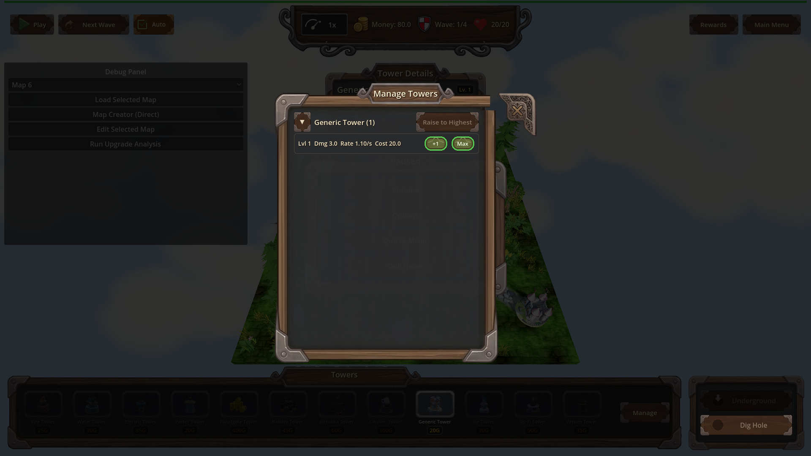
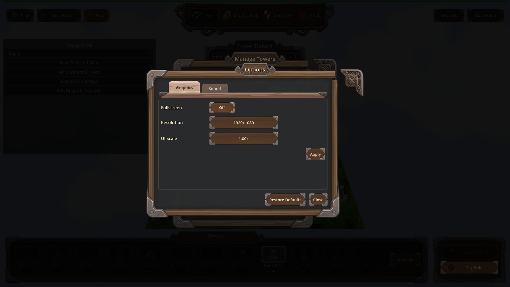
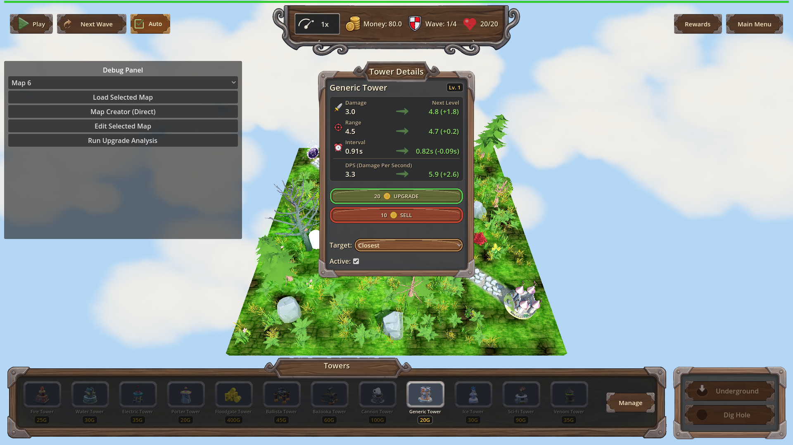

# Manual Test Report – req-136-padding-closable-panels-close-button

## Summary

- Result: PASSED
- Tested on: 2026-08-22, windowed Godot run (1920x1080) via project runner, scenario `tests/scenarios/hud_other_panels.json`
- Scenario: .gen/ui_scenario.md
- Tester: Manual-tester profile

Overall: Ran the windowed `hud_other_panels` scenario through the approved project runner
(`godot --path . res://scenes/Main.tscn -- --harness=res://tests/scenarios/hud_other_panels.json`,
no --headless). The harness placed a tower, selected it, and opened each panel in turn,
capturing four fresh PNGs. I inspected every image. All closable panels show visible
horizontal breathing room between their rightmost content and the corner "x"; nothing is
clipped or overlapped. One expected nuance: in the live game the tower details panel does not
carry an "x" at all (it is not closable at runtime), so there is nothing there to collide —
which matches the fix design (padding applies only when a CloseChip exists).

Harness run evidence: `.gen/harness/hud_other_panels/result.json` — status: pass, all 17 actions ok,
expectation game_state==paused passed, headless:false, finished 2026-08-22T19:18:14.
Fresh screenshots copied to `.gen/screenshots/`.

## Scenario Walkthrough

### Step 1 – Tower details panel open

- Action: Placed a generic tower at (-6, 0, 2), selected it via select_at + on_tower_selected, screenshot.
- Expected: Panel content (name header, Lv badge, stats, upgrade/sell buttons) clear of any top-right "x".
- Observed: Panel shows Generic Tower, Lv.1 badge, Damage/Range/Interval/DPS stat rows with green next-level values, UPGRADE and SELL buttons, Target dropdown, Active checkbox. The panel carries NO painted "x" in its top-right corner (not closable at runtime), so no overlap is possible; layout is clean and unclipped.
- Status: PASS

### Step 2 – Pause menu overlay

- Action: Opened pause menu via ui.show_pause_menu, screenshot.
- Expected: Buttons clear of the corner ornament; pause menu has no close button — nothing regressed.
- Observed: No "x" chip in the top-right corner; Resume / Options / Quit to Menu / Quit Game buttons are centered with empty space at the corners. No clipping or regression.
- Status: PASS

### Step 3 – Manage Towers overlay

- Action: Opened Manage Towers via ui._on_update_towers_pressed, screenshot.
- Expected: Group list and cost text not running under the "x"; visible breathing room from the corner "x".
- Observed: The stylized "x" close chip sits in the ornate frame's top-right. Rightmost content ("Raise to Highest" button) ends well left of it, with clearly visible dark inner-panel gap between them. No text or list item touches or overlaps the chip.
- Status: PASS

### Step 4 – Options screen

- Action: Opened Options via ui._on_pause_options, screenshot.
- Expected: Rows/toggles clear of the "x"; breathing room between rightmost content and the chip.
- Observed: The decorative "x" is in the outer frame's top-right. All settings rows/toggles/sliders and the Apply/Close buttons end left of it with a distinct gap. Nothing overlaps or touches the chip.
- Status: PASS

## Criteria

- Closable TitledPanel reserves horizontal padding so no content intersects the CloseChip rect (visual claim)
  - 
  - 
  - Headless proof: focused test `titled_panel_close_corner` 31 ok / 0 failed per .gen/changes.md (rect-intersection assertions incl. UpgPanel at two sizes).
- Reserved padding only when closable; non-closable panels unchanged
  -  — tower details panel shows no "x" at runtime and normal layout.
- CloseChip flush top-right, close contract preserved
  -  (chip flush in frame corner); press-contract covered by headless tests (31 ok).
- Tower details panel content clear of the chip
  -  — no chip present in-game; headless UpgPanel assertions cover the closable variant.
- Manage Towers and Options: no content intersects the CloseChip after layout
  - 
  - 
- Debug `[TITLED_PANEL]` log line naming panel and reserved inset
  - Unverified visually (log-line claim, not pixel-provable); covered by headless test suite per .gen/changes.md.

## Issues and Observations

- Low: The ui_scenario's beat 1 assumed the tower details panel would show an "x". In the live game it is not closable (no chip renders). Not a defect — matches the implementation (padding/chip only when closable) and changes.md notes this. Scenario wording could be updated for future runs.
- No other issues found; no clipped or overlapping content on any panel.

## Recommendation

Ready for release. The windowed screenshots prove the player-visible story: closable panels keep clear horizontal breathing room from the corner "x", and non-closable panels are unchanged.
