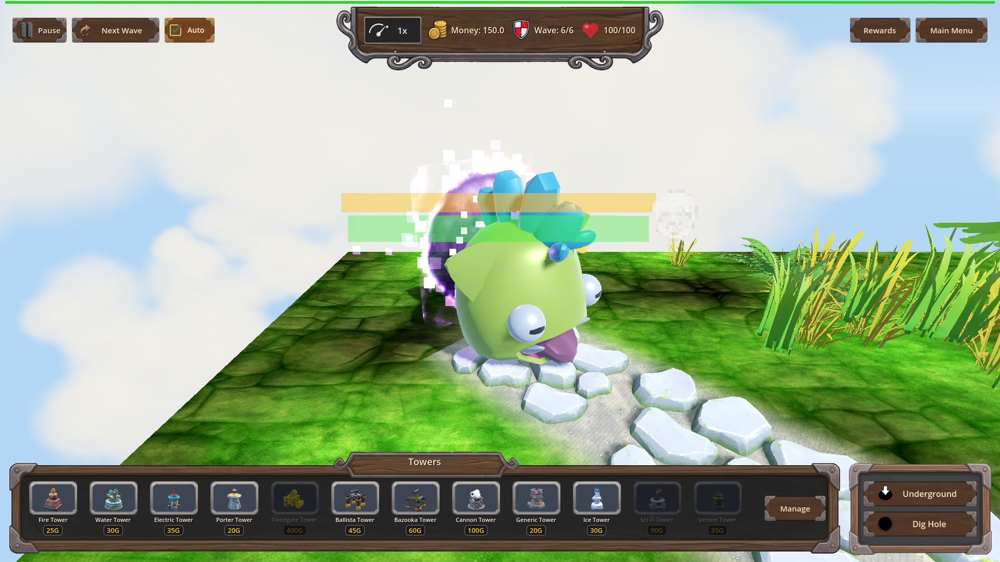
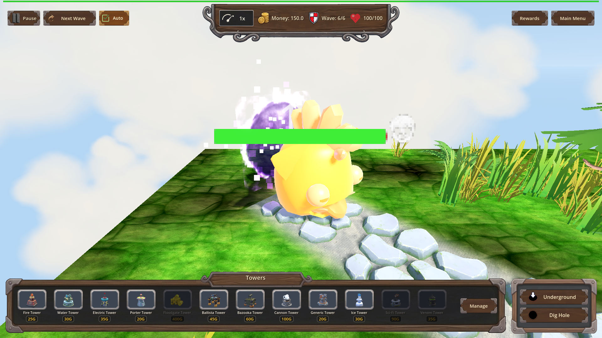
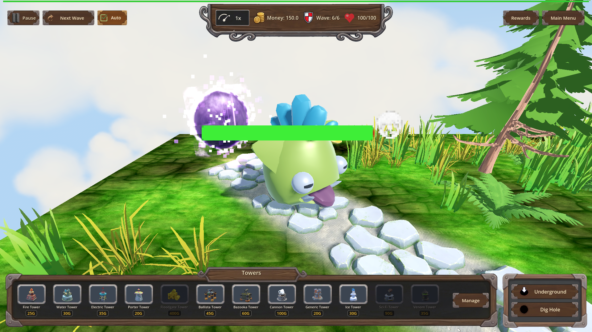
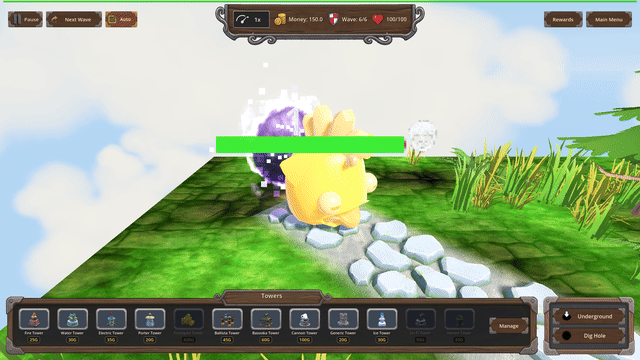

# Manual Test Report – Exposed Plating wash on the Orc King (issue #89)

## Summary

- Result: PASSED
- Tested on: 2026-08-24 (windowed Godot 4.4.1, gl_compatibility/opengl3 on Mesa llvmpipe, 1920x1080)
- Scenario: `.gen/ui_scenario.md` driven by `tests/scenarios/exposed_plating_vfx.json` (map_7, wave 6, exposed_plating L1, single Orc Enemy King boss with armor 60)
- Tester: Manual-tester profile

Overall: Ran the focused VFX scenario windowed (never headless) through `run_project_cmd`
(project=godot-td). The run exited 0 with harness status=pass (7/7 expectations) and captured
3 real screenshots plus 6 real consecutive engine frames (`record_frames captured=6 saved=6`).
Eye inspection of the fresh captures shows a clear player-visible story: green boss before the
breach, an unmistakable golden/amber glowing wash over the entire body during the Exposed
window, and plain green again after expiry. A 30 fps GIF was exported from the recorded frames.

## Scenario Walkthrough

### Step 1 – Before breach: boss at full armor, no wash

- Action: Loaded map_7, applied exposed_plating L1, triggered wave 6, waited for the Orc
  Enemy King to spawn with armor == 60, hid the debug panel, aimed the camera at the boss at
  distance 3.0 / pitch 25°, took screenshot `before_breach_no_wash`.
- Expected: Boss visible filling a large part of the frame with NO amber wash.
- Observed: Large round boss centered in frame (health bar floating above), body plainly
  green, no amber overlay anywhere on its body. Debug panel hidden; only normal top/bottom HUD.
- Status: PASS
- 

### Step 2 – Breach hit opens the Exposed window: obvious amber wash

- Action: Applied one scripted armor_hit carrying exactly the full armor value
  (armor_damage 60). Harness confirmed `exposed_count == 1` and `exposed_vfx == 1`, then took
  screenshot `exposed_wash_on_breach` inside the window (L1 duration 0.5 s, time scale slowed).
- Expected: Obvious amber cracked-shield wash over the enemy body, clearly different from Step 1.
- Observed: The SAME creature now has its whole fluffy body turned golden/amber with a bright,
  luminous glowing wash — unmistakably different from the green Step 1 still by eye. Log shows
  `[EXPOSED] triggered on Orc Enemy_boss level=1 bonus=15% dur=0.5`; the breaching hit itself was
  amplified (hp 1625 → 1614, i.e. −11 not −10). Debug panel still hidden.
- Status: PASS
- 

### Step 3 – Expiry: wash gone again

- Action: Waited for `exposed == false` and `exposed_vfx == 0`, re-aimed camera identically,
  took screenshot `wash_cleared_after_expiry`.
- Expected: Matches Step 1 — wash gone.
- Observed: Body back to pale/lime green, no amber overlay. Log shows `[EXPOSED] expire on
  Orc Enemy_boss` (multiple lines in the windowed run — cosmetic; headless logs exactly one).
- Status: PASS
- 

### Step 4 – Motion evidence: real engine-frame GIF of the whole window

- Action: `record_frames seconds=3 time_scale=0.5` while zoomed on the boss captured 6 real
  consecutive engine frames into `.gen/harness/exposed_plating_vfx/record/`; exported to a
  30 fps GIF with ffmpeg (explicit `-framerate 30`).
- Expected: More than zero real consecutive frames spanning the window, suitable for GIF export;
  visible wash fade.
- Observed: 6 frames saved (all 1920x1080). ffprobe of the exported GIF reports `30/1` fps,
  32 frames. Numeric proof of the fade: amber-pixel count in the center crop drops from
  379 → 117 between the first and last recorded frame as the wash expires, while green-body
  pixels rise (6700 → 7522).
- Status: PASS
- 

## Criteria

- Windowed VFX scenario runs with the camera close on the boss before any screenshot checkpoint
  - 
- Debug panel hidden / not covering the enemy in every capture
  - All three PNGs above show only top/bottom HUD; no debug panel over the enemy.
- `record_frames` spans the whole Exposed window and saves >0 real consecutive engine frames
  - 6 frames in `.gen/harness/exposed_plating_vfx/record/`, exported GIF:
  - 
- "During Exposed" still shows an obvious amber wash differing from "before breach" by eye
  -  vs 
  - Corroborated by pixel counts (amber center-crop px: 82 before → 303 during) and by
    `exposed_vfx == 1` asserted in-run (metadata used only as corroboration, never as the pass).
- "After expiry" matches "before breach": wash gone
  - 
- Headless regression criteria (both scenarios status=pass) were re-verified fresh this run by
  the implementation cluster; the windowed vfx result is fresh at
  `.gen/harness/exposed_plating_vfx/result.json` (status=pass, exit 0).

## Issues and Observations

- Low: The boss GLB renders as a stylized round fluffy creature rather than a humanoid orc —
  that is simply how the "Orc Enemy" asset looks; not a defect of this feature.
- Low: In the windowed run, `[EXPOSED] expire on` logs once per frame during expiry processing
  (cosmetic log spam; headless logs exactly one line).
- Low: Unrelated pre-existing warnings in this worktree: several decorative GLBs fail to load
  (sheep_shed, ruined_house, shed, portal arch, stylized earth backdrop) and invalid UID
  warnings in HudTheme.tres — none affect the Exposed VFX or the tested flow.
- Note: The r5 far-camera shots under `.gen/harness/exposed_plating_vfx/r5-too-far/` were NOT
  copied to screenshots (per plan); all embedded images come from today's fresh windowed run.

## Recommendation

Ready. The Exposed Plating amber wash is clearly player-visible at close range, appears exactly
on the armor breach and clears on expiry, and the motion evidence backs the stills. No code
changes needed for this plan.

ui_feels_broken: no
