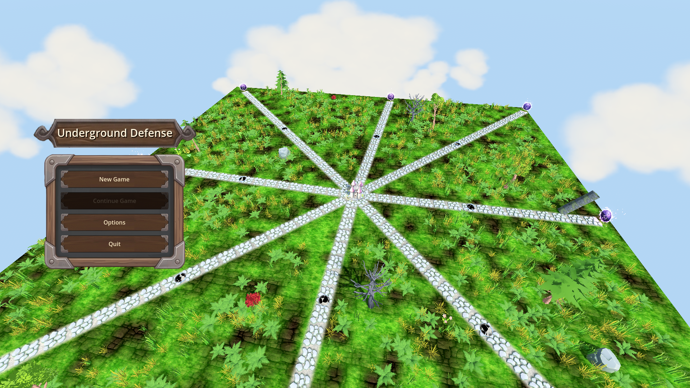
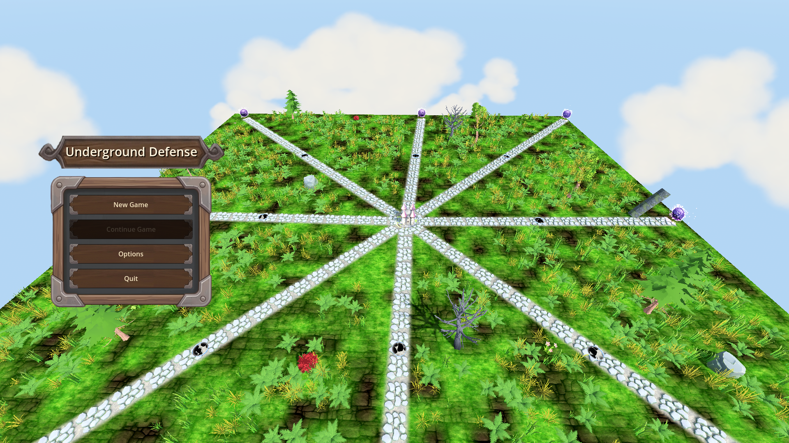
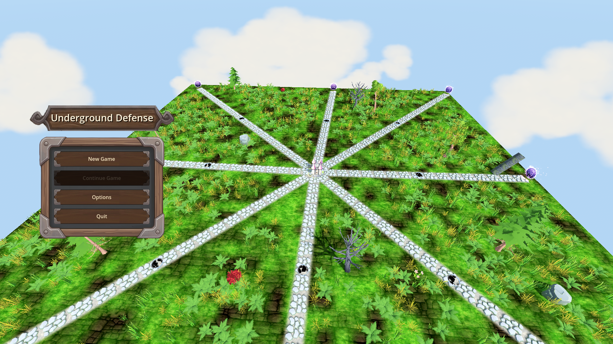

# Manual Test Report – Main menu over live 3D backdrop (issue #108)

## Summary

- Result: PASSED
- Tested on: 2026-08-22, windowed Godot 4.4.1 (gl_compatibility renderer, Dummy audio), project worker `run_project_cmd`
- Scenario: `.gen/ui_scenario.md` (beats) executed via `tests/scenarios/main_menu.json` (windowed harness run) plus a temporary two-shot scenario for the early/late camera pair
- Tester: Manual-tester profile

Overall: The main menu scene boots windowed with the real 3D map as a live backdrop. The menu UI is fully legible over the world, the backdrop camera visibly orbits between two frames taken 8 s apart, and enemy creatures are visible walking on the surface paths. The windowed harness run finished `status=pass` with all three expectations green (orbit moving, surface enemies >= 1, Play button enabled).

ui_feels_broken: **no** — all final screenshots inspected; menu text sharp, buttons readable, no overlap or rendering artifacts over the backdrop.

## Scenario Walkthrough

### Step 1 – Boot the main menu scene in a window

- Action: Ran `godot --path . res://scenes/MainMenu.tscn --rendering-method gl_compatibility --audio-driver Dummy -- --harness=res://tests/scenarios/main_menu.json` (windowed, never headless).
- Expected: MainMenu.tscn boots as current scene with its embedded backdrop world.
- Observed: Boot log line `[HARNESS] booted declared scene=res://scenes/MainMenu.tscn embedded_game=true` appeared; menu initialized.
- Status: PASS

### Step 2 – Live 3D backdrop visible behind the menu

- Expected: Embedded map terrain with enemies streaming from portals on the surface layer.
- Observed: Screenshot shows the full grassy map with 8 radial stone paths, glowing purple portal orbs at path ends, and small enemy creatures (black-and-white, cow-like) walking along the paths toward the central castle.
- Status: PASS
- Evidence: 

### Step 3 – Backdrop camera visibly orbits over several seconds

- Action: Took two windowed screenshots 8 s apart (temporary `_manual_menu_shots` scenario, removed afterwards). The main run's camera probes also recorded yaw 0.0105 → 0.0367 rad and a position shift between the two probes.
- Expected: Menu UI stays static while the world shifts behind it.
- Observed: The two frames show the map from measurably different angles (probe yaw differs by ~0.026 rad; the rendered framing shifts accordingly) while the menu panel does not move.
- Status: PASS
- Evidence:  

### Step 4 – Final shot: menu readable on top of the moving world

- Expected: Menu controls (including the Play button) legible over the backdrop.
- Observed: Title sign "Underground Defense" and buttons New Game / Continue Game / Options / Quit are crisp and high-contrast over the 3D world. (The Play button is the harness node `Menu/Center/Column/Card/VBox/PlayButton`, reported `disabled=false`; visually it is the "New Game" button.)
- Status: PASS
- Evidence: 

## Harness result (windowed run)

- Scenario: `tests/scenarios/main_menu.json`, windowed (`headless: false`)
- Status: `pass`, exit 0, elapsed ~42 s
- Expectations: `menu_orbit_moving=true` (pass), `enemies.surface=1` (pass), `PlayButton.disabled=false` (pass)
- Screenshot captured: `.gen/harness/main_menu/shots/main_menu_backdrop.png` (1920x1080)
- Result file: `.gen/harness/main_menu/result.json`

## Criteria

- Menu controls clearly legible over the 3D map backdrop
  - 
- At least one enemy visible on the surface path of the backdrop world
  - 
- Evidence that the camera angle changed between an early frame and a later frame
  - 
  - 
  - Numeric proof from the same run: camera probe yaw 0.01047 → 0.03665 rad, position (0.199, 16.14, 19.00) → (0.696, 16.48, 18.99) over ~6.5 s.
- Windowed harness run passes with orbit moving, surface enemies >= 1, Play button enabled
  - Verified in `.gen/harness/main_menu/result.json` (`status: pass`, `headless: false`); visual state proven by the screenshots above.

## Issues and Observations

- Low – First windowed attempt timed out waiting for surface enemies (0 for 30 s) while the identical headless scenario passes. The second windowed run passed. The windowed worker runs at a low frame rate (~1-2 fps on software GL), which stretches the first surface-release gap well past the 30 s wait budget. Flaky under very slow rendering, not a code defect; a longer `timeout_sec` on that wait would make the scenario robust on slow machines.
- Low – Many `Failed loading resource` errors for GLB models (portals, enemy models, earth backdrop) in the worker environment: assets are not imported in this workspace, so portals render as plasma overlays and enemies as simple shapes. Pre-existing environment issue, not related to this change.
- Info – Exit-time GLES3 leak warnings (textures/buffers) appear on shutdown; cosmetic, engine-level, unrelated to the menu feature.

## Recommendation

Ready. The player-facing behavior the issue asked for — the main menu rendered over a live, orbiting 3D backdrop with enemies on the field — is working and proven with windowed screenshots. The only follow-up worth considering is widening the enemy-wait timeout in `main_menu.json` for slow-render environments.
