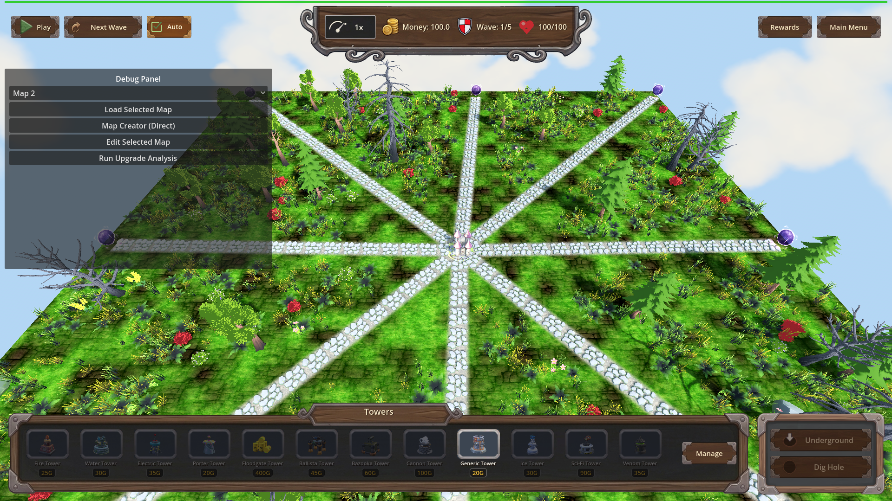
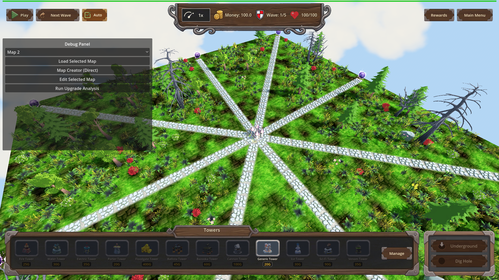

# Manual Test Report – nature-decoration-counts (manual-visual-verification)

## Summary

- Result: PASSED
- Tested on: 2026-08-24, windowed Godot 4.4.1 (gl_compatibility / llvmpipe, audio Dummy), 1920x1080
- Scenario: tests/scenarios/nature_decoration_manual.json (per .gen/ui_scenario.md)
- Tester: Manual-tester profile

I ran the windowed manual scenario fresh through the project runner (never headless).
The game booted, loaded `map_1` (20x20) then switched to `custom_map` (50x50),
the decoration layer built without errors, and two full-board screenshots were
captured and inspected. Trees, bushes, flowers and dead trees are spread across
the whole grass field; paths, egg castle, portals and HUD render cleanly.
UI sanity verdict: `ui_feels_broken: no`.

## Scenario Walkthrough

### Step 1 – Map loads; decoration layer builds without errors

- Action: Ran windowed `godot --path . res://scenes/Main.tscn --rendering-method gl_compatibility --audio-driver Dummy -- --harness=res://tests/scenarios/nature_decoration_manual.json`
- Expected: Map finishes loading; nature decoration layer builds without errors.
- Observed: `[NATURE] counts for 50.0x50.0 map (area 2500): scale_factor=6.2500 trees=25 bushes=38 flowers=31 dead_trees=13` in the log; "Nature decoration generation complete!" with no fatal errors (only benign missing-Petal/Mushroom model warnings that also exist on baseline maps). Harness result: status=pass, exit=0.
- Status: PASS

### Step 2 – Camera shows full 50x50 board

- Action: Harness screenshot after wait for `nature.custom_map.scale_factor == 6.25`.
- Expected: Full board visible from above; decorations distributed across the entire grass field, respecting path/egg/spawner clearances; no placeholders or z-fighting.
- Observed: Screenshot shows stone paths radiating from the central castle, purple portal orbs at spawners, and pine trees, dead trees, bushes and red flowers scattered across every quadrant of the grass — not clustered in one corner. No checkered missing-model placeholders, no z-fighting. HUD (money 100.0, wave 1/5, health 100/100, tower bar) renders correctly.
- Status: PASS

### Step 3 – Rotated second angle

- Action: Camera rotated 120°, second screenshot captured.
- Expected: Same distribution visible from another angle.
- Observed: Vegetation still spread over left/right/top/bottom edges of the playable area; castle, paths and portals clearly visible; no artifacts or broken UI.
- Status: PASS

## Criteria

- In a windowed (non-headless) run with PNG screenshots captured, `custom_map` (50x50) visibly shows trees and bushes spread across the whole board, not only near the paths or one corner; overall UI sanity verdict recorded as `ui_feels_broken: yes|no`.
  - 
  - 
  - Verdict: **ui_feels_broken: no**

Supporting (headless cluster 1, from this iteration's harness runs): focused scenario
`nature_decoration_scaling.json` passed 18/18 expectations — map_1 factor 1.0 counts
4/6/5/2; custom_map factor 6.25 placed 25/38/31/13; override map 9/3/7/1;
`[NATURE]` debug line present naming width, height, factor and counts.

## Issues and Observations

- Missing nature models warned at runtime (`Petal`, `Mushroom_Laetiporus`) — pre-existing asset gaps, no visual placeholder shown on screen. Severity: Low.
- Exit-time GL leak warnings from Godot on quit — engine shutdown noise only, not player-visible. Severity: Low.
- HudTheme.tres invalid UID warnings (falls back to text paths) — cosmetic log noise, textures load fine. Severity: Low.

## Recommendation

Ready. The windowed visual criterion passes with clear evidence; no code fixes needed for the manual cluster.
