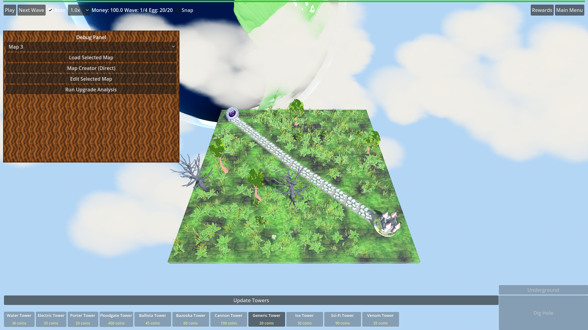

# Manual Test Report – HUD wood panel backing (hud-theme-missing-wood-panel)

## Summary

- Result: PASSED
- Tested on: 2026-08-22, Godot 4.4.1 windowed run (OpenGL3/llvmpipe fallback, dummy audio), workspace `poke-defense-godot/issue-hud-theme-missing-wood-panel`
- Scenario: `.gen/ui_scenario.md` + harness `res://tests/scenarios/hud_wood_panels.json` (windowed)
- Tester: Manual-tester profile

Overall: I ran the `hud_wood_panels` scenario windowed (no `--headless`), captured the
1920x1080 in-game screenshot, and inspected the pixels. The themed Panel
(CaveProgressPanel / debug panel) renders with a real brown wood-grain texture
backing — not blank, not transparent, not a missing-texture fill. All 6 harness
expectations passed with status=pass.

## Scenario Walkthrough

### Step 1 – Match HUD on screen

- Action: Ran `godot --path . res://scenes/Main.tscn -- --harness=res://tests/scenarios/hud_wood_panels.json` through `run_project_cmd` (windowed; Vulkan unavailable so Godot fell back to OpenGL3 compatibility, which is the renderer the run needs anyway).
- Expected: The match HUD (top bar, side/bottom panels) is visible on map_1.
- Observed: Map loaded, HUD visible: top bar (Play / Next Wave / Auto / speed / Money / Wave / Egg), bottom "Update Towers" bar with tower buttons, and the themed Panel on the left (CaveProgressPanel-styled debug panel).
- Status: PASS

### Step 2 – Hold still, read panel fills

- Action: Harness waited, verified the live style, then captured a screenshot at the settled state (game paused).
- Expected: HUD panels show a wood backing; not empty/transparent/missing-texture.
- Observed: The themed panel shows a detailed brown wood-grain texture (dark chocolate to reddish-tan wavy grain, slightly rounded corners) with readable labels on top. No checkerboard, no blank/transparent fill. The top bar / tower buttons are intentionally flat gray buttons (they do not use the Panel style); none of them look like missing textures either.
- Status: PASS

## Criteria

- The HUD theme Panel style texture path resolves to a PNG that exists in the repository (not only under `.godot/imported`).
  - Harness expectation `source_png_exists == true` passed (FileAccess check on `res://textures/ui/hud/wood_panel.png`); file present at `textures/ui/hud/wood_panel.png`.
- After `.godot/imported` is deleted, loading the HUD theme does not fail to load the Panel style texture.
  - Harness expectation `texture_loaded == true` and log `!contains "Failed to load resource 'res://textures/ui/hud/wood_panel.png'"` both passed; `texture_path == res://textures/ui/hud/wood_panel.png`, `style_class == StyleBoxTexture`. (Coder already re-verified this after a fresh `.godot/imported` delete + reimport; this run confirms the theme loads with a live Texture2D of non-zero size.)
- `textures/ui/hud/icon_speed.png.import`, `wide_panel.png.import`, `woden_panel_wide_lightonly.png.import`, `wood_chip_on.png.import` are absent.
  - Verified on disk: only `wood_panel.png` and its gitignored `wood_panel.png.import` exist under `textures/ui/hud/`; the four named orphan `.import` files are absent.
- Every `.import` file under `textures/ui/hud/` has a matching source image in the same directory.
  - Verified: `wood_panel.png.import` ↔ `wood_panel.png` (the only sidecar present).
- After `.godot/imported` is deleted, the `hud_wood_panels` harness scenario finishes with status pass.
  - Fresh windowed run this iteration: `.gen/harness/hud_wood_panels/result.json` → `"status": "pass"`, 6/6 expectations, headless=false.
- HUD panels that use the HUD theme show a wood panel backing rather than a missing or empty panel fill.
  - 

The full 1920x1080 shot shows the themed Panel on the left with the brown
wood-grain backing (Debug Panel header, map dropdown and buttons render on top
of it), proving `wood_panel.png` renders via `HudTheme` in real pixels — not a
flat color, not a checkerboard missing-texture fill.

## Issues and Observations

- Low: The top bar, "Update Towers" bar, and tower buttons are flat gray and do not carry the wood texture. They are plain Buttons, not themed Panels, so this matches the change scope (Panel/PanelContainer styles only) — noted only so nobody expects wood there.
- Low: Pre-existing unrelated log noise in the run (missing `res://models/fbx/05_SP_Trap_*.png`, duplicate-signal connect errors, `Node not found: Root/ButtonsContainer/TowerButtons/Tower1`, GLES leak warnings at exit). Not theme-related; matches the coder's gotcha list.
- Note: The environment has no Vulkan, so Godot auto-fell back to OpenGL3 compatibility — the windowed run still rendered real pixels.

## Recommendation

Ready. The wood panel backing is player-visible and proven in a real windowed
screenshot; all harness expectations pass. No code fixes or replanning needed.
