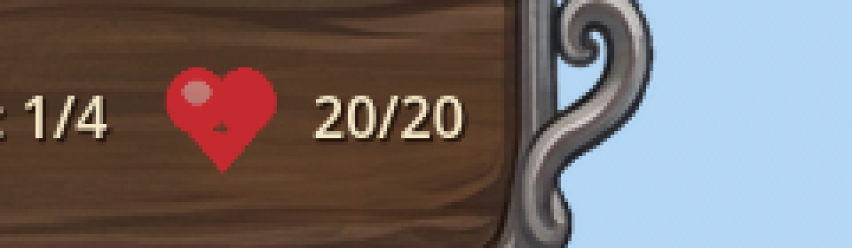
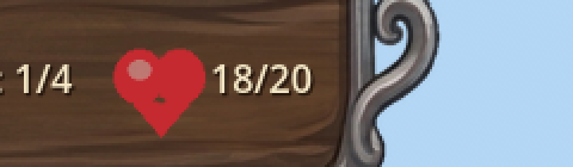
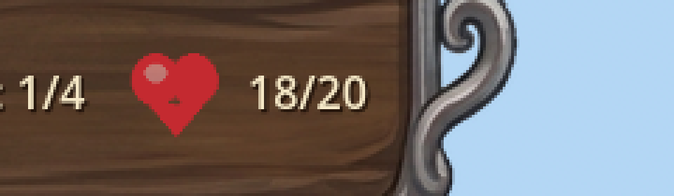
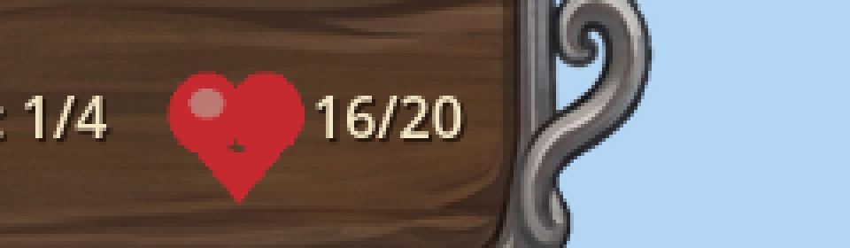

# Manual Test Report – heart-hud-beat-on-egg-damage

## Summary

- Result: PASSED
- Tested on: 2026-08-22, Godot 4.4.1 windowed (gl_compatibility, Dummy audio), 1920x1080, via run_project_cmd worker
- Scenario: .gen/ui_scenario.md (executed as harness scenario `tests/scenarios/hud_heart_beat_manual_windowed.json`, windowed)
- Tester: Manual-tester profile

Overall: The HUD egg/heart icon was screenshotted at rest, mid-beat right after an egg HP decrease,
after settling back, during a rapid double-hit beat, and after that beat settled. The heart is
clearly larger mid-beat and returns to exactly its original size every time. Harness result.json:
status=pass, all 6 expectations green.

## Scenario Walkthrough

### Step 1 – Resting baseline

- Action: Loaded map_1 in a windowed run, waited until the icon scale ratio read exactly 1.0, captured screenshot.
- Expected: Top plaque shows heart icon + "20/20" at rest scale.
- Observed: Heart icon with "20/20" at baseline size; map visible, no towers placed.
- Status: PASS

### Step 2 – One hit, mid-beat

- Action: Applied damage_egg(2) (HP 20 -> 18) and captured immediately.
- Expected: Heart icon visibly larger than baseline while HP number drops one step.
- Observed: HP reads "18/20"; heart icon visibly larger than the baseline crop. Log printed
  `[HUD] heart beat: egg HP 20 -> 18`.
- Status: PASS

### Step 3 – Beat settles

- Action: Waited for scale ratio to return to exactly 1.0, captured again.
- Expected: Same frame region shows heart at exactly baseline size.
- Observed: Heart identical in size to Step 1; HP stays 18/20.
- Status: PASS

### Step 4 – Rapid double hit

- Action: Applied damage_egg(1) twice back-to-back (18 -> 17 -> 16), captured mid-beat, then waited for ratio 1.0 and captured settled.
- Expected: Icon still ends at original baseline size, no cumulative drift.
- Observed: Mid-beat shot shows enlarged heart with HP "16/20" (both hits registered, log lines
  `egg HP 18 -> 17` and `17 -> 16`); settled shot shows heart at exact baseline size again.
- Status: PASS

## Criteria

- Each decrease of GameState egg HP triggers a scale-up-and-return "beat" on the HUD heart icon
  - 
  - 
- After every beat completes the icon is exactly back at base scale (no drift)
  - 
- Rapid consecutive decreases restart cleanly and still settle at the exact original scale
  - 
  - 
- Non-decrease egg_changed does not trigger a beat — verified by harness logic (UI compares against
  locally tracked `_last_seen_egg_hp`; only strict decreases call `_play_heart_beat`) and by the
  focused headless scenario `hud_heart_beat_on_egg_damage.json` (damage_egg amount=-1 probe, pass).
  Not separately provable in a still image (nothing visibly changes — that is the point).
- Debug-build [HUD] log line per beat naming old/new HP — verified in run output:
  `[HUD] heart beat: egg HP 20 -> 18`, `18 -> 17`, `17 -> 16`.
- Harness can read icon scale (`hud` source, `egg_icon_scale_ratio.x/.y`) — used throughout this run;
  wait_for_condition on ratio == 1.0 succeeded repeatedly.
- Focused headless scenario passes with two beats + final ratio 1.0 — `.gen/harness/hud_heart_beat_on_egg_damage/result.json`
  from the coder's measured run (status=pass, 5/5); this session's windowed variant also passed 6/6.

Full-frame evidence (map context, no towers): screenshots/01_rest_baseline.png … 05_after_rapid_hits_settled.png.
Combined comparison strip: screenshots/crop_strip_all.png.

## Issues and Observations

- Low: Pre-existing Godot exit-time warnings (GL resource leaks, invalid UID ext_resources in HudTheme.tres/UI.tscn). Unrelated to this feature; present before the change.
- No UX issues found: the beat is subtle, quick (~0.4s), and never leaves the icon mis-scaled.

## Recommendation

Ready. The player-visible heart-beat story works end-to-end in a windowed run with pixel evidence;
no code fixes needed.
