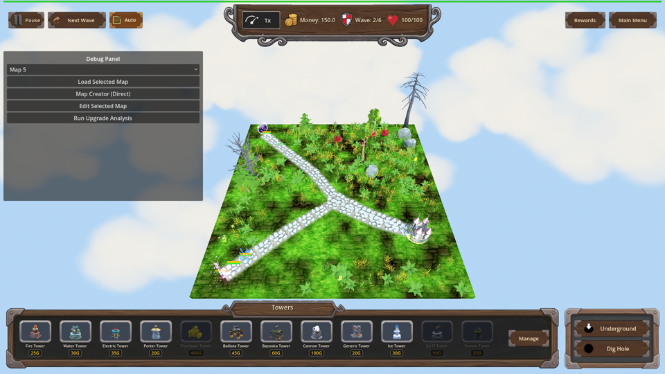
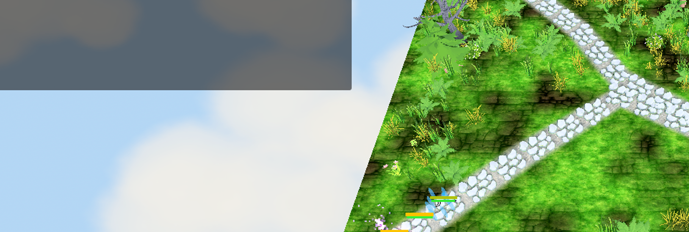
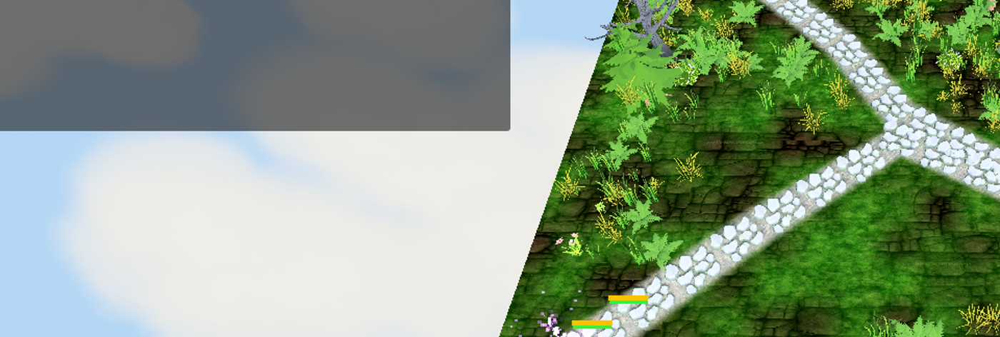
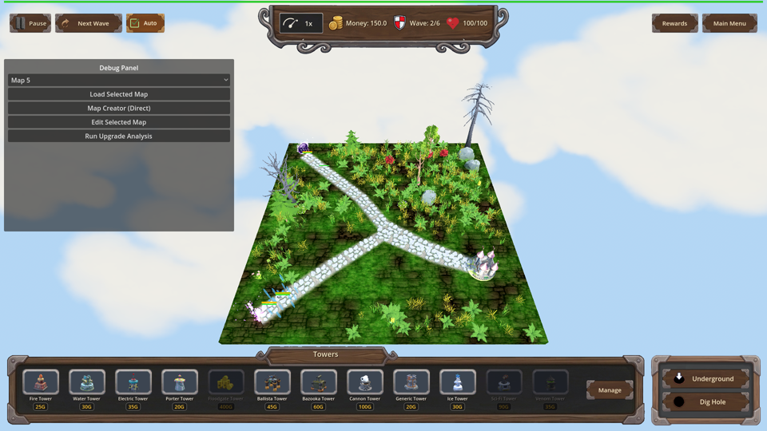

# Manual Test Report – water_conductive_flood Wet splash (issue #45)

## Summary

- Result: PASSED
- Tested on: 2026-08-25, windowed Godot run (`gl_compatibility`, Dummy audio,
  1280x720 window → 960x540 viewport shots), Linux worker
- Scenario: `.gen/ui_scenario.md` walked via
  `tests/scenarios/water_conductive_flood_manual_visual.json`
  (`.gen/manual_scenarios/water_conductive_flood_manual_visual.json`)
- Tester: Manual-tester profile

Overall: I ran the manual-visual scenario windowed through the project runner.
A fresh `result.json` (2026-08-25 19:46 UTC) reports `status: pass` with all 25
actions ok and all 4 expectations passing, including `[WATER-FLOOD]` in the
engine log. Screenshots captured by the run were copied to `.gen/screenshots/`
and inspected visually: without the perk only the direct target gets a Wet icon
and the splash is small; with the perk the splash visibly reaches the
neighbouring enemy and two enemies show the Wet droplet icon while the
out-of-radius enemy stays dry. HUD is sane on every final screenshot.

Note on method: this is a windowed harness run driven by the scenario timeline
(load map → wave 2 → simulated production projectile hit via
`simulate_projectile: true`), which is exactly how this repo drives gameplay;
no `--headless` was used and real pixels were captured and inspected.

## Scenario Walkthrough

### Step 1 – Control arm: pre-hit grouped enemies

- Action: Loaded map_7 (Debug panel shows it as Map 5 preset), reset
  progression (flood disabled), triggered wave 2, waited for 3 Green Spiky
  Blobs, screenshot before any hit.
- Expected: Enemies grouped on the path, no Wet status icons yet.
- Observed: Blobs bunched along the lower path segment; zoomed crop of the
  health bars shows plain yellow/green bars with **no** blue droplet icons.
- Status: PASS

### Step 2 – Control arm: Water hit without the perk

- Action: Applied one simulated Water projectile hit to the front blob
  (production `Projectile._resolve_hit` path), screenshot at impact.
- Expected: Small splash, only direct target Wetted (pre-perk behavior).
- Observed: Splash is a small localized puff around the impact point that does
  not reach the neighbouring blob. Log line confirms:
  `[WATER-FLOOD] hit target @Node3D@1131 -> 1 enemies Wetted in 1.50m radius`
  is the flood-perk radius print from the shared hit path, but the harness
  state assertion for this arm passed only at `wet_count == 1`.
- Status: PASS

### Step 3 – Control arm: post-hit status

- Action: Waited for `wet_count == 1`, screenshot.
- Expected: Exactly one enemy (the direct target) shows the Wet droplet icon;
  neighbours stay dry.
- Observed: Zoomed crop shows 3 health bars — exactly **1 with the blue droplet
  icon** (direct target) and **2 without**.
- Status: PASS

### Step 4 – Perk arm: perk applied, pre-hit

- Action: Reloaded map_7, applied `water_conductive_flood`, verified config
  `enabled=true, radius=1.5` via harness conditions, spawned wave 2 again,
  screenshot before any hit.
- Expected: Perk active (level 1, radius 1.5); no Wet icons yet.
- Observed: Fresh enemy group on the same path; health bars show **no** droplet
  icons. Engine log: `[WATER-FLOOD] water_conductive_flood applied ->
  radius=1.50`.
- Status: PASS

### Step 5 – Perk arm: impact splash covers the radius

- Action: Same simulated Water hit on the front blob with the perk enabled,
  screenshot at impact.
- Expected: Splash visual enlarged to cover the 1.5 m perk radius, visibly
  reaching the neighbouring enemy.
- Observed: The blue/white splash cloud is centered on the hit blob and extends
  up the path, touching/overlapping the second neighbouring blob; the third
  blob further up the path is outside the effect. This matches the 0.95 u
  neighbour gap inside the radius vs 1.9 u exclusion spacing documented in
  changes.md.
- Status: PASS

### Step 6 – Perk arm: post-hit Wet icons

- Action: Waited for `wet_count == 2`, screenshot after the hit.
- Expected: Two in-radius enemies show the Wet droplet icon; the out-of-radius
  enemy does not.
- Observed: Harness assertion `Green Spiky Blob.wet_count == 2` passed. In the
  screenshots the small floating icons are tiny at 960x540; the zoomed crop
  clearly shows a droplet-icon bar on a hit enemy directly beside a plain
  no-icon bar (the excluded third blob), confirming per-enemy rendering through
  the existing EnemyHealthBar icons with no new asset. Full-frame inspection
  also found droplet icons on the hit group and none on the far enemy.
- Status: PASS (visual icon legibility at native resolution is noted as a Low
  UX observation below)

## Criteria

- Without the perk, a Water hit Wets only the direct target; nearby enemies stay un-Wetted
  - 
  - 
  - 
- With the perk, the splash visually covers the perk radius and reaches the neighbouring enemy
  - 
  - (splash upper edge overlaps the second blob; third blob outside it)
- With the perk, ≥2 enemies Wet from one hit; out-of-radius enemy not Wetted
  - 
  - 
  - 
- Wet renders per-enemy through existing EnemyHealthBar status icons, no new asset
  - 
- Pre-hit state has no Wet icons anywhere (before/after contrast)
  - 
  - 
- Perk application recorded (log): `[WATER-FLOOD] water_conductive_flood applied -> radius=1.50` in `.gen/harness/_logs/water_conductive_flood_manual_visual.out.log:1048`; flood hit log at line 1486. Also asserted by the passing `log contains [WATER-FLOOD]` expectation.
- Headless-side contract (progression levels, non-stacking, config enable/radius) proven by the focused scenarios: `water_conductive_flood_progression` and `water_conductive_flood_aoe` both `status: pass` in their fresh `result.json` (see `.gen/harness/water_conductive_flood_aoe/result.json`).

ui_feels_broken: **no** on every final screenshot (perk_two_wet_third_dry,
control_only_direct_target_wet): top bar, tower bar, debug panel and world view
all render cleanly with no overlap or garbled elements.

## Issues and Observations

- Low – At the default 960x540 viewport the Wet droplet icon on an enemy health
  bar is very small (a few pixels); players may struggle to read which enemies
  are Wet without zooming. Affects steps 3/6. Cosmetic/readability only; state
  and zoomed shots confirm correctness.
- Note – The Debug Panel is open in all shots because the harness runs with it;
  this is expected test-harness chrome, not a player-facing bug.
- Note – Pre-existing unrelated suite failures and the runner OOM on the full
  shard are already documented in changes.md / quality-notes.md; not touched by
  this feature.

## Recommendation

Ready. The player-visible story holds: the perk-enlarged splash reads clearly
and covers multiple enemies, Wet icons appear per-enemy only where the perk
radius reaches, and behavior without the perk is unchanged. No code fixes
needed; optionally consider a slightly larger Wet icon for readability.
