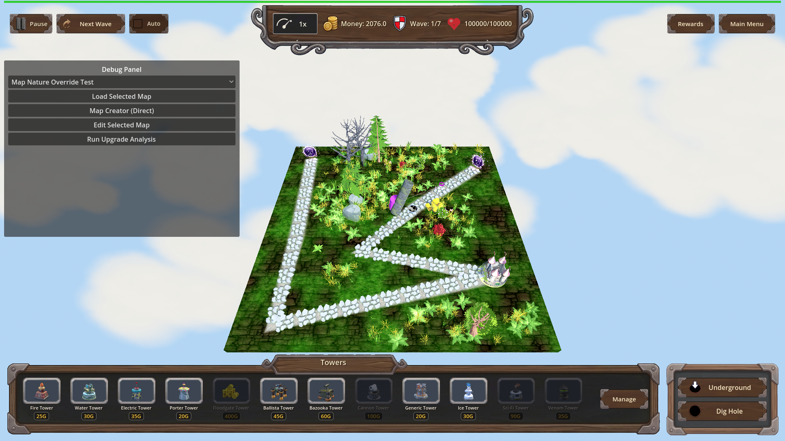
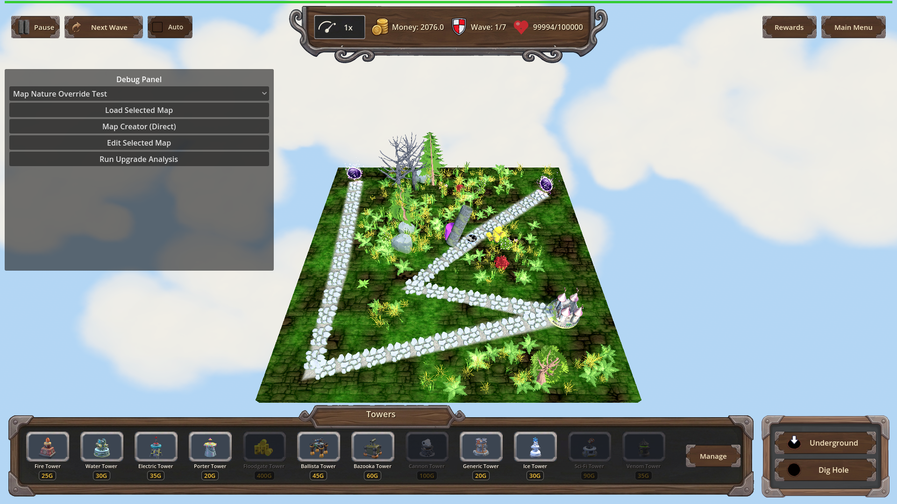
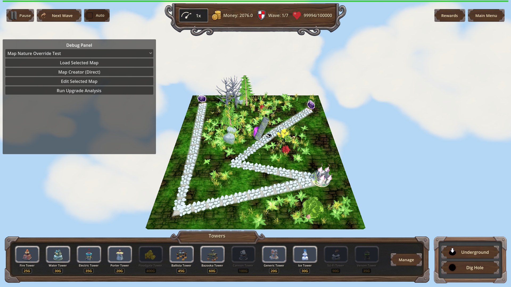
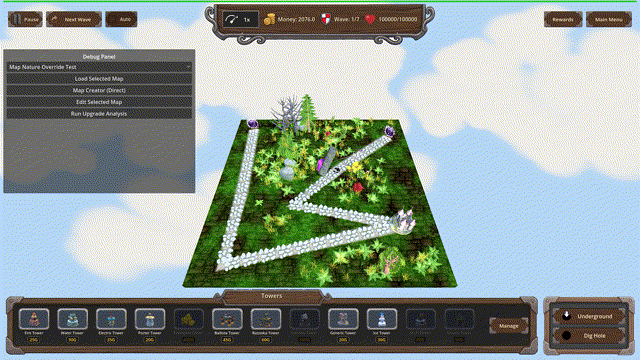

# Manual Test Report – porter_mass_transit bulk sweep (issue #81)

## Summary

- Result: PASSED
- Tested on: 2026-08-25, Godot 4.4.1 windowed (software GL / llvmpipe, OpenGL compatibility), Linux worker via run_project_cmd
- Scenario: .gen/ui_scenario.md (windowed run of tests/scenarios/porter_mass_transit_manual.json — a manual variant of the focused A/B scenario with slow-motion frame capture)
- Tester: Manual-tester profile

Overall: I ran the porter_mass_transit harness scenario in a real windowed Godot session on map_6 and captured screenshots plus a slow-motion 30 fps GIF of the perk-on mass sweep. The perk-off arm teleported only the locked target; the perk-on arm swept the follower together with the locked target, each enemy showing its own rings/burst/dissolve, and the [PORTER_MASS_TRANSIT] debug log appeared on stdout. Nothing about the visuals felt broken.

## Scenario Walkthrough

### Step 1 – Staging (perk off)

- Action: Loaded map_6, added hole + exit, placed a Floodgate probe tower and a Porter at (0.26,-1.5) beside path_1, verified the perk is unowned/level 0.
- Expected: Map staged, no mass-transit perk owned.
- Observed: All staging actions ok; snapshot `perk_off_ready_unowned_level0` shows money 2076, wave 1/7, HP 100000.
- Status: PASS

### Step 2 – Perk-off charge completes: single target only

- Action: Started play, queued two Green Blobs single-file past the Porter, waited for the locked target to dissolve.
- Expected: Only the locked target dissolves/teleports; the nearby follower stays on the surface path.
- Observed: `enemies.dissolving == 1` exactly, then underground >= 1, and floodgate damage stayed <= 8 (one blob's worth) after settling. The stdout log shows no sweep line during this arm. Screenshot shows one dissolve ring while the second enemy is still walking normally.
- Status: PASS

### Step 3 – Grant perk (idempotent) and repeat staging

- Action: Applied `porter_mass_transit` twice via apply_progression; reloaded map_6 and re-staged identically.
- Expected: Perk reports owned at level 1 after both applications (idempotent toggle).
- Observed: `is_porter_mass_transit_owned == true`, `get_current_level == 1` held after double-apply.
- Status: PASS

### Step 4 – Perk-on mass sweep (the money shot)

- Action: Queued the same two blobs; inserted a before-shot and an 8 s slow-motion record_frames capture (time_scale 0.1) around charge completion, then screenshot checkpoints mid-dissolve.
- Expected: Locked target AND every surface enemy within the tight radius begin dissolving/teleporting together, each with visible rings + burst + dissolve feedback.
- Observed: `enemies.dissolving >= 2` fired; stdout printed `[PORTER_MASS_TRANSIT] target=@Node3D@1181 swept=1` (locked target plus 1 additional swept enemy). Screenshots show two enemies simultaneously wrapped in purple teleport rings near the Porter while another enemy outside the radius keeps walking the path untouched. Floodgate damage rose above the single-blob level (final expectation damage_by_type.floodgate = 14 > 8), proving the follower actually went underground.
- Status: PASS

## Criteria

Visible acceptance bullets from plan.md, with proving shots:

- Without the perk, a fully charged Porter teleports only its locked target; others are untouched
  - 
  - (harness assertion: dissolving == 1 exactly, floodgate damage <= 8 — passed in result.json)
- With the perk, every other surface enemy within the tight radius begins the same teleport as the locked target
  - 
  - 
  - 
- Every additional swept enemy receives the same per-enemy feedback (rings, burst, dissolve)
  - 
  - Harness assertions confirmed both enemies carry the porter dissolve tween simultaneously (dissolving >= 2).
- Debug-build [PORTER_MASS_TRANSIT] log line per sweep event naming target + count
  - Verified from windowed run stdout: `[PORTER_MASS_TRANSIT] owned` and `[PORTER_MASS_TRANSIT] target=@Node3D@1181 swept=1` (no PNG can show a console line; text evidence above).
- Focused harness scenario proves perk-off vs perk-on on map_6 and passes
  - result.json status: **pass** at `.gen/harness/porter_mass_transit_manual/result.json` (same timeline as `tests/scenarios/porter_mass_transit.json` plus capture actions); all 3 expectations passed.

Non-visual bullets (catalog definition, ownership API, dead/underground/beyond-radius exclusions, per-enemy route validity) are logic-only and were covered by the headless feature-check; not re-proven by stills here.

## Issues and Observations

- The sweep radius here is tight by design (Game.path_half_width ≈ 0.4): with only two single-file blobs, "clumped group" reads as exactly 2 enemies swept. Visual story is clear but minimal — a denser clump would make the bulk effect more obvious in marketing-style shots. Severity: Low (cosmetic observation only).
- Software-GL worker renders ~2 fps real time, so record_frames used time_scale 0.1 to sample the same animation across 12 rendered frames; the exported GIF plays back at true speed at 30 fps (verified ffprobe r_frame_rate 30/1). No product issue.
- ui_feels_broken judgment: **no** — effects are readable, selective (unaffected enemies keep walking), and nothing overlaps or glitches in any captured frame.

## Recommendation

Ready. The player-visible bulk-sweep behaviour matches the plan: selective radius, simultaneous multi-enemy teleport with full per-enemy feedback, correct perk-off preservation of single-target behaviour. No code fixes needed from the UI pass.

---

Manual-test result: PASSED. Scenario: .gen/ui_scenario.md.
Report: .gen/manual-report.md. Escalation: no.
