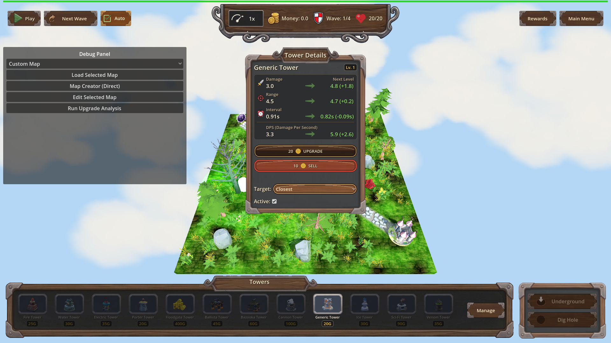
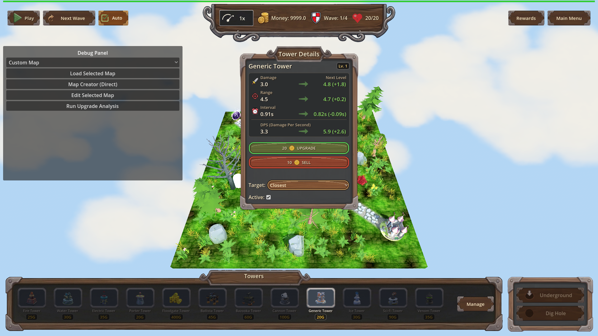
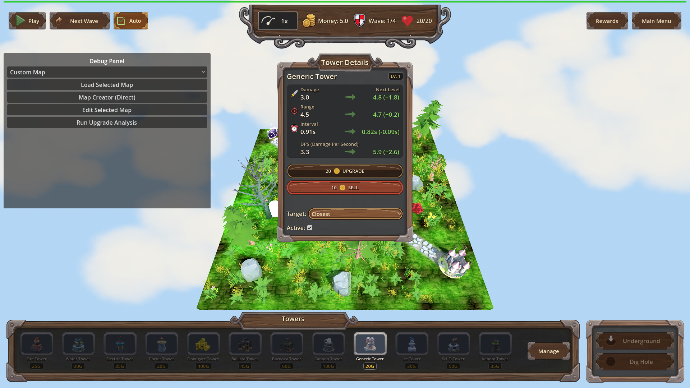

# Manual Test Report – Upgrade button affordability (issue #135)

## Summary

- Result: PASSED
- Tested on: 2026-08-22, windowed Godot 4.4.1 (gl_compatibility, Dummy audio) via project runner `poke-defense-godot/issue-upgrade-button-disabled-without-money`
- Scenario: `.gen/ui_scenario.md` (walked as windowed visual twin `tests/scenarios/issue_135_upgrade_button_visual.json` of the focused harness scenario)
- Tester: Manual-tester profile

Overall: The upgrade panel was opened on a placed Generic tower with money below the
upgrade cost, then money was granted and re-drained while the panel stayed open on the
same tower. The Upgrade button visibly flipped disabled → enabled → disabled with no
re-selection or re-opening. Live button state assertions (`ui_call.is_upgrade_button_disabled`)
passed at each step and the engine log shows exactly one `[UPG-BTN]` transition per direction.

## Scenario Walkthrough

### Step 1 – Open upgrade panel while broke

- Action: Placed a Generic tower on map_1 (money 200→180), set money to 0, selected the
  tower and opened the details panel; no further input.
- Expected: Panel open from the first frames with the Upgrade button greyed out/disabled,
  price caption still readable.
- Observed: Tower Details panel open ("Generic Tower", Level 1), Upgrade button shows the
  coin icon + cost "20", rendered in its dimmed/disabled wood texture (distinct from the
  bright green enabled look). Money display reads 0.0. Harness confirmed live button state
  disabled=true.
- Status: PASS

### Step 2 – Fund the player while panel stays open

- Action: Set money to 9999 without re-selecting or closing anything.
- Expected: Upgrade button becomes enabled within a frame.
- Observed: Same panel still open; Upgrade button is now bright saturated green (enabled),
  cost caption "20" unchanged, Money reads 9999.0. Log line:
  `[UPG-BTN] upgrade button available kind=generic level=1 cost=20 money=9999`.
- Status: PASS

### Step 3 – Drain money back below cost while still open

- Action: Set money to 5, again with no re-selection.
- Expected: Upgrade button disabled again within a frame.
- Observed: Upgrade button back to the dark muted disabled texture, Money reads 5.0,
  cost caption still readable. Log line:
  `[UPG-BTN] upgrade button unavailable kind=generic level=1 cost=20 money=5`.
- Status: PASS

## Criteria

- When the upgrade panel is open on a selected tower whose next-level cost exceeds current
  money, the Upgrade button is disabled without any further input (no reopen, no click elsewhere).
  - 
- While the upgrade panel stays open on the same tower, granting money so it meets or exceeds
  the upgrade cost enables the Upgrade button within one frame of the money change.
  - 
- While the upgrade panel stays open on the same affordable tower, spending money below the
  upgrade cost disables the Upgrade button again within one frame of the money change.
  - 
- Opening the upgrade panel on a tower while money is already below its upgrade cost presents
  the Upgrade button in the disabled state from the first frame the panel is shown — covered by
  Step 1 (panel opened while money was already 0; shot above shows disabled at open).
- Debug-build `[UPG-BTN]` trace: verified in run log — exactly
  unavailable(money=0) → available(money=9999) → unavailable(money=5), kind=generic level=1
  cost=20; one transition per direction, no flapping from selection polls (log regex in the
  focused scenario `issue_135_upgrade_button_disabled.json`, status pass). Not screenshot-provable;
  verified via log text.
- Harness end-to-end scenario + single-transition discipline: fresh
  `.gen/harness/issue_135_upgrade_button_visual/result.json` status=pass (this run), plus the
  coder's focused run `.gen/harness/issue_135_upgrade_button_disabled/result.json` (status pass).

## Issues and Observations

- Low: The disabled Upgrade button uses a dark brown/red wood texture rather than an obvious
  grey; it is distinguishable from the bright green enabled state but a player skimming quickly
  might not read it as "disabled". Cosmetic only; behavior is correct.
- Low (non-blocking): Run-log warnings about invalid UIDs in HudTheme.tres/UI.tscn and some
  unimported GLB resources on this worktree; unrelated to this fix.

## Recommendation

Ready for release from a player-visible standpoint: the button tracks affordability live,
with correct visual states and clean log discipline. No code changes needed.
