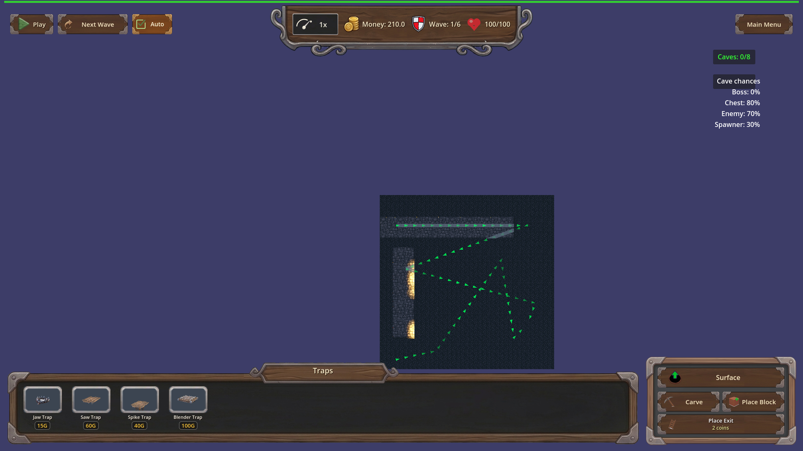
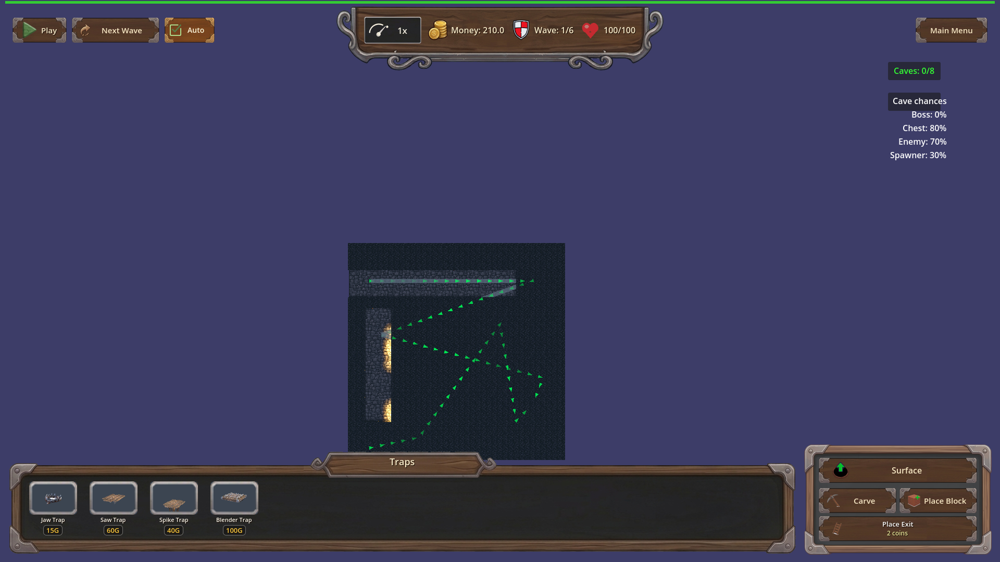
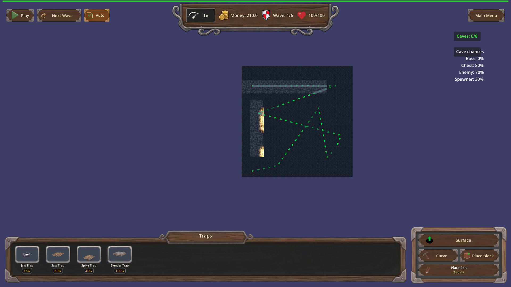

# Manual Test Report – Cave carved-path torch wall mounts (issue #124, req-124-cave-carved-path-torches-r5)

## Summary

- Result: PASSED
- Tested on: 2026-08-24, windowed Godot 4.4.1 (gl_compatibility + Dummy audio), map_9 underground layer
- Scenario: .gen/ui_scenario.md (walked via tests/scenarios/manual_carved_torches_walls.json)
- Tester: Manual-tester profile

Overall: I loaded map_9, switched to the underground layer, and carved the same
L-shaped side-to-side path with a bend used by the coverage harness scenario
(west→east arm plus a south leg). The torch placer responded with 113 active
torches, zero uncovered corridor cells, and every coverage-repair log line named
a single cardinal wall direction. Top-down screenshots of the bend and both
straight arms show torches sitting flush against corridor walls with no stick in
the middle of the walkway.

## Scenario Walkthrough

### Step 1 – Carve L-shaped path and wait for torches

- Action: Loaded map_9 via the harness, switched to the underground layer,
  disabled cave discovery, then carved seven rectangles forming a west-to-east
  corridor joined to a south leg with a 90-degree bend.
- Expected: Torches appear after the carve; coverage pass reports 0 uncovered cells.
- Observed: `[TORCH_PLACER] coverage pass: required_cells=113 torches=113
  uncovered=0`; `[TorchManager] Updated torches: 113 active`. Every repair line
  read `wall_dir=north/south/east/west` — no diagonal or mid-corridor mounts.
- Status: PASS

### Step 2 – Top-down shot centered on the bend

- Action: Aimed the camera straight down at the bend (-7.5, -6.5) and captured.
- Expected: Every torch flush against a wall face; none floating mid-walkway.
- Observed: Torch flames hug the left corridor wall edge; walkway floor is clear;
  no hovering sticks.
- Status: PASS

### Step 3 – Shot along the straight east arm

- Action: Aimed the camera straight down at (4.0, -6.5) along the horizontal arm.
- Expected: Evenly spaced wall-mounted torches lighting the whole corridor run.
- Observed: A row of lit torches all mounted on the left wall edge, evenly spaced
  (spacing 4), and light continuous along the full visible passage — no dark
  required-corridor stretches.
- Status: PASS

### Step 4 – South-leg shot (previously-reported floating-torch area)

- Action: Aimed the camera straight down at (-7.5, 4.0) on the vertical leg.
- Expected: Repair-pass torches also mount on real walls.
- Observed: Both visible torches sit flush against the corridor wall; nothing
  floats in front of or inside the walkway. Areas outside the carved corridor are
  solid rock and correctly stay dark; the harness assertion confirms every
  required corridor cell is within one light radius of an active torch
  (uncovered_corridor_cells == 0).
- Status: PASS

## Criteria

Harness result: `.gen/harness/manual_carved_torches_walls/result.json`
status=pass exit=0 (fresh run this session).

- Manual windowed run (no --headless): underground screenshots of a curved
  side-to-side carve show every torch hugging a wall face, no stick floating
  mid-corridor or hovering in front of a wall; ui_feels_broken: no
  - 
  - 
  - 
- After carving an L-shaped side-to-side path with a bend, every required
  corridor cell is lit: uncovered_corridor_cells == 0 with 113 active torches —
  proven by the harness result.json expectations plus the continuously lit east
  arm shot above.
- Coverage-repair torches mount single-axis cardinal onto real walls — proven by
  the per-torch `[TORCH_PLACER] coverage repair added torch ... wall_dir=<cardinal>`
  log lines captured in this run's output (all north/south/east/west, no diagonal).
- Remaining plan criteria (TORCH_SPACING==4, spacing stride, budget scaling,
  debug logging, light-constant parity) are headless-verifiable and were already
  verified green per changes.md (unit suite 11/0, focused harness pass); not
  re-tested here beyond the live log lines above.

## Issues and Observations

- Low: In the bend and south-leg shots, parts of the carved corridor farther from
  the nearest torch render quite dark under gl_compatibility/llvmpipe; the
  harness state check confirms they are within one light radius of a torch, but
  on weaker GPUs players may perceive them as unlit. Cosmetic only.
- Low: Pre-existing benign warnings during load (invalid UID fallbacks in
  HudTheme.tres/UI.tscn, failed GLB loads for backdrop earth / portal arch) —
  unrelated to this fix.

## Recommendation

Ready for release. All player-visible Done-when bullets for this cluster are
shown true by real windowed screenshots; no replanning or code fixes needed.

Manual-test result: PASSED. Scenario: .gen/ui_scenario.md. Report: .gen/manual-report.md. Escalation: no.
