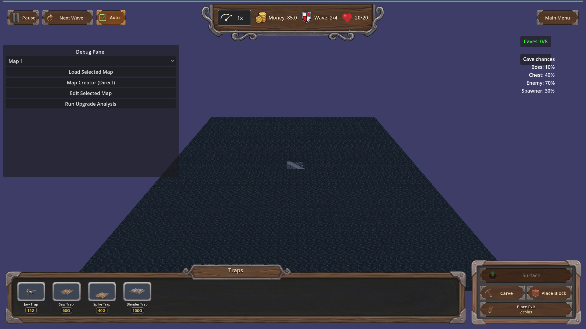
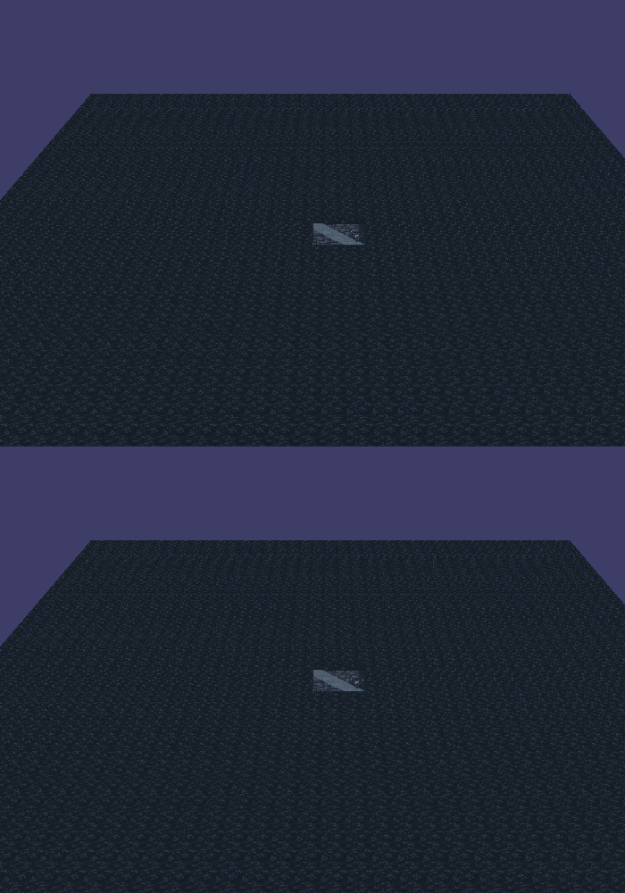

# Manual Test Report – Buried Ordnance chained explosion (issue #39)

## Summary

- Result: FAILED
- Tested on: 2026-08-22, Godot 4.4.1 windowed (gl_compatibility, llvmpipe), map_1, harness scenario
- Scenario: `.gen/ui_scenario.md` (beat 2–3 of the chained-explosion story)
- Tester: Manual-tester profile

Overall: The Buried Ordnance chain logic works — with the perk owned, a trap hit on an
underground enemy rolled the chance, dealt blast damage to 2 neighbors, logged
`[BURIED_ORDNANCE] trap=trap_01 chain=1 rolled=true caught=2`, and called
`ExplosionFX.spawn_bazooka_explosion` twice (log lines `[ExplosionFX] blast radius=0.60 ...`).
However the required visual evidence is NOT visible in any captured frame: the explosion
particles are parented under `Game/Surface`, which is hidden while viewing the underground
layer — exactly where this perk always fires. Three windowed runs (including a slow-motion
0.05x variant and a run that waited out the scene fade) all show an empty cave floor at the
blast moment; blast frame and aftermath frame are pixel-identical. This is a player-visible
bug: the acceptance criterion "each chained blast produces a visible small-explosion effect"
is not met.

## Scenario Walkthrough

### Step 1 – Perk grant + trap hit setup (harness-driven)

- Action: Ran the focused scenario windowed:
  `godot --path . --rendering-method gl_compatibility --audio-driver Dummy res://scenes/Main.tscn -- --harness=res://tests/scenarios/traps_buried_ordnance_progression.json`
- Expected: `traps_buried_ordnance` eligible on fresh run, granted to level 1
  (chance 0.5, radius 2.0), idempotent on save/reload.
- Observed: All progression actions ok; log shows
  `[TrapProgression] traps_buried_ordnance -> chance 0.50 radius 2.00`. Result `status: pass`.
- Status: PASS (logic)

### Step 2 – Underground enemy steps on the trap

- Action: Two cave enemies force-spawned next to a placed trap_01 at (0.25,-3.0,0.25);
  game set to playing; chance roll forced true via `set_buried_ordnance_next_roll(0.0)`.
- Expected: Trap hits one enemy; chain decision rolls.
- Observed: `[BURIED_ORDNANCE] trap=trap_01 chain=1 rolled=true caught=2` plus two
  `[ExplosionFX] blast radius=0.60 particles=300 ... life=0.150` lines — the chain fired
  and spawned two burst effects.
- Status: PASS (logic)

### Step 3 – Capture the chained-blast VFX moment (windowed)

- Action: Harness `then_screenshot` captured the viewport on the first frame the chain log
  line appeared (`buried_ordnance_chain_blast.png`). Re-ran twice more with a dedicated
  visual scenario: once at 0.05x engine time scale (blast stretched from 0.15 s to ~3 s)
  and once waiting 5 s for the scene fade-in overlay to finish before arming the roll.
- Expected: A red/orange particle burst visible on the underground floor at the blast site,
  with the trap and neighboring enemies in frame.
- Observed: In every run the cave floor is empty at the capture frame — no burst, no sparks,
  no enemies (cave enemies also render nothing because their GLB models fail to import).
  The blast frame and the aftermath frame are pixel-identical (ffmpeg difference YMAX=67,
  no reddish pixels above background). Root cause found by code inspection:
  `scripts/game/effects/ExplosionFX.gd` parents particles under `Game/Surface`
  ("Prefer parenting under Surface for correct layer visibility"), but
  `Game._on_layer_changed()` sets `$Surface.visible = false` when the layer is
  `underground`. So the chained explosion renders only while the player is looking at the
  surface layer — invisible exactly when/where Buried Ordnance triggers.
- Status: FAIL

## Criteria

- The `traps_buried_ordnance` perk is defined as a Unique progression, eligible/grantable through the normal flow, level applied idempotently on load/replay
  - Proven by fresh headless+windowed harness result (48/48 actions ok): `.gen/harness/traps_buried_ordnance_progression/result.json` (status pass). No still can prove eligibility alone; log expectation `\u005bTrapProgression\u005d traps_buried_ordnance -> chance 0.50 radius 2.00` passed.
- With the perk owned, a trap hit on an underground enemy has a chance to deal explosion damage to other underground enemies within radius
  - Verified logically (caught=2 within radius 2.0); no screenshot needed for damage itself.
- Without the perk owned, no chained damage (behavior unchanged)
  - Second arm passed headless: `[BURIED_ORDNANCE] trap=trap_03 chain=1` never appears; `chain=0 rolled=false caught=0` logged. Unverified visually (nothing visible even with perk — see failure below).
- Non-underground enemies never receive chained explosion damage
  - Structural per `Trap.gd::_apply_chain_blast` iterating `get_all_underground_enemies` + per-enemy `is_enemy_underground` check. Code-reviewed only.
- Each chained blast produces a VISIBLE small-explosion effect at the affected location — **FAILED**
  - Blast-moment frame, empty floor, no burst anywhere:
    
  - Aftermath frame seconds later — pixel-identical to the blast frame (no transient was caught or exists):
    
  - Same region side-by-side (top = blast moment, bottom = aftermath), showing zero visual difference:
    
- Chain deterministic under fixed seed / debug `[BURIED_ORDNANCE]` log lines
  - Log expectations passed in both runs; marker names trap id, roll outcome, caught count. Release-build absence not separately verified (debug build only here).

## Issues and Observations

- **High — chained-explosion VFX is invisible in play**: `ExplosionFX.spawn_bazooka_explosion`
  parents its GPUParticles3D under `Game/Surface`; `Game._on_layer_changed` hides `$Surface`
  on the underground layer, so Buried Ordnance blasts (which only ever happen underground)
  are never seen by a player watching the tunnel view. Affects step 3; violates the explicit
  acceptance criterion "a chained kill with no visible cue is not acceptable".
  Suggested fix: parent the particles under the layer-appropriate node
  (`Game/Underground` when the hit is underground), or under a node not toggled by layer.
- **Medium — cave enemies have no visible model**: every Cactoro spawn logs
  `res://models/glb/Cactoro.glb ... failed to load ... No fallback mesh (cone) will be created`,
  so even without the FX bug the blast site would show no enemies in screenshots. Import or
  fallback issue affects all cave enemies in this worktree's imported cache.
- **Low — Trap_03.tscn fails to parse** (`Invalid parameter ... Trap_03.tscn:14`): the second
  arm's trap still functions via script fallback but loads with errors each run.
- **Low — pre-existing GL import warnings** (HUD UIDs, ruined_house, portal arch, backdrop
  earth) — unrelated to this feature.

## Recommendation

Not ready for release. Send back for a code fix: make `spawn_bazooka_explosion` (or the
Buried Ordnance call site in `Trap._apply_chain_blast`) attach the particles so they are
visible from the underground camera, then re-run this manual check. The logic/perk/data side
is solid and needs no rework.

## Evidence artifacts

- Windowed visual run result: `.gen/harness/manual_buried_ordnance_visual/result.json` (status pass — logic only)
- Fresh focused run result: `.gen/harness/traps_buried_ordnance_progression/result.json` (status pass)
- Screenshots: `.gen/screenshots/chain_blast_moment.png`, `.gen/screenshots/aftermath.png`,
  `.gen/screenshots/blast_trap_region_pair.png`, `.gen/screenshots/blast_vs_aftermath.png`
