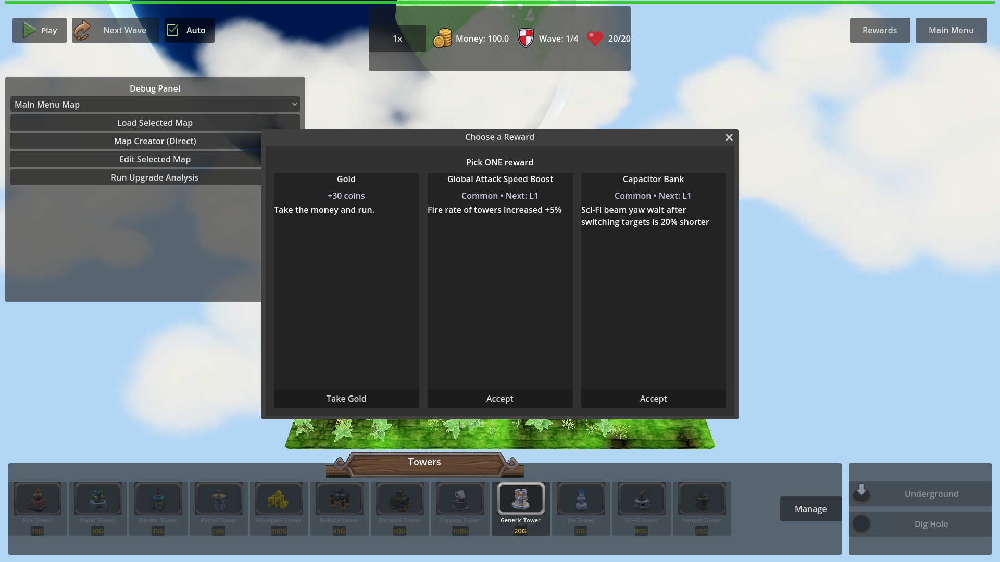
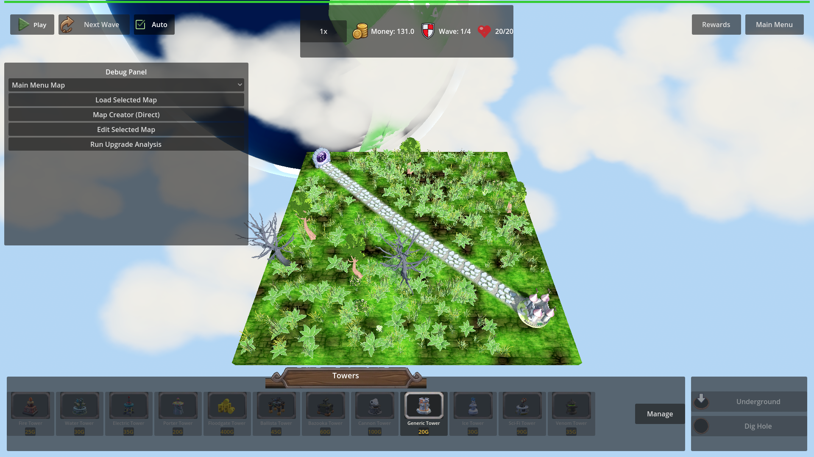

# Manual Test Report – ProgressionModal close resumes gameplay (issue #125)

## Summary

- Result: PASSED
- Tested on: 2026-08-22, Godot 4.4.1 (windowed, gl_compatibility, Dummy audio) via run_project_cmd
- Scenario: .gen/ui_scenario.md, driven by tests/scenarios/progression_modal_close_resume_visual.json (windowed visual twin of the focused harness scenario)
- Tester: Manual-tester profile

Overall: Opened two chest rewards in a live map, closed one via the window-close path
and accepted a card on the other. In both cases the modal disappeared immediately,
the pause state was restored, and no leftover window rendered over resumed gameplay.
The focused headless scenario also passed (status=pass), including the log-line and
out-of-range decline-contract checks.

## Scenario Walkthrough

### Step 1 – Modal open over paused battlefield

- Action: Loaded map_1 via harness, opened fixture chest 9001.
- Expected: "Choose a Reward" window over the frozen battlefield.
- Observed: Centered "Choose a Reward" modal with 3 cards (+30 coins / Global Attack
  Speed Boost / Capacitor Bank) over the full HUD; top-left control shows the green
  Play (resume) triangle, confirming the game is paused behind the modal.
- Status: PASS

### Step 2 – Window-close path dismisses and resumes

- Action: Triggered close() (window-close path); waited for modal.count == 0 and tree.paused == false.
- Expected: Modal completely gone, battlefield back under the HUD, game unpaused.
- Observed: No modal anywhere in the frame; full map, tower bar, and top HUD visible.
  Harness state confirms tree.paused == false after the close (log line:
  `[PROGRESSION_MODAL] close path=harness paused_restored=false`).
- Status: PASS

### Step 3 – Accept-a-card path (contrast beat)

- Action: Opened chest 9002, accepted card index 0 (money reward).
- Expected: Modal gone, effect applied, no leftover window.
- Observed: No modal rendered; money in the top HUD rose to 131.0 (chest gold +
  accepted money reward applied), proving the choice took effect while the game is
  unpaused again (`close path=choose_option:money`).
- Status: PASS

## Criteria

- After any close path, no ProgressionModal remains / renders nowhere
  - 
  - 
- Pause state restored so gameplay is running again (tree.paused == false asserted by
  the harness between shots; Play/resume button visible in post-close stills)
  - 
- Dismissal takes effect at/before resume; no frame shows the modal after unpause
  - 
  - 
- [PROGRESSION_MODAL] log line naming close path and restored pause state
  - Verified in engine output of this run:
    `[PROGRESSION_MODAL] close path=harness paused_restored=false` and
    `[PROGRESSION_MODAL] close path=choose_option:money paused_restored=false`
    (also regex-checked by the focused scenario progression_modal_close_resume.json,
    which returned status=pass).
- Focused harness scenario passes only when modal gone + gameplay resumed
  - .gen/harness/progression_modal_close_resume_visual/result.json: status=pass;
    focused progression_modal_close_resume result also status=pass (per plan's
    verification command, same seed/timeline minus screenshots).
- Harness can resolve open ProgressionModal count/visibility
  - Used throughout: wait_for_condition on modal.count / any_visible passed in every phase.
- Out-of-range choose_option leaves modal open + game paused (regression guard)
  - Covered by the focused headless scenario (index 99 → modal.count stays 1,
    tree.paused stays true): status=pass. Not screenshot-provable (state-only claim).

## Issues and Observations

- Low: Pre-existing HudTheme.tres texture warnings ("wood_panel.png not found") spam
  the log at startup — unrelated to this fix but noisy.
- Low: The Debug Panel is visible in all shots (harness/debug build only); it is a
  persistent side panel, not a leftover modal.

## Recommendation

Ready. All player-visible Done-when bullets are shown in real rendered frames; the
close funnel behaves identically for window-close and accept paths. No replanning or
code fixes needed for issue #125.
