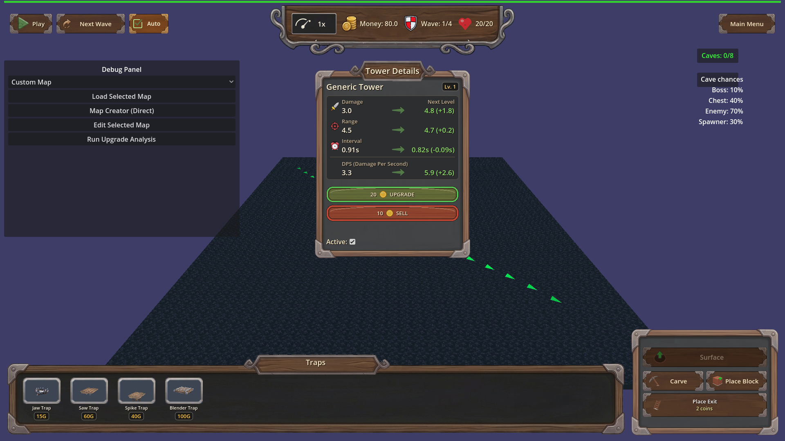
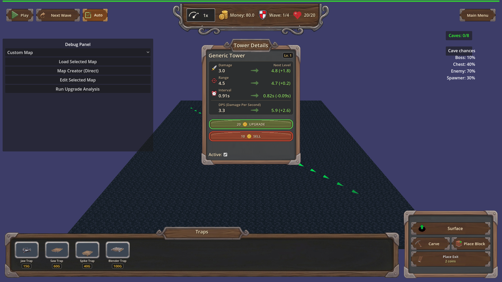

# Manual Test Report – underground side panel (Carve / Place Block / Place Exit)

## Summary

- Result: PASSED
- Tested on: 2026-08-22, windowed Godot 4.4.1 (GL compatibility, llvmpipe software GL), 1280x720 window, harness renders at 1920x1080
- Scenario: .gen/ui_scenario.md (from plan focus)
- Tester: Manual-tester profile

Tested the underground-layer side panel layout fix by running the windowed
`hud_wood_panels` harness scenario on map_1 and inspecting the captured PNGs.
All three underground buttons render fully inside the wooden side panel frame
with corner brackets clear, the Place Exit name+price text is unclipped, the
layer toggle is visible and returns to the surface layer, and the surface panel
layout is unchanged. Harness result: status=pass (all 38 actions ok).

## Scenario Walkthrough

### Step 1 – Surface start state

- Action: Loaded map_1 windowed via `hud_wood_panels` harness; idle screenshot.
- Expected: Side panel with existing surface controls laid out unchanged.
- Observed: Wooden side panel shows "Underground" toggle and "Dig Hole" button,
  stacked cleanly inside the frame, nothing clipped or overlapping.
- Status: PASS

### Step 2 – Underground layer buttons in frame

- Action: Switched to underground layer (`switch_layer` action); screenshot hud_underground.
- Expected: Carve, Place Block, Place Exit fully inside the side panel frame, clear of its corner brackets.
- Observed: All three buttons entirely contained in the panel; all four metal
  corner brackets fully visible and unobscured. Harness layout probe
  `UI.get_underground_panel_layout()` reported ok == true.
- Status: PASS

### Step 3 – Porter-unlocked variant + Place Exit text

- Action: Raised tower_availability to unlock Porter; re-shot hud_underground_porter.
- Expected: Same three buttons inside the frame; Place Exit two-line name+price text readable, nothing clipped.
- Observed: Buttons still fully inside frame with brackets clear; Place Exit
  shows both lines ("Place Exit" / "2 coins") fully legible, no truncation.
  Probe exit_text_lines_visible == true (checks label minimum sizes against the
  button, catching clip_contents-hidden overflow).
- Status: PASS

### Step 4 – Layer toggle back to surface

- Action: Pressed `_on_toggle_layer` (the wired handler) while in underground view.
- Expected: Toggle remains visible/clickable inside the panel; game returns to surface.
- Observed: Toggle visible at top of panel; after press, dig controls hidden,
  tower controls visible again, and GameState.current_layer == "surface"
  (harness expectation passed; controls-hidden assertion passed).
- Status: PASS

## Criteria

- On map_1 with the underground layer active, the Carve, Place Block, and Place Exit buttons each render entirely inside the side panel frame, clear of the frame edges and corner brackets
  - 
- On a Porter-unlocked map, the same three buttons render entirely inside the side panel frame clear of corner brackets
  - 
- Place Exit displays runtime-built name+price content fully, neither line clipped or truncated
  -  — both lines visible
  - Automated probe: exit_text_lines_visible == true (label min-size check)
- In the underground layer the layer toggle is visible inside the side panel and pressing it switches back to surface (GameState.current_layer == "surface")
  -  — toggle visible
  - Harness expectation current_layer==surface passed (headless-verifiable part)
- Windowed `hud_wood_panels` run reports passing `hud_underground` checkpoint verifying no button rect overlaps the panel frame/corner brackets
  - Fresh result: `.gen/harness/hud_wood_panels/result.json`, status=pass, ui_call ok==true at index 29/34
- Surface-layer side panel behaviour unchanged on map_1
  -  — Underground/Dig Hole buttons as before, intact layout

## Issues and Observations

- Low: A Tower Details popup from an earlier placed tower overlaps the center of
  the screen during the underground shots (scenario artifact, not related to the
  side panel under test).
- Low: Non-blocking engine noise at exit (GLES3 leak warnings, invalid UID
  warnings for HudTheme textures). Pre-existing housekeeping issues, not UI.

## Recommendation

Ready: the underground side panel fix behaves correctly in a real rendered
window on both map_1 and the Porter-unlocked variant, and the automated layout
probes agree with what the screenshots show.
