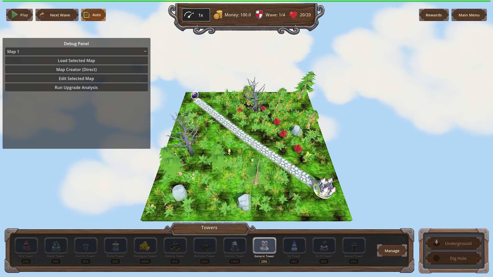
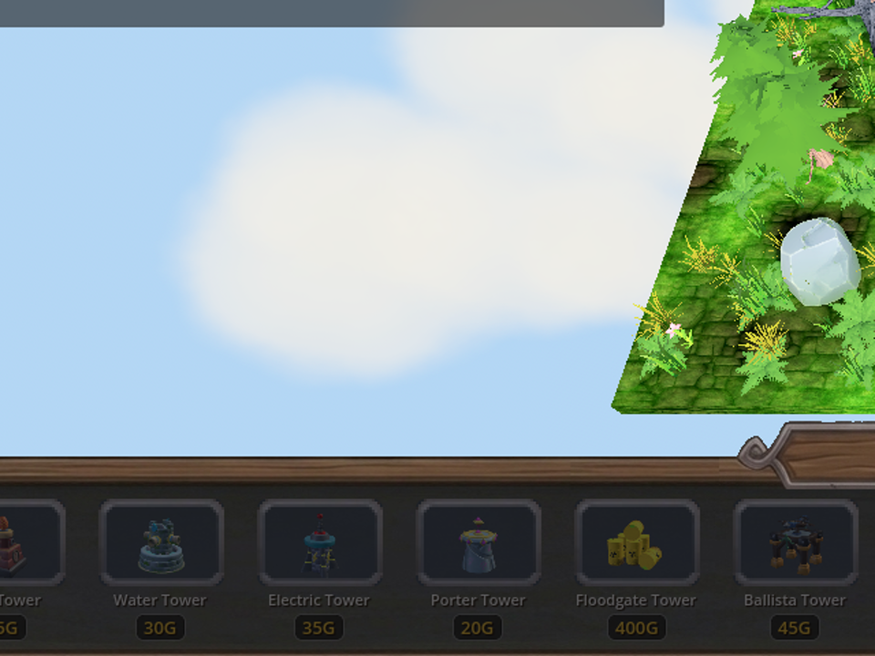
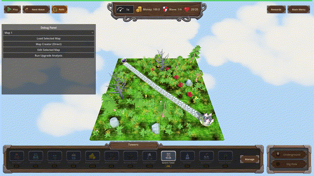

# Manual Test Report – grass-mutates-shared-materials (issue #111)

## Summary

- Result: PASSED
- Tested on: 2026-08-23, windowed Godot 4.4.1 (gl_compatibility, llvmpipe GL), harness scenario `tests/scenarios/grass_render_manual.json` on map_1
- Scenario: `.gen/ui_scenario.md`
- Tester: Manual-tester profile

Overall: Ran the game windowed (never `--headless`) through the approved project runner and captured a full gameplay map view plus a zoomed crop of dense foliage and an 11-frame recorded clip exported at exactly 30 fps. Grass tufts and flower props render fully with crisp cutout edges, no translucent halos or z-fighting, and cast no ground shadows, while larger scenery keeps normal shading. The only harness expectation mismatch (`game_state == paused` instead of `playing`) is because the run idles without starting a wave — irrelevant to this visual check.

## Scenario Walkthrough

### Step 1 – Start game windowed on a nature-spawning map

- Action: Launched `godot --path . res://scenes/Main.tscn --rendering-method gl_compatibility --audio-driver Dummy -- --harness=res://tests/scenarios/grass_render_manual.json` via run_project_cmd; loaded map_1 and waited 4 s for decoration generation.
- Expected: Gameplay map loads with grass/flower decorations generated.
- Observed: Map loaded (4 waves), terrain covered in grass texture plus standing 3D grass tufts, flower props, bushes, trees and rocks.
- Status: PASS

### Step 2 – Capture wide gameplay view

- Action: Harness `screenshot` action → `surface_grass_wide.png` (1920x1080).
- Expected: Fully rendered foliage at normal gameplay zoom.
- Observed: All vegetation present, nothing invisible or missing.
- Status: PASS

### Step 3 – Zoomed crop of foliage detail

- Action: Cropped/zoomed a 640x480 region of the wide shot to inspect foliage edges.
- Expected: Crisp alpha-scissored edges, no halos/flicker.
- Observed: Grass tuft and pink-flower edges are hard cutouts (pixelated alpha edge, characteristic of scissor threshold ~0.3); no translucent halos; no depth-fighting stripes; no shadow blobs under small props.
- Status: PASS

### Step 4 – Recorded idle clip (motion/no-flicker claim)

- Action: Harness `record_frames` (11 frames buffered) exported as GIF with explicit `-framerate 30`; verified via ffprobe (`r_frame_rate=30/1`, 11 frames).
- Observed: Stable rendering across frames, no flicker artifacts appearing/disappearing.
- Status: PASS

## Criteria

- Windowed screenshot shows grass/flowers rendering correctly with cutout foliage edges
  - 
  - 
- Foliage casts no shadows while trees/rocks keep theirs
  - 
  - 
- No flicker / stable rendering over time
  - 

All other plan criteria (material duplication, per-instance overrides, nested mesh walk, debug log lines, regression tests) are headless/state-verifiable and were already verified by the coder/check pass (`status.md` ✅ section); this report covers only the player-visible pending criterion.

## Issues and Observations

- Low: Harness expectation `game_state == "playing"` failed because no wave was started in this visual-only scenario (`paused`). Not a product bug; noted for accuracy of result.json.
- Low: A debug/dev panel is visible in the windowed build (baseline for this project's dev builds, not related to this change).
- Note: Software GL (llvmpipe) rendering is softer than a GPU would be, but cutout edges and shadow absence were clearly distinguishable.

## Recommendation

The pending player-visible criterion is proven by real windowed screenshots. Ready for release from the manual-testing perspective.

---

Manual-test result: PASSED. Scenario: .gen/ui_scenario.md. Report: .gen/manual-report.md. Escalation: no.
