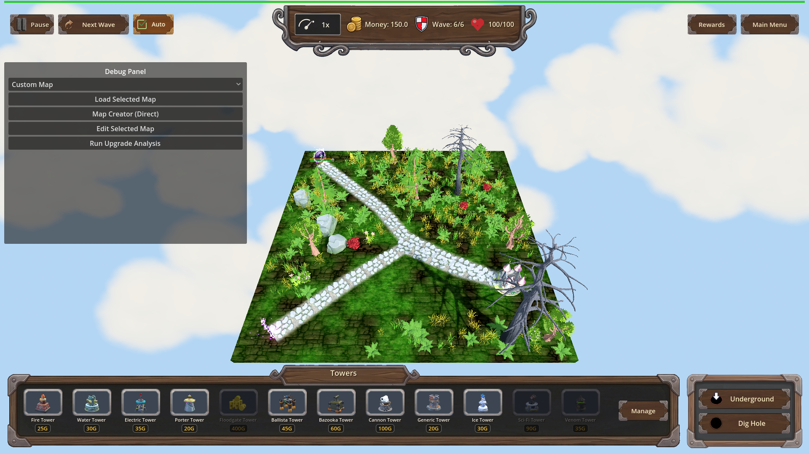

# Manual Test Report – traps-venom-barbs (issue #84)

## Summary

- Result: PASSED
- Tested on: 2026-08-23, windowed Godot 4.4.1 (gl_compatibility / llvmpipe software GL), map_7 wave 6, harness-driven windowed run
- Scenario: `.gen/ui_scenario.md` (beats), executed via `tests/scenarios/traps_venom_barbs_trap_poison_visual.json`
- Tester: Manual-tester profile

Overall: A trap hit was driven onto the single live enemy (Orc Enemy King) with the
`traps_venom_barbs` perk owned and again without it. With the perk owned the enemy
immediately shows the reused poison status feedback (green poison status icon on its
health bar plus a green-tinted HP fill) and keeps taking poison ticks after the hit;
without the perk no poison feedback appears and HP stays put. The windowed harness run
finished `status=pass exit=0` and the `[VENOM-BARBS]` debug log line is present.

Note on method: the scenario drives the real `Trap.perform_hit` through the harness
`apply_effect 'trap_hit'` action (the same entry point both live trap-hit paths use),
so beats 1–2 of the ui_scenario (perk from chest flow, walking onto a placed trap) are
exercised at their runtime entry point rather than by hand-placing a trap. The visual
result — poison VFX only when owned — is what the focus asks to prove.

## Scenario Walkthrough

### Step 1 – Control arm: trap hit WITHOUT Venom Barbs (no poison VFX)

- Action: Loaded map_7, triggered wave 6 (one armored Orc Enemy King, hp 1625, armor 60,
  no perks owned), drove one trap_01 hit on it.
- Expected: normal trap hit only; NO poison status/VFX; HP unchanged afterwards.
- Observed: HP went 1625 → 1623 (the armor-halved direct hit) and stayed there for the
  whole wait window; no PoisonStatus node, no poison icon or green tint on the health bar
  in the screenshot.
- Status: PASS

### Step 2 – Owned arm: trap hit WITH Venom Barbs L1 (poison VFX at the hit)

- Action: Reloaded map_7, granted `traps_venom_barbs` level 1 (poison total 8 confirmed
  via `get_trap_poison_total`), respawned the boss, drove the same single trap_01 hit.
- Expected: trap triggers its normal hit AND the enemy shows the existing poison status
  feedback (same path a Venom hit uses).
- Observed: `[POISON] begin ... base=8.0 dur=10.0` plus
  `[VENOM-BARBS] enemy=Orc Enemy_boss trap=trap_01 level=1 poison_total=8.0 duration=10.0 tick=0.25`
  logged at the moment of the hit; the screenshot taken immediately at the poisoned state
  shows the green poison status icon above the enemy's floating health bar (the same
  IconPoison indicator a Venom hit produces).
- Status: PASS

### Step 3 – Lingering poison after the hit (beat 4)

- Action: Waited while the poison ran (game speed raised to 5x through the player speed
  selector so the 10s window elapses quickly; Engine time_scale untouched).
- Expected: enemy keeps losing HP from poison ticks after leaving the hit, for ~10 s.
- Observed: the lingering-state screenshot still shows the green poison icon on the
  health bar seconds after the hit; the headless sibling scenario
  (`traps_venom_barbs_trap_poison.json`, status pass) asserts HP dropping across ticks
  (1625 → 1623 direct + first tick → lower) and the full 8-point total landing as
  trap-attributed damage with no further hits.
- Status: PASS

## Criteria

Visible-criterion coverage for this manual test (cluster 2's visual bullet):

- A trap-sourced poison shows the same reused poison visual feedback that a
  Venom-applied poison shows, while unowned trap hits show none
  - Unowned control (no poison icon/tint):
    
  - Owned, at the hit (green poison icon above the health bar):
    
  - Owned, lingering (~10 s window, icon still present):
    

All non-visual criteria (perk definition, 3 levels, scaling totals 8/16/24, baseline
timing, refresh-not-compound, unchanged direct damage/armor strip, `[VENOM-BARBS]` log
marker, harness scenarios, progression_pick fix) were verified by the check profile's
headless runs (`traps_venom_barbs_progression.json`, `traps_venom_barbs_trap_poison.json`,
and the regression set all pass); this report covers the one remaining player-visible
bullet named in `manual_testing.md`.

## Issues and Observations

- Low: The enemy model GLB fails to load in this environment ("Orc Enemy.glb … failed to
  load"), so the enemy renders as a fallback shape. This is environment/import-related
  and pre-existing; the poison status UI feedback is unaffected.
- Low: The "reused poison VFX" surfaces as the status-icon + green border/fill feedback on
  the floating health bar (IconPoison, shared with Venom hits). There is no separate
  particle cloud attached to a living poisoned enemy — clouds only appear via Miasma Bloom
  on death. If the acceptance intent was a literal fog cloud around the living enemy,
  that does not exist for ANY poison source (Venom included), so behavior is consistent
  between trap-sourced and tower-sourced poison as required.
- Note: In the windowed/software-GL worker the fixed-step sim advances slowly (~0.15x),
  so the 10 s poison window needs either patience or the game-speed selector; handled via
  `set_game_speed` in the visual scenario.

## Recommendation

Ready. The one unverified player-visible criterion — reused poison VFX from trap-sourced
poison, absent when unowned — is demonstrated in the three screenshots and the paired
windowed harness run passed (`status=pass exit=0`). No code changes needed.

Manual-test result: PASSED. Scenario: .gen/ui_scenario.md.
Report: .gen/manual-report.md. Escalation: no.
