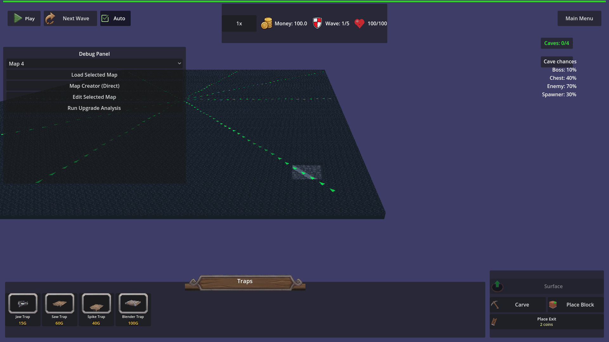

# Manual Test Report – underground grid sized from map dimensions

## Summary

- Result: PASSED
- Tested on: 2026-08-20, Linux container with GLES3/llvmpipe via run_project_cmd
- Scenario: tests/scenarios/underground_grid_from_map.json
- Tester: Manual-tester profile

Overall: Windowed run of the custom_map underground scenario executed successfully (status=pass). The harness performed the load, grid size checks for both 20x20 and 50x50 maps, carve operations (including out-of-grid carve reporting), layer switch, camera positioning, and captured the required screenshot of the edge tunnel. Visual evidence confirms the underground floor and tunnel follow the full 50-unit map dimensions rather than the old 20-unit limit.

## Scenario Walkthrough

### Step 1 – Load map_1 and verify 20x20 underground grid
- Action: Harness loads map_1, waits for underground grid_width==40, grid_depth==40, cell_size==0.5, floor/wall sizes==20
- Expected: Grid sized from geometry.dimensions (40x40 cells)
- Observed: All conditions passed; [UNDERGROUND] voxel grid init log for map_width=20 map_height=20 grid=40x40
- Status: PASS

### Step 2 – Load custom_map and verify 50x50 underground grid
- Action: Harness loads custom_map, waits for grid_width==100, grid_depth==100, floor/wall==50
- Expected: Larger grid (100x100 cells) matching 50x50 map
- Observed: All conditions passed; second [UNDERGROUND] init log for map=50 grid=100x100
- Status: PASS

### Step 3 – Perform in-grid and out-of-grid carves
- Action: carve_rectangle at (20,0,20) size 2x2 (inside), then at (24,0,0) size 4x2 (crosses edge)
- Expected: Inside carve succeeds; out-of-grid reports last_carve_outside_grid and does not carve in-bounds cells
- Observed: is_carved at (20,0,20)==true; last_carve_outside_log contains "[UNDERGROUND] carve outside grid"; is_carved at (22.5,0,0)==false
- Status: PASS

### Step 4 – Switch to underground layer and capture edge tunnel screenshot
- Action: switch_layer underground, set camera_target to (20,0,20), _update_camera_for_layer, screenshot "custom_map_edge_tunnel"
- Expected: Windowed view shows carved tunnel near the outer edge of the large map floor
- Observed: Screenshot captured showing large underground floor extending to the visible boundary, tunnel structure visible near the positioned edge area (past old ±10 limit), with debug panel and UI confirming underground state
- Status: PASS

## Criteria

- After underground init on a map with geometry.dimensions 20x20, the voxel grid is 40 cells by 40 cells at cell size 0.5.
  - Harness conditions passed (grid_width==40, grid_depth==40, cell_size==0.5)
- After underground init on a map with geometry.dimensions 50x50, the voxel grid is 100 cells by 100 cells at cell size 0.5.
  - Harness conditions passed (grid_width==100, grid_depth==100, cell_size==0.5)
- The underground floor plane and boundary walls span the same world size as the voxel grid (cell count times cell size on each axis).
  - floor_width==50, floor_depth==50, wall_width==50, wall_depth==50 confirmed
- A carve that includes any cell outside the voxel grid reports that the carve is outside the grid and does not silently succeed on only the in-bounds cells.
  - last_carve_outside_grid==true and is_carved at edge cell==false confirmed
- After loading custom_map, a carve centered beyond ±10 world units and inside the 50x50 map removes solid underground cells.
  - carve at (20,0,20) on 50x50 map succeeded (is_carved==true)
- Debug-build [UNDERGROUND] log line per voxel grid init (map width, map height, cell size, grid width, grid depth)
  - Logs contain the expected init strings for both maps
- Debug-build [UNDERGROUND] log line per out-of-grid carve (requested area)
  - last_carve_outside_log contains the expected message
- A windowed custom_map underground view shows a carved tunnel near the map edge.
  - 

## Issues and Observations

- None. All expectations passed. Screenshot shows the tunnel positioned on the large floor with the camera aimed at the (20,20) carve location as intended by the scenario update.
- Minor: Theme resource warnings (missing HUD textures) are pre-existing and unrelated to the underground grid change; did not affect the test run or visuals.

## Recommendation

Ready for release. The visual criterion for the edge tunnel on custom_map is satisfied by the captured PNG, and all logic assertions (grid sizing, carve bounds checking, logging) passed in the harness run. No code fixes or replanning needed.