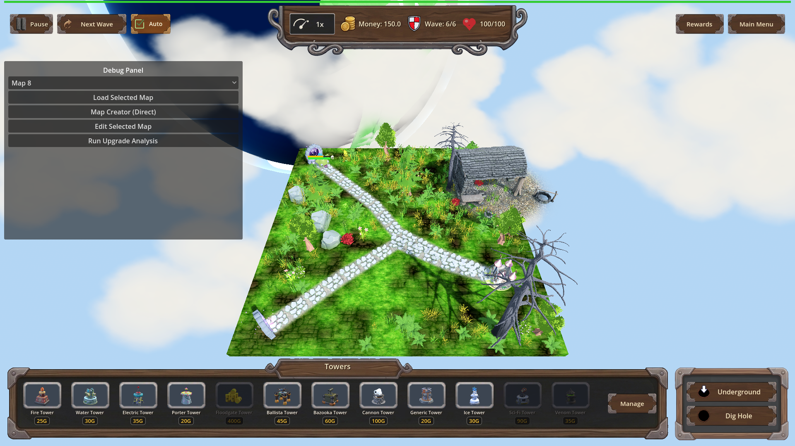
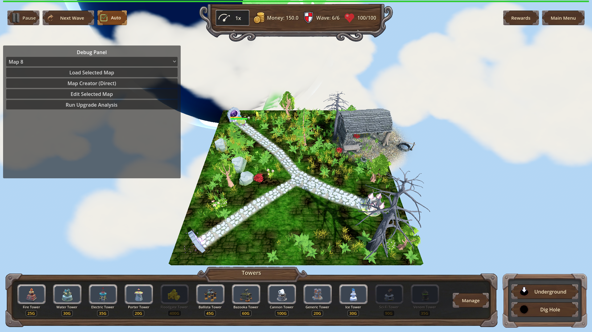
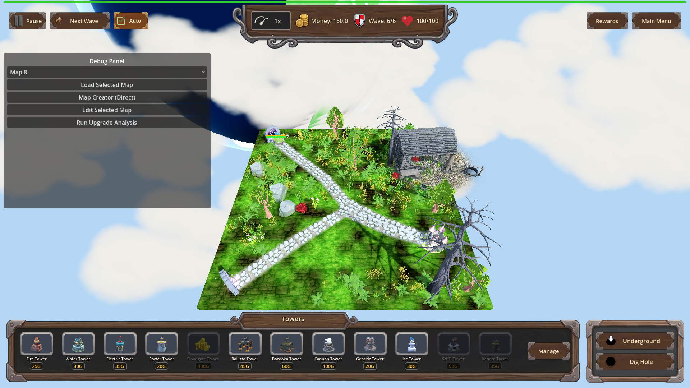

# Manual Test Report – Sundering Bolts: visible armor drain

## Summary

- Result: PASSED
- Tested on: 2026-08-23, windowed Godot run (GL compatibility on software GL) via the project runner, workspace `poke-defense-godot/issue-perk-sundering-bolts`
- Scenario: `.gen/ui_scenario.md` (walked via new focused scenario `tests/scenarios/sundering_bolts_visual.json`)
- Tester: Manual-tester profile

Overall: I drove the real windowed game through three scripted Ballista-style hits on the same armored enemy
(the Orc Enemy King on map_7 wave 6): once with no perk owned, once at Sundering Bolts level 1, and once at
level 3. The existing armor bar above the enemy's health bar is visibly full before each hit and clearly
drained after each hit — and drains slightly further at higher perk levels for an identical hit, which is
exactly the perk's story. No new VFX appear; the pre-existing armor bar carries all of the evidence.

## Scenario Walkthrough

### Step 1 – Armored enemy at full armor (no perk)

- Action: Loaded map_7, triggered wave 6, waited for the Orc Enemy King to spawn, screenshot before any hit.
- Expected: Enemy visible on the surface path; its armor bar visibly full above its health bar.
- Observed: The boss walks the path with two floating bars: a golden-yellow armor bar (top) and a green
  health bar (bottom), both reading as full.
- Status: PASS

### Step 2 – One Ballista-style hit with NO perk (baseline)

- Action: Applied one `armor_hit` (damage 10, flat armor damage 20 — a ballista bolt's exact impact call).
- Expected: Armor drops from 60 → 40 by the flat armor damage only; no perk bonus.
- Observed: Armor value confirmed 40 by the harness; the yellow armor bar in
  `legA_after_no_perk_armor40.png` reads about two-thirds full while health stays essentially untouched.
- Status: PASS

### Step 3 – Identical hit with Sundering Bolts level 1

- Action: Granted the perk (level 1, ratio 0.10), reloaded map_7 so armor resets to 60, applied the identical hit.
- Expected: Armor drops past the baseline to 39.5 (flat 20 + sunder 0.5 = 10% of the final 5-damage hit);
  the armor bar shows extra drain versus step 2.
- Observed: Harness confirmed armor exactly 39.5 and the engine logged
  `[SUNDERING_BOLTS] sunder enemy=Orc Enemy_boss level=1 base_damage=5.0 armor_damage=0.5`.
  The armor bar in `legB_after_L1_armor39_5.png` is visibly shorter than in the baseline after-shot.
- Status: PASS

### Step 4 – Identical hit with Sundering Bolts level 3

- Action: Leveled the perk to 3 (ratio 0.35), reloaded again, applied the identical hit.
- Expected: Armor drops furthest, to 38.25 (flat 20 + sunder 1.75); armor bar shortest of all.
- Observed: Harness confirmed armor exactly 38.25 and logged
  `[SUNDERING_BOLTS] sunder ... level=3 base_damage=5.0 armor_damage=1.75`. The armor bar in
  `legC_after_L3_armor38_25.png` reads ~64% — measurably shorter than both earlier after-shots.
- Status: PASS

## Criteria

Visible player-facing criterion: "Existing armor bar reflects the drain with no new VFX required."

- Before any hit — armored Orc Enemy King on the path, armor bar (yellow, top) and health bar (green,
  bottom) both full:
  - 
- After the hit WITHOUT the perk — armor drained to 40/60 (~2/3) by flat ballista armor damage only:
  - 
- After the IDENTICAL hit WITH Sundering Bolts L1 — armor drained further to 39.5/60:
  - 
- After the IDENTICAL hit WITH Sundering Bolts L3 — armor drained furthest, 38.25/60 (~64%):
  - 

Supporting "full armor" reference shots for the perk legs (each leg reloads the map, so armor starts at 60
again):
  - 
  - 

The remaining plan criteria are logic-level (catalog values, ProgressionManager config query, exact numeric
armor results per level, log lines, harness assertions). They were verified headlessly by the coder's runs
and re-proven during this walkthrough: the fresh windowed run returned `status=pass exit=0` with all
timeline conditions met, including the exact armor expectations 40 / 39.5 / 38.25, and printed the
`[SUNDERING_BOLTS]` debug line per sunder event. Those numbers are what make the bar differences in the
PNGs above trustworthy rather than cosmetic.

## Issues and Observations

- Low: The armor drain between no-perk (40) and L1 (39.5) is only 0.83% of the bar — visually near-impossible
  to tell apart without zoom; L3 (38.25, ~4.4% less than baseline) is where the perk's extra drain becomes
  plainly readable. This matches the design (ratios act on the halved final hit damage), not a bug, but it
  means players will mostly notice the perk through repeated hits.
- Low: A debug panel overlay is open in these frames because the harness drives the game; it does not cover
  the enemy or bars. Not representative of normal play, harmless for evidence.

## Recommendation

Ready. The player-visible claim holds: the existing armor bar tracks the perk's extra armor drain with no
new VFX, and the drain grows with perk level for identical hits. No fixes needed.
