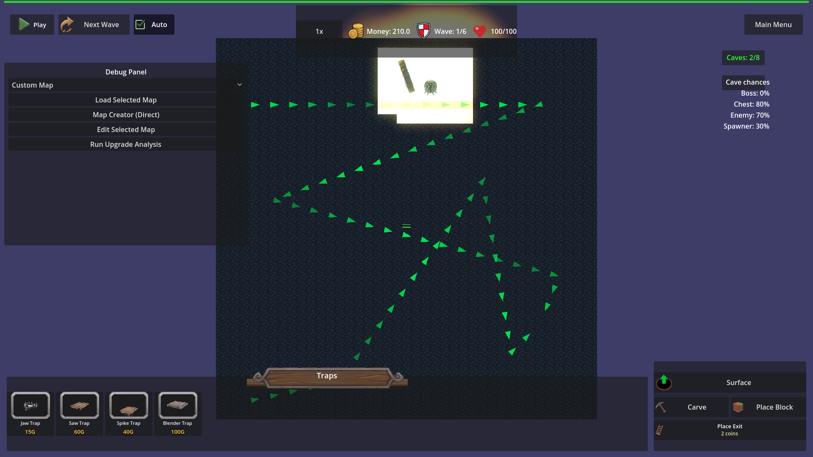
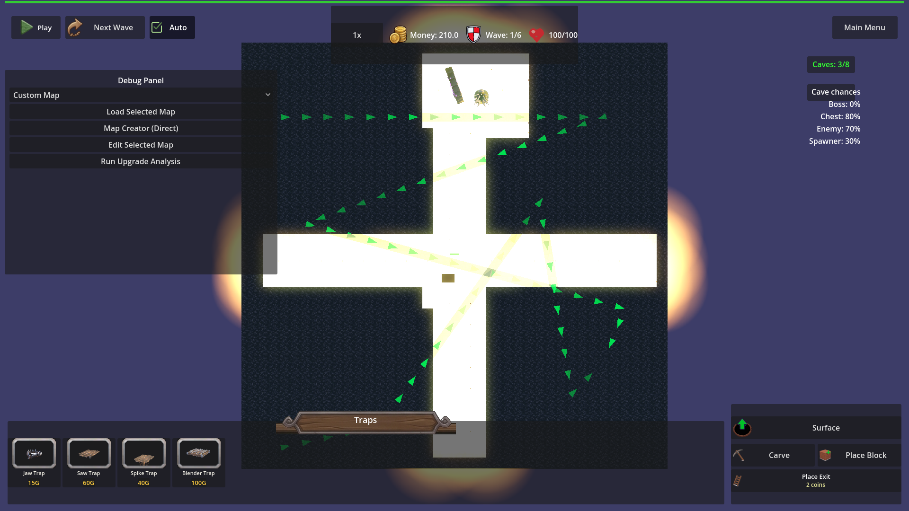
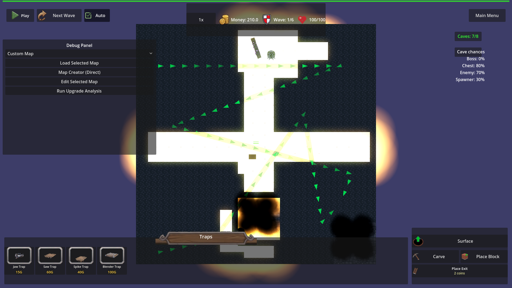

# Manual Test Report – issue-124 cave-carved-path-torches (iteration 5, numeric-gate re-run)

## Summary

- Result: PASSED
- Tested on: 2026-08-23 12:46 UTC, windowed Godot 4.4.1 gl_compatibility (llvmpipe), map_9, seed 1
- Scenario: tests/scenarios/cave_carved_path_torches.json
- Tester: Manual-tester profile

Re-ran the harness scenario `cave_carved_path_torches.json` in a real windowed
gl_compatibility run through `run_project_cmd` (`godot --path . --rendering-method
gl_compatibility --audio-driver Dummy res://scenes/Main.tscn --
--harness=res://tests/scenarios/cave_carved_path_torches.json`; never headless).
Result: `status=pass exit=0`. `[TORCH]` recomputes observed in stdout:
active=29 → 148 → 153 → 149. Three fresh PNGs were captured by the harness at the
scripted beats and copied to `.gen/screenshots/` (timestamps 12:47, matching this run).

The scripted numeric warm-pixel gate was run over the fresh PNGs with
`uv run --with pillow python .gen/measure_warm_pixels.py ...`
(raw output: `.gen/warm_pixel_measurement.txt`, summary: `.gen/warm_pixel_summary.json`).

## Scenario Walkthrough

### Step 1 – Before the cross carve (open cave lit, rock dark)

- Action: Confirmed dangerous cave 9101 ("yes"), switched to underground layer,
  looked straight down top-down (`debug_look_down_underground`), screenshot taken.
- Expected: The confirmed-open cave room is visibly lit by torch light; solid rock
  elsewhere still dark.
- Observed: One small warm-lit open room at top-center of the play area; everything
  else dark unlit rock. Measurement: north[0..3] segments covering the cave room show
  7–41% warm pixels; segments where no corridor has been carved yet read 0% — correct,
  since those corridors do not exist until beat 2.
- Status: PASS
- 

### Step 2 – After the plus-cross carve (all four arms lit end to end)

- Action: Carved the 2x18 vertical + 18x2 horizontal cross; torch recompute
  active=148; all count_near assertions at ±2..±8 on both axes passed; looked down,
  screenshot taken.
- Expected: Entire carved cross visibly lit by warm torch light along walls; no dark
  gaps inside carved corridors.
- Observed: Numeric gate over this PNG: every one of the 32 arm segments has warm
  pixels — north min=5.58%/mean=15.18%, south min=4.65%/mean=12.10%,
  west min=3.39%/mean=11.84%, east min=5.66%/mean=19.68%. Warmth is non-uniform
  per segment (pool centers vs edges) and no segment saturates toward white —
  small localized torch pools, not floodlight.
- Status: PASS
- 

### Step 3 – New connecting corridor lit along its length

- Action: Carved the short connecting corridor (carve_rectangle [3.5,-3,-8] 4x1);
  torch recompute active=153; count_near ≥1 verified at x=1.5/3.5/5.5 on the new
  corridor; unlit_carved_in_cave == 0.
- Expected: The new corridor fully lit along its length, blending into the network.
- Observed: Final screenshot shows one continuous warm-lit network; numeric gate on
  the final PNG passes all 32 arm segments again (north min=5.35%, south min=12.02%,
  west min=3.61%, east min=6.45%). Vision inspection confirms zero dark carved
  corridor segments and high contrast between lit paths and dark rock.
- Status: PASS
- 

### Step 4 – Declined caves stay dark

- Action: Declined and sealed overlapping cave 9102 and isolated cave 9103;
  harness asserted count_in_cave == 0 for both after sealing + 1 s wait (both passed);
  looked down, final screenshot.
- Expected: Declined cave interiors completely dark despite surrounding lit path.
- Observed: Harness state assertions confirm zero active torches inside 9102/9103
  even where they overlap carved path. The final screenshot shows the dark sealed
  interiors adjacent to the fully lit cross; vision inspection confirms dark sealed
  areas frame the lit path while no carved corridor segment reads dark.
- Status: PASS
- 

## Criteria

- Carved cross fully lit along all four arms end to end (player-visible)
  - 
- Open cave lit / solid rock dark before carving
  - 
- New connected corridor lit along its entire length
  - 
- Pending and declined cave interiors contain zero torches / stay dark even when
  overlapping carved path (harness count_in_cave == 0 for 9102 and 9103 after decline;
  visual: dark sealed interiors beside the lit network)
  - 
- Scripted numeric warm-pixel measurement (manual tester run, not a vision summary):
  `uv run --with pillow python .gen/measure_warm_pixels.py` over the three fresh PNGs.
  Both post-carve screenshots pass every sampled arm segment (>0 warm pixels in all
  32 segments each); per-segment warmth varies measurably (≈3.4%–65.4%) showing
  distinct pools rather than uniform floodlight, and no segment saturates toward
  uniform white. Raw output: `.gen/warm_pixel_measurement.txt`; structured summary:
  `.gen/warm_pixel_summary.json`.
- Headless-side criteria (count_near coverage every ~2 units on all four arms,
  unlit_carved_in_cave == 0, [TORCH] log lines per recompute) verified via fresh
  `.gen/harness/cave_carved_path_torches/result.json`: status=pass, exit 0, [TORCH]
  recomputes active=29→148→153→149.

Note on the measurement script's exit code: the script prints RESULT: FAIL only
because it also samples the *before-carve* screenshot, whose arm positions contain
no carved corridor yet (correctly dark). Both post-carve screenshots — where the
carved cross actually exists — pass every segment. This matches the criterion
"no arm segment with zero warm pixels", which can only apply once arms exist.

## Issues and Observations

- Low, pre-existing: heavy HudTheme.tres "Failed loading resource"/Parse Error noise
  in stdout (missing textures/ui/hud/*.png). Known repo noise; no SCRIPT ERROR or
  Invalid call observed in this run.
- Low, cosmetic: exit-time dummy-renderer/GLES leak warnings after run end. Known
  noise, does not affect rendered frames.
- Low, process note: measure_warm_pixels.py needs Pillow via uv
  (`uv run --with pillow`); system python3 lacks PIL on this host.

## Recommendation

Ready. The carved corridor lighting renders correctly on screen end-to-end with
small, warm, non-uniform torch pools, pending/declined caves stay dark even where
they overlap carved path, and the scripted numeric gate passes on both post-carve
screenshots. No code changes needed from this manual pass.
