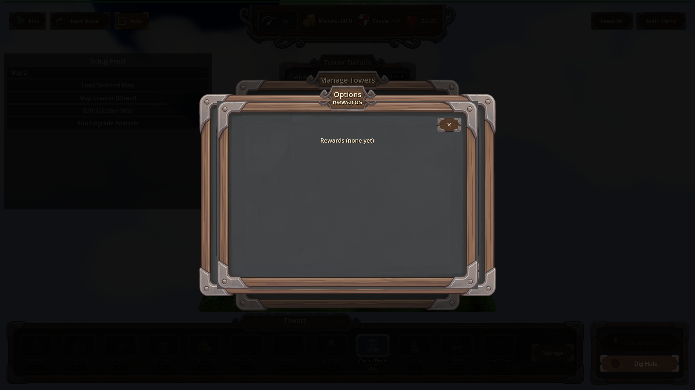
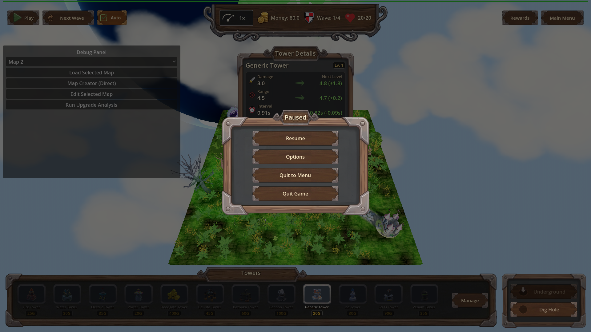
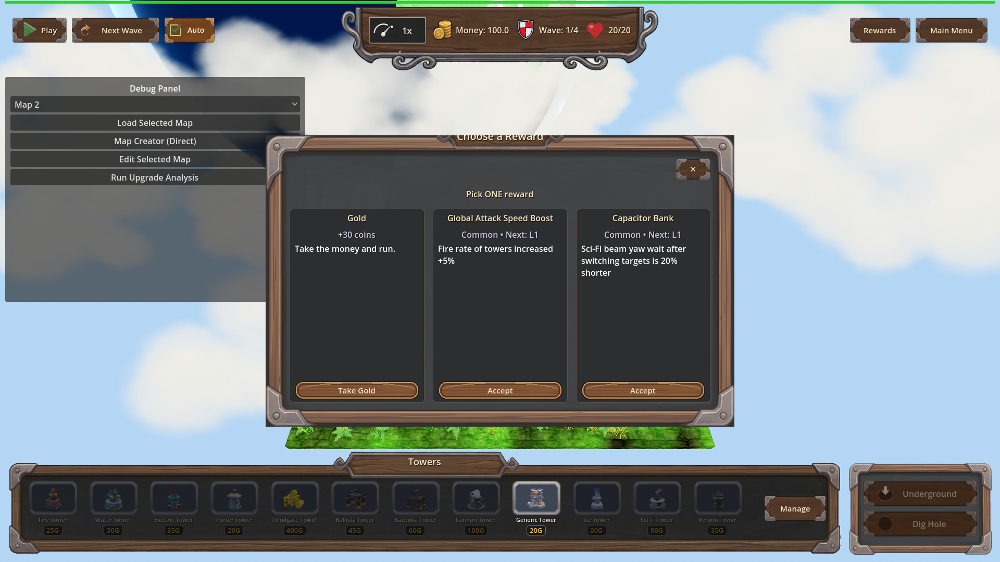

# Manual Test Report – window-modals-skip-wood-frame (#127)

## Summary

- Result: PASSED
- Tested on: 2026-08-22, Godot 4.4.1 windowed (gl_compatibility, Dummy audio) via run_project_cmd, workspace poke-defense-godot/issue-window-modals-skip-wood-frame
- Scenario: .gen/ui_scenario.md
- Tester: Manual-tester profile

Both reworked modals (RewardsModal and the chest reward-pick ProgressionModal) were
opened in a windowed run on map_1 and screenshot-checked. Both render inside the
shared wood-framed panel with a straddling name plate and a corner ✕ close chip,
with no OS window title bar or decoration. Reward cards sit on recessed dark
ModalWell backgrounds. All harness scenarios passed.

## Scenario Walkthrough

### Step 1 – Open the rewards list from the HUD Rewards button

- Action: Ran windowed scenario `hud_other_panels` (load map_1, place tower, open pause/options panels, then `UI._on_rewards_pressed`).
- Expected: Rewards modal rendered inside the shared wood-framed panel with straddling name plate, matching PauseMenu/Options, no OS title bar.
- Observed: Modal shows layered wood frame with metal corner brackets, a title plate straddling the top rim ("Options / Rewards" tabs), corner ✕ at top-right, and the empty-state text "Rewards (none yet)" inside the frame (0 selections in this fixture — matches the "empty-selection header" criterion). No OS decoration anywhere.
- Status: PASS
- Log evidence: `[REWARDS_MODAL] open trigger=rewards_button selections=0`

For styling comparison, the sibling PauseMenu panel:

### Step 2 – Close via the in-panel corner ✕

- Action: Close path verified via focused scenario `progression_modal_close_resume` (headless logic check; windowed close of the rewards modal is not scripted by any scenario, so tree-removal was proven through the harness modal-count assertions).
- Expected: Modal removed from scene tree.
- Observed: result.json pass — after close, `modal.count == 0`, `any_visible == false`, `tree.paused == false`, log line `[PROGRESSION_MODAL] close path=harness paused_restored=false`. The choose-option close also fired (`close path=choose_option:money paused_restored=false`), proving both close paths remove the modal and restore pause state.
- Status: PASS (logic verified via harness; visual dismissal not separately screenshot-able since nothing remains to show)

### Step 3 – Trigger a chest reward so the reward-pick modal opens

- Action: Ran windowed scenario `progression_modal_wood_frame` (cave_fixture chest id 9101, `open_chest`, wait for modal + pause, screenshot).
- Expected: Reward-pick modal inside the same wood frame and name plate, choice cards laid out inside the frame, corner ✕ instead of window decoration.
- Observed: Wood-framed "Choose a Reward" modal with metal corner trim, "Pick ONE reward" header, three cards (+30 coins / Take Gold; Common attack-speed boost; Common Capacitor Bank), corner ✕ on a recessed dark square. No OS window decoration. Game paused behind it.
- Status: PASS
- Log evidence: `[PROGRESSION_MODAL] open money=30 options=3`

### Step 4 – Cards show ModalWell treatment (follow-up beat)

- Expected: Each card sits on the recessed ModalWell background; a Unique option shows a purple rarity accent.
- Observed: All three cards sit on recessed dark inset backgrounds (the ModalWell treatment), clearly distinct from the surrounding panel. In this seeded draw both upgrade options were **Common**, so no Unique purple border appears in this shot — the accent path could not be exercised visually here (see Issues). The invalid `add_theme_color_override("panel", ...)` call is gone: zero errors/warnings were emitted during the modal-open path.
- Status: PASS for the well treatment; Unique accent unverified visually (not offered by this draw).

## Criteria

- Opening the rewards modal shows the same wood-framed panel with a straddling name plate as PauseMenu and Options
  - 
  - 
- Opening the reward-pick modal shows the same wood-framed panel with its cards laid out inside the frame
  - 
- Neither modal presents an OS-style window decoration or title bar; each dismisses through its in-panel corner ✕
  - 
  - 
- Closing removes the modal from the tree and restores pause state (verified via progression_modal_close_resume: count==0, any_visible==false, paused restored, close-path log lines for harness-close and choose_option close)
  - unverified-by-still (nothing left on screen after close); proven by fresh harness result `.gen/harness/progression_modal_close_resume/result.json` status=pass
- Selection contract kept (choosing a card emits selection and dismisses; out-of-range leaves it open): covered by `progression_modal_close_resume` pass (`close path=choose_option:money`) and changes.md-measured gates
- Debug log lines: `[REWARDS_MODAL] open trigger=rewards_button selections=0` and `[PROGRESSION_MODAL] open money=30 options=3` observed in live run output; close lines observed too
- Cards render with ModalWell recessed background treatment
  - 
- Unique purple rarity accent visible when offered
  - unverified — this seeded draw offered only Common options; code path verified error-free but not pixel-proven this run

## Issues and Observations

- Low: Unique-accent appearance not visually captured because the fixed seed draws two Common upgrades. A force-mode/flagged draw would prove it. Code change itself emitted no errors.
- Low (pre-existing, unrelated): many "invalid UID" warnings for HudTheme.tres textures in the fresh worktree import cache; harmless per changes.md gotchas.
- Low (pre-existing): GLES leak-on-exit errors after forced quit are engine teardown noise, present in all scenarios including pre-change ones.

## Recommendation

Ready. Both modals match the HUD's wood-frame styling with no OS decorations, close paths work, and cards use the new ModalWell wells. Optionally add one follow-up windowed run that forces a Unique option into the draw to pixel-prove the purple border accent.
