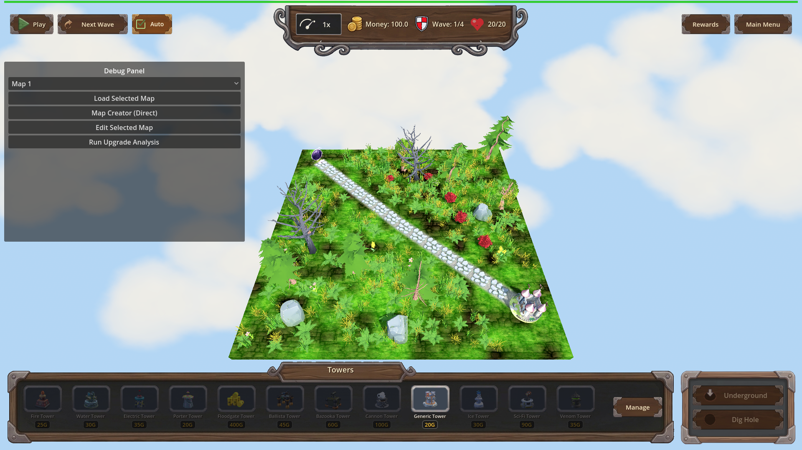
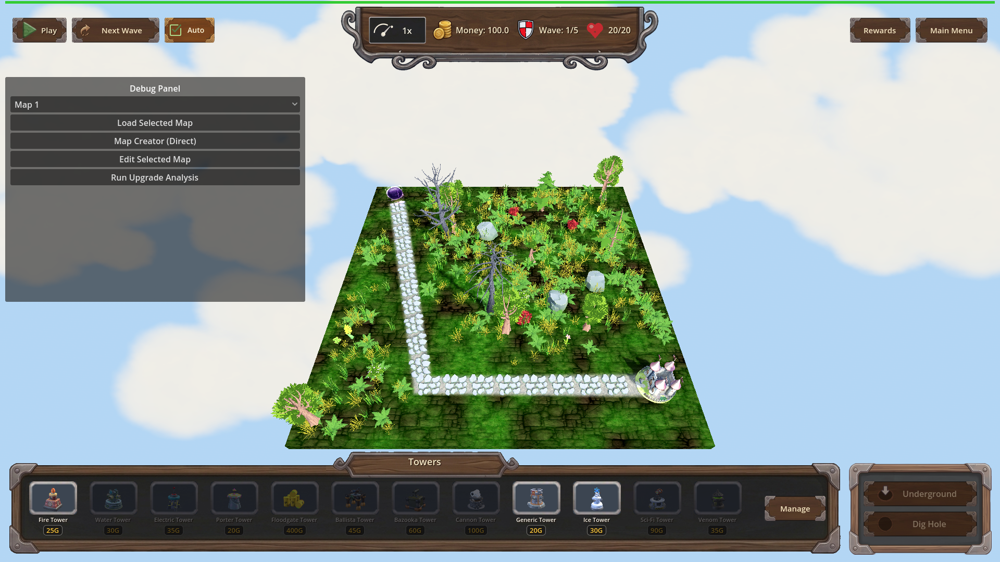
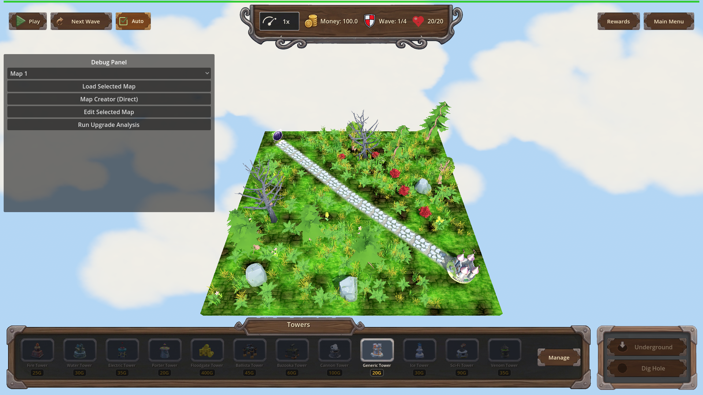

# Manual Test Report – issue-ground-material-ignores-cache (ground material survives map switch)

## Summary

- Result: PASSED
- Tested on: 2026-08-22, Godot 4.4.1 windowed (llvmpipe OpenGL compatibility renderer, Dummy audio), via run_project_cmd worker
- Scenario: .gen/ui_scenario.md, executed with tests/scenarios/manual_ground_material_map_switch.json (windowed harness variant)
- Tester: Manual-tester profile

Overall: I ran the game windowed and switched maps twice through the debug/harness
map loader, taking a real PNG screenshot at each checkpoint (initial surface map,
after switching to the second map, after switching back). In every checkpoint the
ground plane shows a blended grass/dirt texture with visible tiling detail — never
the flat "shader-only" color described in issue #115. The harness probe also
confirmed non-empty grass/dirt samplers and the correct tint after all switches.

## Scenario Walkthrough

### Step 1 – Initial surface map (map_1)

- Action: Started the game windowed with the harness scenario; harness loaded map_1 and captured a screenshot after the scene settled.
- Expected: Ground plane rendered with blended grass/dirt textures (visible texture detail, not flat shader color).
- Observed: Fully loaded map — stone path, castle, trees/rocks, complete HUD. The terrain clearly shows tiled green grass mixed with brown dirt patches and vegetation detail. No flat uniform ground, no fade overlay.
- Status: PASS

### Step 2 – Switch to a different map (map_2)

- Action: Harness load_map action switched to map_2 (second map config); screenshot taken after the new map settled.
- Expected: New map's ground still textured (not a uniform "shader only" surface).
- Observed: Map_2 loaded fully (path now has 19 segments vs 15 on map_1, wave count changed to 1/5). The ground keeps its grass/dirt blended tiling — green grass variation plus dirt patches along the path and around props. Not flat.
- Status: PASS

### Step 3 – Switch back / second switch (map_1 again)

- Action: Harness load_map action returned to map_1; final screenshot captured.
- Expected: Blended grass/dirt texture intact, tint matching the map's configured grass color.
- Observed: Ground again shows vibrant textured grass with brown dirt patches and natural height variation; castle, path, decorations and HUD all present. The in-game probe reported `grass=ok dirt=ok tint=0.309804,0.498039,0.309804`, which is exactly the configured grassColor (5209935) shared by the shipped maps.
- Status: PASS

## Criteria

Visible acceptance bullets mapped to proving screenshots:

- Ground keeps non-empty grass_albedo / dirt_albedo across two map switches (visual side)
  - 
  - 
  - 
- grass_tint follows the newly loaded map's configured grass color
  - Probe string from the same windowed run: `grass=ok dirt=ok tint=0.309804,0.498039,0.309804` (matches configured 5209935); screenshots show correctly tinted textured ground at each checkpoint (images above).
- Ground is never a flat untextured "shader-only" surface at any checkpoint
  - All three images above show recognizable grass/dirt tiling.

Headless-verifiable bullets were additionally confirmed by the fresh windowed run's
result file `.gen/harness/manual_ground_material_map_switch/result.json`:
status `pass`, `headless: false`, expectation `__ground_shader_probe ==
"grass=ok dirt=ok tint=0.309804,0.498039,0.309804"` pass, and every `[GROUND]
ground material created: from_cache=map_grass.jpg,underground_floor.jpg fresh=none`
log line present for each of the three material creations. (Code-level criteria —
CACHE_MODE_REUSE usage, sampler reassignment root cause, fallback paths, [GROUND]
debug logging — were verified by the coder's focused headless run and are not
re-asserted here beyond what this run observed.)

## Issues and Observations

- Low: Pre-existing missing-model warnings during map loads (`ruined_house.glb`, `shed.glb`, `portal_fantasy_arch.glb`, `stylized_earth_in_clouds.glb`, nature model "Petal") — unrelated to this fix but they log errors every map load. Affected steps: all.
- Low: Debug panel dropdown still reads "Map 1" while map_2 is active after a harness/debug load (label not synced). Cosmetic; affected step 2.
- Low: Godot exit-time GL leak warnings (textures/buffers leaked at exit under llvmpipe). Engine/shutdown noise, no player impact.

## Recommendation

The ground texture story holds up visually across a double map switch: three real
windowed screenshots show blended, tiled grass/dirt ground at every checkpoint,
backed by a passing in-game probe. Ready for release from the manual-testing side;
the cosmetic observations above can go to backlog.
