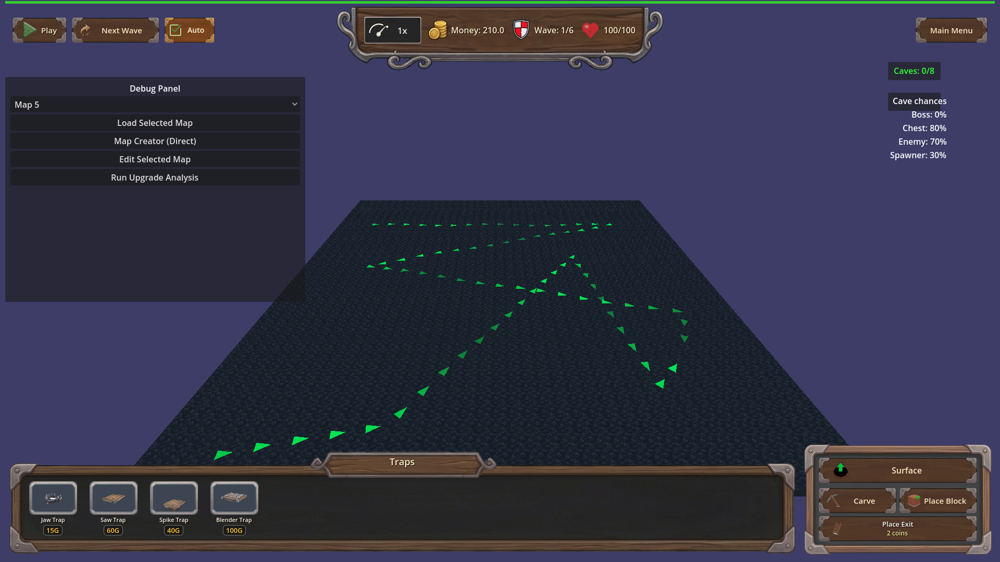
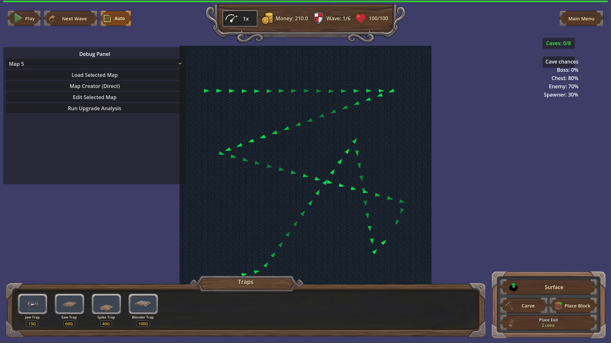
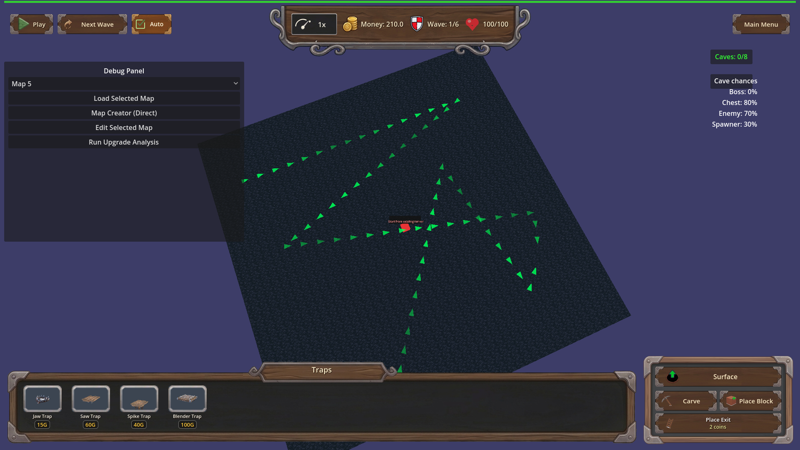

# Manual test report — underground carve top-down camera (issue #130)

Windowed run (`godot --path . --rendering-method gl_compatibility --audio-driver Dummy` on Xvfb :77, 1280x800, **not headless**). Scenario: `tests/scenarios/carve_camera_manual.json` (map_9, underground layer). Harness status: **pass**, exit 0. All shots inspected visually.

## Beat 1 — Default angled underground view before carve

Camera is clearly angled/isometric with perspective distortion; carved paths visible. This is the "before" reference.

## Beat 2 — Carve armed → top-down bird's-eye view

After activating Carve the camera is straight overhead — no perspective foreshortening, carved path reads flat from above. Board position/zoom unchanged (harness probe confirms identical position across the transition).

## Beat 3 — Manual rotation during carve works

After scripted rotation while carving, the view is angled again — player rotation input still works during carve mode.

## Beat 4 — Cancel after manual rotation keeps the player's angle

Canceling carve did NOT snap back: camera stays at the player's rotated angle.

## Beat 5 — Plain cancel restores original angle

Carve re-armed and canceled without touching rotation: camera returned to the default angled underground view matching Beat 1.

## Verdict
All four acceptance behaviors visually confirmed. Focused harness `carve_camera_topdown` also passes 7/7 with real basis probes.
