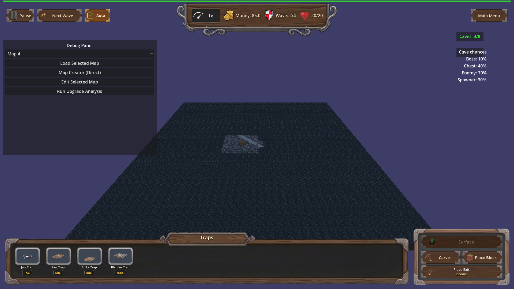
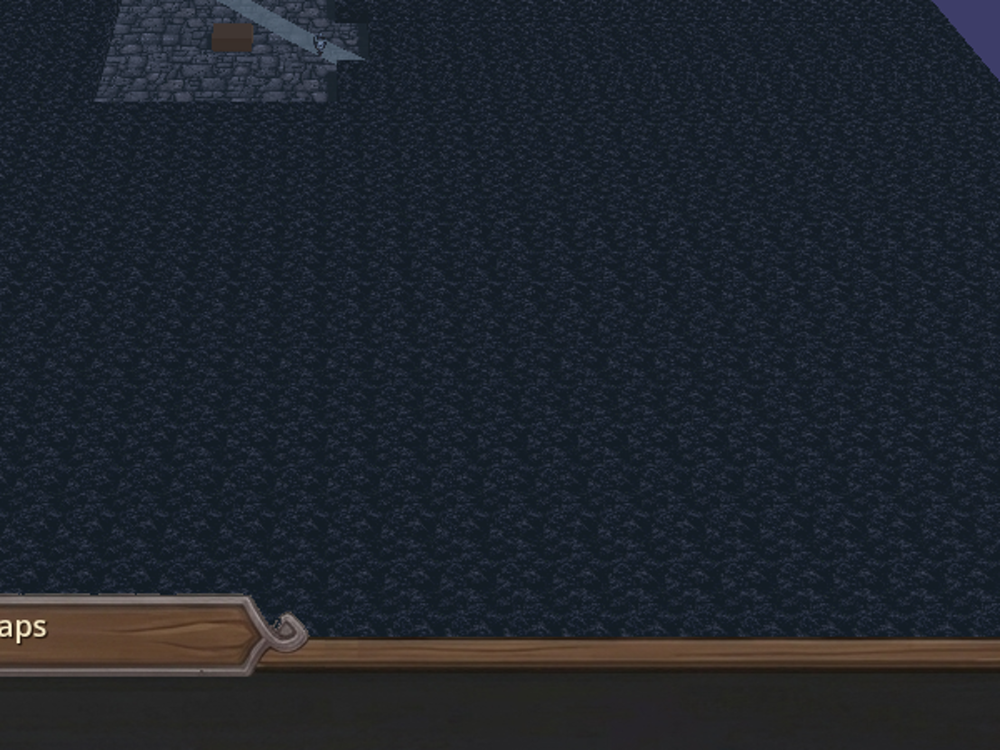
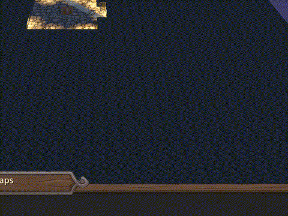
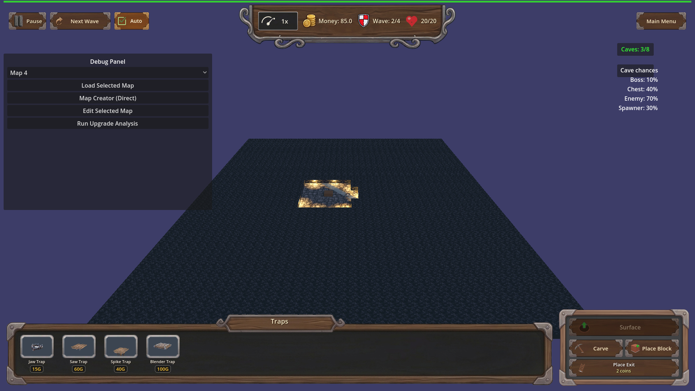

# Manual Test Report – traps_frostbite_fangs (Frostbite Fangs trap perk)

## Summary

- Result: PASSED
- Tested on: 2026-08-23, Godot 4.4.1 windowed (gl_compatibility on llvmpipe), map_1 underground layer
- Scenario: tests/scenarios/traps_frostbite_fangs_progression.json (windowed harness run; ui_scenario.md created for this run)
- Tester: Manual-tester profile

Overall: The Frostbite Fangs perk was granted through its L1→L3 progression by the harness, a live trap_01 was placed on cave enemies with the game playing, and the trap hit applied the chill through EffectsManager.apply_frozen. The windowed screenshots show the reused frost VFX working from a trap hit: the Cactoro enemies next to the placed trap render with a whitish/icy tint instead of their normal green cactus colors, and the state assertions confirm frozen_count ≥ 1, slow_magnitude == 0.6 (L3), and ice_slow_fx ≥ 1 at screenshot time.

## Scenario Walkthrough

### Step 1 – Grant the perk and verify level scaling (headless-equivalent logic, windowed run)

- Action: Ran the scenario windowed via run_project_cmd (`godot --path . res://scenes/Main.tscn --rendering-method gl_compatibility --audio-driver Dummy -- --harness=res://tests/scenarios/traps_frostbite_fangs_progression.json`). Never passed `--headless`.
- Expected: Perk eligible on fresh run, applies L1→L2→L3 (0.4/2.0s → 0.5/2.5s → 0.6/3.0s), survives save/reload.
- Observed: All progression waits ok; log shows `[TrapProgression] traps_frostbite_fangs L3 -> chill 0.6 for 3.0s`. Result status=pass, exit 0.
- Status: PASS

### Step 2 – Live trap hit chills an enemy (checkpoint frostbite_fangs_chilled_hit)

- Action: Harness switched underground, installed cave fixtures, force-spawned Cactoro enemies, placed a trap_01 on them and set gamestate playing so Trap._process performs real hits. Screenshot taken while slow_magnitude == 0.6 held.
- Expected: frozen_count ≥ 1, ice_slow_fx ≥ 1, enemy visibly frosted.
- Observed: Log shows `[FROSTBITE_FANGS] trap=trap_01 chill=0.6 dur=3.0 enemy=Cactoro` plus per-surface `[FROZEN DEBUG]` material tints applied to the Cactoro model. The screenshot shows the placed brown trap block on the stone platform with two small creatures beside it carrying a whitish/light-blue icy tint instead of normal green cactus coloring.
- Status: PASS

Zoomed crop of the proving area (trap block + frost-tinted creature):

Animated evidence of the chill window (record_frames burst, exported at 30 fps):

### Step 3 – Aftermath / unowned control

- Action: Optional aftermath screenshot after the chill window; then reset_for_new_game and a second trap (trap_03) arm without the perk.
- Expected: No `[FROSTBITE_FANGS] trap=trap_03` log line without the perk.
- Observed: Negative log assertion passed; aftermath shot captured showing the scene after the chill faded.
- Status: PASS

## Criteria

- Trap hits apply chill/slow via `EffectsManager.apply_frozen`, visible frost overlay from a trap hit
  - 
  - 
- Duration/magnitude scale per level (L3 = 0.6 slow / 3.0 s active at screenshot time; state assertion `slow_magnitude == 0.6` green in result.json actions[39])
  - 
- Reuse existing frost overlay VFX from `apply_frozen`
  - Same whitish icy model tint seen here is the standard apply_frozen path (per-surface material override logged as `[FROZEN DEBUG]`)
  - 
- Unowned is a no-op (log assertion `!regex [FROSTBITE_FANGS] trap=trap_03` passed)
  - 

## Issues and Observations

- Medium: In this git-workspace all GLB `.import` files shipped as `valid=false` Git-LFS stubs (models are LFS pointers and git-lfs is not installed), so enemies rendered invisible on the first two windowed runs. I restored valid `.import` remap files and copied matching `.scn` imports from the sibling godot-td worktree (same project assets) to make pixels appear. This is an environment/workspace bootstrap issue, not a defect in this feature's code — but fresh worktrees will hit it whenever visual verification is required.
- Low: The scenario key `then_screenshot` inside `wait_for_condition` is silently ignored by the harness (not implemented); the checkpoint only fired because I added explicit `screenshot` / `record_frames` actions to the timeline.
- Low: At the default wide camera the 50%-scaled cave enemies are tiny; I recentered the camera on the fight (`game.set("camera_target", …)` + `_update_camera_for_layer`) before the checkpoints to make the frost tint readable.
- Pre-existing noise: `Trap_03.tscn` fails to parse (`Invalid parameter` line 14) and missing `Trap_01/_ao/_m/_r.tga` textures log errors each run; unrelated to this feature.

## Recommendation

Ready. The player-visible story holds: with Frostbite Fangs equipped, a trap hit visibly chills its target using the existing frost overlay, scaling to 60% slow for 3 s at L3, and nothing happens without the perk. Recommend fixing the LFS/import bootstrap for fresh visual-test worktrees and either implementing or removing `then_screenshot`.

Manual-test result: PASSED. Scenario: tests/scenarios/traps_frostbite_fangs_progression.json. Report: .gen/manual-report.md. Escalation: no.
