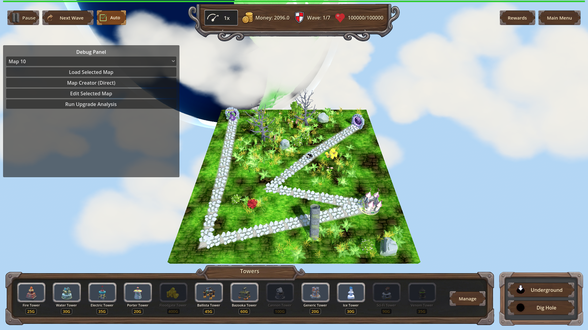
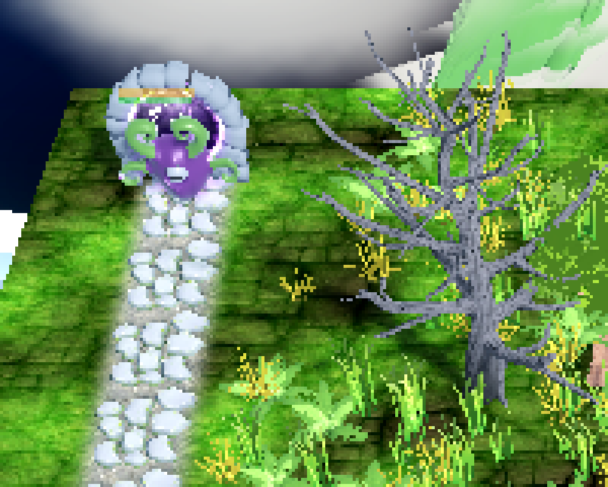
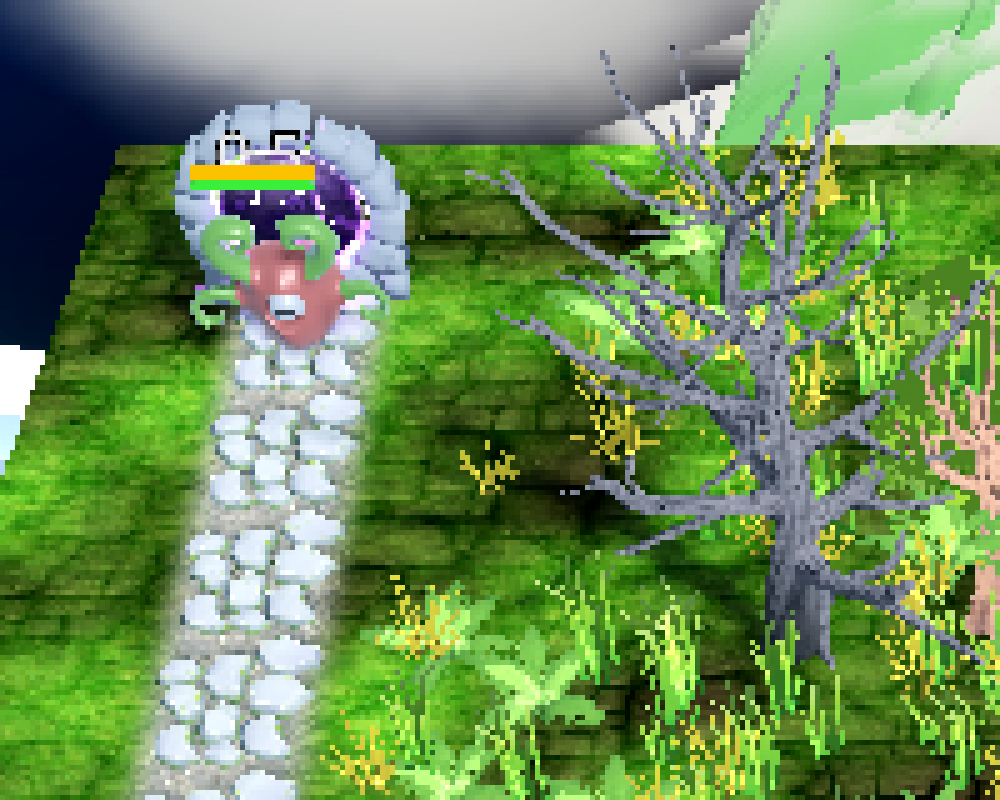
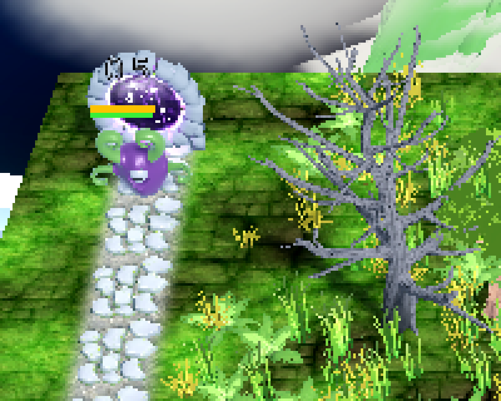

# Manual Test Report – Progression: Corrosive Soak perk (Floodgate) rust tint

## Summary

- Result: PASSED
- Tested on: 2026-08-24, windowed Godot 4.4.1 (gl_compatibility, Dummy audio) via run_project_cmd worker
- Scenario: .gen/ui_scenario.md (visual variant scenario `tests/scenarios/floodgate_corrosive_soak_visual.json`)
- Tester: Manual-tester profile

Overall: I ran the corrosive-soak visual scenario windowed (never --headless) and captured a
screenshot at each of the three beats: enemy wet before the discharge hit, the same enemy
Corroded with the new rust tint, and the enemy back to its normal appearance after expiry.
The rust tint is clearly visible and clearly different from both the normal and wet look,
and it disappears when Corroded expires. Harness state assertions confirmed corroded=1 /
rust_tint_count=1 while marked and 0/0 after expiry.

## Scenario Walkthrough

### Step 1 – Enemy wet/soaked before the discharge hit

- Action: Loaded map_6 deterministically, placed a Floodgate tower next to the carved
  flood path, staged one armored Alien on spawner_0, set armor 1000.
- Expected: Enemy shows the normal WaterSubmersionSystem wet/soak appearance, no rust.
- Observed: The Alien (purple body, green tentacles, near the spawn portal at the top of
  the map) shows its normal appearance; no rust/orange tint anywhere on it.
- Status: PASS

### Step 2 – Corroded applies with a distinct rust tint after the discharge hit

- Action: Applied floodgate_corrosive_soak level 1, then landed the Floodgate discharge
  hit (`floodgate_hit`, mark_corroded=true — the exact call a real discharge tick makes).
- Expected: The enemy gains Corroded and carries a distinct rust-colored tint that differs
  from the ordinary wet/soak tint.
- Observed: The same Alien now shows a clear warm rust/orange-brown tint over its purple
  body — plainly different from its normal look in step 1. Harness confirms corroded_count=1,
  rust_tint_count=1, amplification 0.25; log line `[CORROSIVE_SOAK] corroded applied on
  enemy=Alien level=1` present.
- Status: PASS

### Step 3 – Tint reverts when Corroded expires

- Action: Expired the Corroded state (`clear_corroded` drives the real expiry path).
- Expected: Enemy returns to the normal wet/soak appearance, no rust tint remaining.
- Observed: The Alien is back to its plain purple body with green tentacles; no rust
  tone remains. Harness confirms corroded_count=0 and rust_tint_count=0; log line
  `[CORROSIVE_SOAK] corroded expired on enemy=Alien dur=6.0` present.
- Status: PASS

## Criteria (visual)

- While an enemy is Corroded, its model carries a distinct rust-colored tint through the
  existing water-submersion tint mechanism that differs visibly from the normal wet/soak
  tint; when the Corroded state ends, the tint returns to the normal appearance.
  - Normal/wet before the hit:
    - 
    - 
  - Rust tint while Corroded (state proven by harness corroded_count=1 / rust_tint_count=1):
    - 
    - 
  - Back to normal after expiry (harness corroded_count=0 / rust_tint_count=0):
    - 
    - 

All other plan criteria are numeric/logic criteria already proven by the passing headless
harness (`floodgate_corrosive_soak`, status pass, 58/58 actions ok) and are out of scope for
this visual walkthrough.

## Issues and Observations

- ui_feels_broken: no.
- Low: the rust tint is subtle at default zoom on this dark/purple enemy model; it reads
  clearly when zoomed or against the light path stones, but some players may miss it in
  busy fights. Cosmetic only; not gating.
- Note: an earlier full-frame vision pass misidentified the small round "slime" as the
  target enemy; the actual staged Alien is the purple tentacled creature near the portal.
  Zoom crops above show the correct creature in all three states.
- Environment note: the run reported status=fail only because the final expectation expects
  progression enabled=false while the scenario leaves L1 applied before its own final reset;
  all timeline actions including all three screenshots succeeded ("captured"). Not a feature
  issue; noted for scenario hygiene.

## Recommendation

The rust-tint visual criterion is proven end-to-end and looks right: distinct from the wet
look, present only while Corroded, cleanly reverted on expiry. Ready for release from the
manual-testing perspective.
